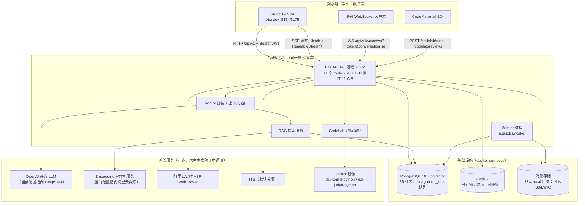
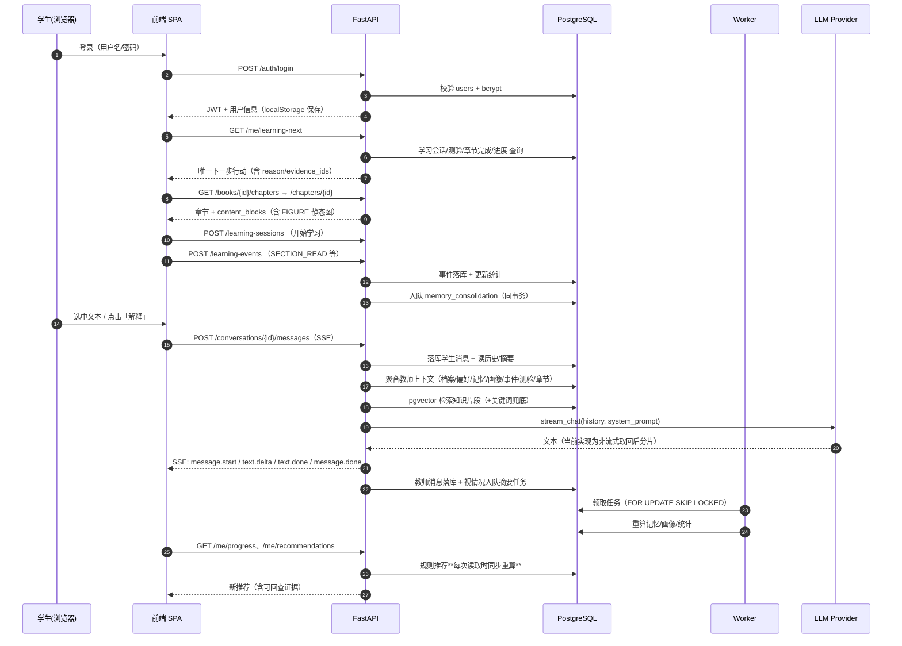
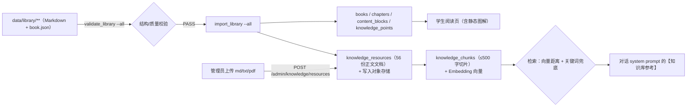

# 项目现状与技术决策交接文档

> 面向对象：**无法访问本仓库的外部技术顾问**
> 目的：让顾问在不读代码的前提下，判断项目现状、技术栈适配性、赛题覆盖度、后续开发顺序与技术风险。
> 生成方式：以**当前工作区代码、配置、数据结构与实际运行结果**为唯一事实源（README 与历史文档仅作线索，冲突处单独标注）。

---

## 文档元信息

| 项 | 值 |
| --- | --- |
| 项目名（代码内命名） | 霜铃（Shuangling）· K12 AI 数字教师 V3 |
| 对应赛题 | 中国移动杯·第二届浙江省大学生人工智能竞赛，题目编号 **JBGS-2026-02**《多模态K12人工智能通识课教学助手对话智能体》 |
| 赛题原件核对情况 | **已核对原件**：`移动杯赛题(2).docx`（工作区根目录，未纳入 git）；正文经解压 `word/document.xml` 提取，落款「浙江省大学生人工智能竞赛组委会 2026年6月3日」 |
| 调查日期 | 2026-09-18（Asia/Shanghai） |
| 调查基线 commit | `696364ff54c99f711e1cddd7364c9ac4d5282943`（2026-09-16 23:30 `docs(codelab): 明确真实 LLM Provider 尚未验收…`） |
| 分支 | `master`，相对 `origin/master` **ahead 9**（本地领先 9 个提交，未推送） |
| 工作区状态（调查开始时） | 无已跟踪文件被修改；未跟踪项仅 4 个：`.playwright-mcp/`、`backend/空`（内容为 `117` 四个字符）、`移动杯赛题(2).docx`、`移动杯项目深度交接_Prompt.txt` |
| 工作区状态（调查结束时） | 仅新增本文件 `docs/handoff/PROJECT_HANDOFF.md`；另在**隔离数据库**与 `/tmp` 下产生临时验证痕迹（见附录 D，均不在 git 跟踪范围内） |
| 代码规模 | 后端 `backend/app` 116 个 Python 文件、20,033 行；前端 `frontend/src` 184 个文件、23,038 行（ts/tsx/css） |
| 本次是否修改业务代码 | **否**。仅新增本交接文档与隔离验证产物；未改代码、未升级依赖、未替换技术栈、未重写既有文档 |
| 脱敏声明 | 全文不列出任何 API Key / Token / 密码 / 连接串明文；环境变量只给名称、用途与安全示例。文中出现的 `deepseek-v4-flash`、`qwen3.7-text-embedding` 等为**模型标识**（配置项），非凭据 |

### 状态口径（全文统一使用，请顾问严格按此理解）

| 维度 | 取值 | 含义 |
| --- | --- | --- |
| 实现状态 | 未发现实现 / 占位或 Mock / 局部实现 / 主链路已接通 | 代码层面「有没有、通到哪」 |
| 验证状态 | 未运行 / 已静态核对 / 隔离环境测试通过 / 真实集成验证通过 / 验证失败 | 是否真的跑过、跑在哪 |
| 数据与服务性质 | 真实服务 / 测试替身（Mock） / 种子数据 / 演示数据 | 跑的东西是不是真的 |

**三者不可互相替代**。例如：「Mock Provider 下 E2E 通过」说明的是**业务链路与前端交互**成立，不等于「真实大模型教学质量已验收」。

### 本次调查实际执行范围（摘要，完整记录见附录 D）

- 静态通读：后端 11 个领域模块 + AI 层 + 基础设施 + 后台任务 + 脚本；前端路由/页面/API 层/状态管理/测试；`docker-compose.yml`、`Dockerfile`、CI、env 模板、迁移链、语料与任务数据。
- 真实运行（**全部在隔离环境**，未触碰真实开发库 `shuangling` 的写入）：
  - 新建独立库 `shuangling_handoff918`、`shuangling_handoff918_clean`，跑通 24 条迁移 → 内容导入 → 后端进程 → Worker → 前端 dev → 真实浏览器 E2E。
  - 后端 pytest 全套：**462 项，461 通过 / 1 失败**（失败项经复跑确认为「测试自身前置数据未建立」，详见第 11 章）。
  - 前端 vitest：**52 文件 / 280 用例全部通过**；`tsc --noEmit` 通过。
  - Playwright：chromium 项目 20 项（15 通过 + 5 项 CodeLab 失败，失败根因为**该库未执行 `import_code_tasks`**；补导入后 CodeLab 5/5 通过）；390/820/1280 响应式 18 项**全部通过**。
- 未做/做不到的：真实大模型端到端质量验证（**未调用付费模型**）、真实语音链路（未使用阿里云 Key 发请求）、S3/MinIO 存储后端的实际读写、生产部署验证、未成年人数据合规性审查。

---

## 第 0 章：交接摘要与阅读导航

### 0.1 一句话现状

> 这是一个**单体模块化的 FastAPI + React 教学平台**：课程内容（25 本原创 AI 通识教材、125 章）与「AI 数字教师对话 + 随堂测验 + 学习记录/画像/推荐 + 在线编程（CodeLab）」四条主链路**已有可运行的真实代码**；前端**没有使用 Mock 数据**，全部走真实 API。但**赛题六类多模态能力中，只有三类（对话问答、在线编程、练习测评）具备可运行实现**，「动画讲解」「图文绘本」**完全没有实现**，「多模态教学资源（视频/Word/PPT）」目前只做到**后台入库 + 检索增强**，**没有学生端可看可下载的资源供给界面**。

### 0.2 目标用户与核心业务（代码可验证的部分）

| 角色 | 是否存在 | 证据 |
| --- | --- | --- |
| 学生（STUDENT） | ✅ 有完整实体、登录、档案、学习链路 | `users.user_type`、`student_profiles`、`GET /api/v1/me` |
| 管理员（ADMIN） | ✅ 有独立 `admins` 表与后台 5 个页面 | `admins` 表、`/api/v1/admin/*`、`frontend/src/pages/admin/*` |
| 教师 / 家长 | ❌ **代码中不存在**（无实体、无角色、无页面） | 全仓无 teacher/parent 用户类型；`teacher_roles` 是「AI 教师人格风格」而非真人教师账号 |

> ⚠️ 术语陷阱：代码中的 `teacher_roles` / `TeacherRole` 指的是**AI 教师的人格风格**（名称、语气、教学风格），不是真人教师权限体系。顾问若按字面理解会误判「已支持教师角色」。

### 0.3 实际技术栈（按运行位置分类，非按 README）

| 层 | 实际使用 | 证据 |
| --- | --- | --- |
| 后端 | Python 3.12 + FastAPI + SQLAlchemy 2.0 async + asyncpg + Pydantic v2 | `backend/pyproject.toml`、`backend/app/main.py:41` |
| 数据库 | PostgreSQL 18（pgvector 镜像），向量列用 `vector` 类型，HNSW 索引 | `docker-compose.yml`、`alembic/versions/a2b3c4d5e6f7_*` |
| 缓存/锁 | Redis（可降级为进程内）；用于会话串行锁 + 分布式限流 | `app/infrastructure/cache/redis.py`、`app/infrastructure/rate_limit.py` |
| 对象存储 | 抽象层 `local`（默认）/ `s3`（MinIO 兼容）；**默认走本地磁盘** | `app/config.py:59`、`app/infrastructure/storage/*` |
| 后台任务 | **PostgreSQL 表驱动队列**（`background_jobs`，`FOR UPDATE SKIP LOCKED`），独立 Worker 进程；非 Celery/RQ | `app/jobs/queue.py:48`、`app/jobs/worker.py`、`docker-compose.yml` worker |
| AI 对话 | OpenAI 兼容 HTTP 适配器（当前 `.env` 指向 DeepSeek），或本地 `MockAIProvider` | `app/ai/openai_compatible.py`、`app/ai/factory.py` |
| Embedding/RAG | 可切换 mock(64维)/OpenAI 兼容(当前配置 1024 维)；pgvector 余弦检索 + ILIKE 关键词兜底 | `app/ai/embedding.py`、`app/modules/knowledge/service.py:127-231` |
| 语音 | WebSocket 语音状态机 + 阿里云 ASR（`fun-asr-realtime` 系列）+ TTS（可关） | `app/modules/voice/ws.py`、`app/ai/voice.py` |
| 代码执行 | **Docker 一次性容器沙箱**（自建 runner.py，run/judge 双镜像） | `app/modules/codelab/sandbox.py:1-22,141-204` |
| 前端 | React 19 + TypeScript 7 + Vite 8 + React Router 7 + Zustand + TanStack Query + Tailwind 4 + CodeMirror 6 | `frontend/package.json` |
| 测试 | pytest（后端，连真实 PG）+ vitest + Playwright（4 视口项目） | `backend/tests/`、`frontend/vitest.config.ts`、`frontend/playwright.config.ts` |
| 部署 | 只有 docker-compose（postgres/redis/minio/worker）+ 后端 Dockerfile；**前端无容器化产物、无反向代理配置** | `docker-compose.yml`、`backend/Dockerfile`；`find . -name Dockerfile*` 仅 1 个 |

### 0.4 当前最重要的阻塞项（按影响排序，详见第 12 章）

1. **六类多模态只落地三类**：动画讲解、图文绘本无任何实现；多模态教学资源无学生端供给界面 → 直接压在评分维度「多模态交互质量 25%」上（ISSUE-001/002/003）。
2. **年级自适应的实际影响面很窄**：年级只影响「提示词文本 + 书籍元数据筛选 + 兜底选书」，**不影响题目难度**（AI 随堂测验写死 `MEDIUM`/3 题）、不影响讲解媒介选择（ISSUE-004）。
3. **「智能体主动引导」没有服务端实现**：只有前端 6 秒后弹一个「陪伴气泡」，没有章节教学状态机、没有服务端主动推送/续问（ISSUE-005）。
4. **向量检索存在维度断层**：真实开发库中 **651/1198 条 chunk 是 64 维（早期 mock 遗留）、547 条是 1024 维**；而检索 SQL 用 `vector_dims(embedding) = :当前维度` 过滤 → 用当前 1024 维配置时，**54% 的已嵌入内容对向量检索不可见**，只能靠关键词兜底（ISSUE-006）。
5. **标准启动流程漏两步导入**：`import_assessments`（审校题）与 `import_code_tasks`（编程题）**没有被 `scripts/start.sh`、`ci.sh`、`ci-e2e.sh`、GitHub CI 中任何一处调用**；干净库导入后 `reviewed_questions=0`、`code_tasks=0`。本次 E2E 中 5 项 CodeLab 用例失败即由此直接导致（ISSUE-007/008）。
6. **真实大模型仍未验收**：`.env` 已配置真实 Provider，但仓库内最近一次提交标题即「明确真实 LLM Provider 尚未验收」；本次出于成本与安全要求**未调用付费模型**，因此真实生成质量、时延、成本全部为**未验证**（ISSUE-009）。

### 0.5 「目前实际可走通的学习流程」（含断点标注）

以下流程**已在本次调查中以真实浏览器 + 真实后端 + 隔离数据库跑通**（Mock AI 提供文本，其余全真实）：

1. 打开 `http://localhost:5175` → 登录页（演示账号提示由 `VITE_SHOW_DEMO_CREDENTIALS` 控制）→ 登录成功，JWT 存 localStorage。
2. 首页：问候语 + 学习统计 + 「继续学习」卡 + 「下一步行动」卡（来自 `GET /me/learning-next`）+ 推荐列表（规则式）+ 记忆/画像摘要。
3. 书库：按学段/主题筛选 → 书籍详情 → 开始阅读。
4. 阅读页：按 `content_blocks` 顺序渲染标题/段落/知识卡/图例（126 个 FIGURE 静态 SVG）/提示块；滚动产生 `SECTION_READ` 事件；阅读会话开始/结束落库。
5. 选中文字或点「解释/总结/出题」→ 右下角 AI 教师（数字人形象）面板打开 → 前端发 `POST /conversations/{id}/messages`（SSE）→ 后端拼装 system prompt（学生档案 + 偏好 + 长期记忆 + 画像洞察 + 近 10 条学习事件 + 近 5 次测验 + 当前章节正文节选 + RAG 检索片段 + 页面上下文）→ **AI Provider**（当前为 Mock；真实 Provider 已实现未验收）→ 16 字符分片流式回写 → 消息落库。
6. 说「给我出题」→ 后端识别意图走 **tool 流程**：按当前章节创建测验（优先审校题 → 真实 LLM 出题 → 本章确定性模板 → 通用题库），以 SSE `tool.result` 返回 `quiz_session_id`，前端渲染 QuizCard。
7. 答题 → 逐题判定 + 3 级提示 + 解析 → 完成后写 `QuizAnswer`、发 `LearningEvent`、触发 `memory_consolidation` 任务 → Worker 重算记忆/画像/统计。
8. 回到首页：下一步行动与推荐**随学习事件改变**（规则式，可解释，带 evidence_ids）。
9. CodeLab（需 `CODELAB_ENABLED=true` + Docker 镜像 + 已导入任务）：选任务 → 编辑器（CodeMirror）→ 运行（Docker 沙箱，无网络/只读根/CPU 内存限额）→ 请求 AI 评价（结构化 JSON 评分，Mock Provider 也能走完校验链路）。

**断点（真实存在，非推测）**：
- 第 5 步若走真实 Provider：**未验收**（时延/成本/质量均无测量数据）。
- 第 6 步的题目难度**不随年级/偏好变化**。
- 第 8 步的推荐**只有 4 条固定规则**，无协同过滤/学习模型；冷启动依赖 `learning_next` 的年级兜底。
- 全流程**没有动画、没有绘本、没有可观看/可下载的视频或 PPT 资源**——学生端唯一的「资源」是书内静态 SVG 图解。
- 语音输入/播报需要真实阿里云 Key 与 TTS 配置，默认 `TTS_PROVIDER=none`，未配置时接口明确返回 `TTS_UNAVAILABLE`（不假装有声音）。

### 0.6 阅读导航

| 你想知道 | 直接跳转 |
| --- | --- |
| 赛题每一条要求对应到哪、缺口在哪 | 第 1 章 |
| 产品到底做了什么、角色与流程 | 第 2 章 |
| 技术栈真相（含历史遗留与外部复用） | 第 3 章 |
| 系统怎么跑起来的、一次 AI 调用发生了什么 | 第 4 章 |
| 每个业务模块的实现细节与证据 | 第 5 章 |
| AI 教师/提示词/上下文/RAG 的真实机制 | 第 6 章 |
| 六类多模态能力逐项核查（赛题关键） | 第 7 章 |
| 课程内容、知识库、个性化闭环 | 第 8 章 |
| 接口、数据模型、状态与幂等 | 第 9 章 |
| 页面、交互、教育适配与浏览器实测 | 第 10 章 |
| 怎么启动、怎么测、能不能演示 | 第 11 章 |
| 风险与待办（ISSUE 编号） | 第 12 章 |
| 技术路线选择建议（A/B 方案对比） | 第 13 章 |
| 已有材料清点、证据索引、待确认问题 | 第 14 章 |
| 接口全清单 / 表清单 / 命令记录 / 术语 | 附录 A–E |

---

## 第 1 章：赛题拆解与逐项对照

### 1.0 赛题原文口径（先纠正三个常见误读）

1. 赛题原文是「**智能体应支持以下至少三种**多模态交互方式」（原文 5(2) 首句）。**不是**「六类全部必做」，也**不是**「问答之外再做三种」——对话问答本身即六类之一，可计入三种。
2. 同一类里的不同文件格式（Word/PPT/视频都属于第②类「多模态教学」）**不能**各自计数。
3. 原文中的学段选项为「**小学低年级 / 小学高年级 / 初中 / 高中**，或教材」（原文 5(1)）。本项目代码把小学合并为一个 `PRIMARY`（1–6 年级），**少了一档**。
4. 原文评分标准五项及权重：智能体设计合理性 **25%**、多模态交互质量 **25%**、教育适配性与实用性 **20%**、用户体验 **15%**、创新性 **15%**。原文**未给出更细的评分细则**，本文件任何细化条目均为**建议**，不是官方要求。

### 1.1 需求项总表

状态口径：`实现`=主链路已接通；`局部`=有代码但未闭环；`无`=未发现实现。验证列区分「本次实际运行」与「仅静态核对」。

| 编号 | 来源条款 | 要求类别 | 项目对应实现 | 实现状态 | 验证状态 | 关键证据 | 主要缺口 |
| --- | --- | --- | --- | --- | --- | --- | --- |
| REQ-001 | 5(1) 首句 | 硬性（核心能力） | 学生档案 `grade 1..12`；前端把 1–6/7–9/10–12 归为 PRIMARY/JUNIOR/SENIOR 三档；设置页可改年级 | 局部 | 静态核对 + E2E（`grade-persistence.spec.ts`） | `backend/app/modules/identity/service.py:34-39`；`frontend/src/entities/student/types.ts:6-10`；`frontend/src/pages/settings/SettingsPage.tsx:25-28` | **小学低/高年级未区分**；无「按教材选择」入口 |
| REQ-002 | 5(1) 第2句 | 硬性（核心能力） | 书籍按 `grade_min/grade_max` 过滤（`GET /books?grade_min&grade_max`）；`/me/learning-next` 第 5 优先级按 `profile.grade` 选书 | 局部 | 隔离环境测试通过 | `backend/app/modules/content/service.py:122-126`；`backend/app/modules/recommendation/service.py:551-584` | 图书馆默认列表**不自动**按学生年级过滤（前端默认「推荐」档，由用户自选）；知识库（RAG）检索**不按年级过滤** |
| REQ-003 | 5(1) 第2句 | 硬性（核心能力） | `TeacherRole`（人格/语气/教学风格）注入 system prompt；学生可切换风格 | 局部 | 静态核对 | `backend/app/modules/conversation/service.py:663-674`；`backend/app/modules/identity/router.py:121`；`/api/v1/teacher-roles` | 「风格」是**全局 2 个种子人格**（温暖鼓励/严谨清晰），**不随学段自动切换** |
| REQ-004 | 5(1) 第2句 | 硬性（核心能力） | 难度梯度存在于：书籍 `difficulty` 字段、测验请求参数 `difficulty`、学生偏好 `preferred_difficulty` | 局部 | 隔离环境测试通过（接口层）+ 静态核对（策略层） | `backend/app/modules/quiz/service.py:234`；`frontend/src/shared/api/api-quiz-service.ts:212`；`backend/app/modules/conversation/service.py:766-769` | **AI 随堂测验难度写死 `MEDIUM`、题数写死 3**；`preferred_difficulty` 只进提示词文本与画像展示，**不参与出题难度决策** |
| REQ-005 | 5(1) 第3句 | 硬性（核心能力） | 学生提问 → SSE 流式回答（含知识库引用块、教师工具调用） | 实现 | 真实集成验证通过（Mock Provider） | `backend/app/modules/conversation/service.py:431-1056`；`frontend/src/shared/api/api-conversation-service.ts:1-120` | 真实 Provider 下未验收 |
| REQ-006 | 5(1) 第3句 | 硬性（核心能力） | 仅前端「陪伴气泡」在 6 秒后提示；后端仅有**被触发**的意图工具（如出题） | 无 | 已静态核对（全仓搜索 `proactive`/`主动` 无服务端实现） | `frontend/src/features/companion/hooks/useCompanionDock.ts:66-78` | **无章节教学状态机、无服务端主动发起、无续问/跟学**；赛题此项属硬性能力 |
| REQ-007 | 5(2)① | 多模态第①类 | 对话问答（见 REQ-005） | 实现 | 真实集成验证通过（Mock Provider） | 同上 | 未验证真实模型质量/引用准确性 |
| REQ-008 | 5(2)② | 多模态第②类 | 管理员上传资源（md/txt/pdf/…）→ 存储 → 队列 → 解析切分 → 向量入库 → 供对话 RAG 引用；书内 126 个静态 SVG 图解可展示 | 局部 | 隔离环境测试通过（导入/检索）+ 静态核对（无学生端界面） | `backend/app/modules/admin/router.py:292-345`；`backend/app/modules/knowledge/ingestion.py:209-372`；`backend/app/modules/knowledge/service.py:127-202`；`frontend/src/pages/admin/AdminKnowledge.tsx:95-135` | **无学生端「资源推荐/打开/下载」入口**；**无视频/PPT 能力**（`ContentBlock` 类型枚举无 VIDEO/PPT：`models.py:303-307`）；**无资源生成（大模型产出文档）** |
| REQ-009 | 5(2)③ | 多模态第③类 | **未发现任何实现**（全仓搜 `动画/animation/视频` 仅命中 UI 动效与精灵帧） | 无 | 已静态核对（多关键词、全仓含前端与语料） | 反证：`frontend/src/features/companion/hooks/useSpriteFrame.ts`（仅为形象帧动画） | 完全缺失 |
| REQ-010 | 5(2)④ | 多模态第④类 | **未发现任何实现**（全仓搜 `绘本/picturebook/storybook` 无命中） | 无 | 已静态核对 | 反证：`backend/app/infrastructure/database/models.py:303-307` 内容块类型无「绘本/图文故事」类型 | 完全缺失（且赛题对低龄学生**示例**了此形式） |
| REQ-011 | 5(2)⑤ | 多模态第⑤类 | CodeLab：任务列表 → CodeMirror 编辑器 → 运行（Docker 沙箱）→ AI 分维度评价（结构化 JSON + 确定性测试合并评分） | 实现（受开关约束） | 真实集成验证通过（Docker 真实执行；Mock AI 评分） | `backend/app/modules/codelab/sandbox.py:141-204`；`backend/app/modules/codelab/service.py:167-398`；`frontend/src/pages/codelab/CodeLabPage.tsx:60-90` | 默认 `CODELAB_ENABLED=false`；任务需**手动** `import_code_tasks`（未接入启动流程）；任务数仅 3；无「调试（断点/单步）」能力，只有运行/报错/AI 评价 |
| REQ-012 | 5(2)⑥ | 多模态第⑥类 | 测验会话：4 种题型、题库/章节模板/审校题/LLM 四种来源、3 级提示、自动判定、解析、错题复习、学习事件 | 实现 | 真实集成验证通过（含浏览器完成多题测验） | `backend/app/modules/quiz/skill.py:106-312`、`505-560`；`backend/app/modules/quiz/service.py:439-605`；`frontend/src/features/quiz/components/QuizCard.tsx` | 「游戏化」仅体现在卡片式交互与即时反馈，**无积分/徽章/连击/小游戏**（全仓无 `streak/badge/积分` 命中） |
| REQ-013 | 5(2) 首句 | 硬性（组合约束） | 已具备：①对话 + ⑤编程 + ⑥练习 = **3 类**；第②类为半成品 | 满足下限（3 类） | 本次 E2E 覆盖 ①⑤⑥ | 见 REQ-007/011/012 | 若顾问目标含「多模态 25% 满分」，当前结构上限有限 |
| REQ-014 | 5(3) 第1分句 | 硬性（核心能力） | 学习事件表 + 学习会话 + 章节完成 + 阅读结算 + 测验作答全量落库 | 实现 | 真实集成验证通过 | `backend/app/modules/learning/service.py:282-344`；`learning_events`/`learning_sessions`/`chapter_completions`/`reading_settlements` 表 | 事件采集依赖前端埋点（滚动/停留），**无后端防伪** |
| REQ-015 | 5(3) 第2分句 | 硬性（核心能力） | 规则式推荐（R1 继续阅读 / R2 薄弱复习 / R3 读下一本 / R4 兴趣匹配）+ 统一下一步行动 + 记忆/画像（Worker 异步重算） | 实现（规则式） | 真实集成验证通过 | `backend/app/modules/recommendation/service.py:129-266,409-605`；`backend/app/modules/memory/pipeline.py:1-5,176-600` | 「动态调整」是**4 条确定性规则**，无模型/无 A-B 效果验证；兴趣推荐依赖记忆中的 tag 匹配（`title in candidate.tags` 之类字符串匹配） |
| REQ-016 | 5(4) 前半 | 硬性（交付物） | 可运行原型：一键脚本 + 真实前端/后端/DB/Worker；本次在隔离环境实际跑通 | 实现 | 真实集成验证通过 | `scripts/start.sh`（7 步）；本次运行记录见附录 D | 启动脚本**不导入**审校题与编程任务；无前端生产容器 |
| REQ-017 | 5(4) 后半 | 硬性（交付物） | 文档层面有 API 契约与运行说明；代码层**无页面嵌入（iframe/组件包）**能力，无对外集成 SDK | 局部 | 静态核对 | `docs/contracts/api-contract.md`；无 `<iframe>`/embed 相关实现（全仓无命中） | 「集成部署方案」目前只有「HTTP API + 说明文档」，**无嵌入产物** |
| REQ-018 | 5(5) | 硬性（交付物） | 仓库内有大量设计与状态文档（`docs/00-17`、`.audit/*`、`tasks/*`），但**没有一份面向评委的参赛项目报告** | 局部 | 静态核对（文档清点见第 14 章） | `docs/` 目录清单 | 需另行撰写「系统架构/大模型调用策略/多模态技术路线/知识库构建/难题与解决方案」正式报告 |
| REQ-019 | 6(1) | 评分维度 25% | 有真实模块化分层、Provider 抽象、RAG、记忆/画像、工具调用（quiz）、沙箱；**但无多智能体编排**，年级自适应薄弱 | 部分具备 | 见第 6 章 | 第 6 章 | 「智能体设计合理性」中「年级自适应机制是否完善」是明显失分点 |
| REQ-020 | 6(2) | 评分维度 25% | 3 类可运行 + 1 类半成品；可视化质量：书内 SVG 图解 + 数字人精灵 + 测验卡片 | 部分具备 | 见第 7 章 | 第 7 章 | 动画/绘本缺失；资源供给缺学生端出口 |
| REQ-021 | 6(3) | 评分维度 20% | 25 本原创教材覆盖小学/初中/高中 9 个主题；内容有 `license/copyright_status` 字段与校验脚本 | 部分具备 | `validate_library --all` 实际 PASS（books=25, violations=0） | `backend/app/scripts/validate_library.py`；本次运行结果 | 小学低/高未分档；无教育效果验证数据；无教师审核流程（审校题源全部 `DRAFT`） |
| REQ-022 | 6(4) | 评分维度 15% | 桌面 + 三种移动视口均有 E2E；空态/错误/重试/401 处理存在；响应速度无测量 | 部分具备 | Playwright 38 项通过（18 响应式 + 20 chromium，见第 11 章） | `frontend/e2e/*`；`frontend/playwright.config.ts:25-63` | 无性能测量（无 LCP/TTFB 数据）；无真实慢网/弱网测试 |
| REQ-023 | 6(5) | 评分维度 15% | 可称为创新的候选：显式记忆+画像可追溯（evidence_ids）、错题可解释、「记忆可质疑可修改」、CodeLab 确定性+LLM 混合评分 | 部分具备 | 部分经代码核对，未做对比实验 | `backend/app/modules/memory/*`、`backend/app/modules/codelab/scoring.py:83-141` | 无「与基线对比」的实验证据；创新点未被包装为可展示叙事 |

### 1.2 五个评分维度的现有证据与薄弱点（不构成分数预测）

| 维度（权重） | 现有可展示证据 | 薄弱点 |
| --- | --- | --- |
| 智能体设计合理性 25% | Provider 抽象 + 每操作 token 预算表（fail-closed）+ 上下文预算窗口 + 会话级串行锁 + 幂等重放 + 异步记忆整合 | **无多智能体/无规划器**；年级自适应只影响提示词文本；工具只有 1 个（quiz）；无重试中的语义校验 |
| 多模态交互质量 25% | 对话（SSE）、代码沙箱（真容器）、测验（4 题型 + 提示 + 解析）、书内 SVG 图解、数字人陪伴 | 动画/绘本为零；资源供给无学生端；无视频/PPT；无生成式多媒体 |
| 教育适配性与实用性 20% | 25 本分学段原创教材、140 个知识点、阅读进度/章节完成/错题复习/画像 | 学段少一档；难度不自适应；无教学效果评测（`backend/evals/` 有 37 条评测用例与脚本，但**未接入 CI、无实测报告**） |
| 用户体验 15% | 4 视口 E2E 通过、可访问性标签（`getByRole` 依赖）、错误/空态/重试、流式打字效果 | 无性能预算与测量；长响应期间只有心跳注释；移动端信息密度未做真实用户测试 |
| 创新性 15% | 记忆可质疑可修改 + 证据可回查；画像只用定性等级（禁止 mastery 百分比，`models.py:333-335` 注释明确） | 创新点没有被实验或文档包装；与赛题「创新突破」需要主动叙事 |

### 1.3 面向赛题的「诚实结论」

- **可以计入赛题下限的三类**：①对话问答、⑤在线编程、⑥游戏化练习（第⑥类为「趣味测验」，不是「小游戏」，若评委严格区分，存在被扣风险）。
- **代码已具备但未实际运行确认的类别**：无（第②类是「已运行但只覆盖检索侧」，不构成学生端可展示的多模态教学）。
- **完全缺失的类别**：③动画讲解、④图文绘本。
- **建议（非官方）**：若目标是把「多模态 25%」做实，优先级应是「②学生端资源供给 + ③图解/动画式讲解」而不是先做⑥的小游戏皮肤——理由见第 13 章。

---

## 第 2 章：产品定位、用户角色与业务流程

### 2.1 项目实际解决的问题（以代码为准）

代码实现的是一套**结构化课程 + 对话式 AI 教师 + 练习与学习档案**的平台，可以概括为：

1. **有教材、有章节、有知识点**：内容以 Markdown 语料文件维护，导入为 `books/chapters/content_blocks/knowledge_points` 四层结构（不是「随便聊」的通用聊天）。
2. **AI 教师回答时带上下文**：回答前会拼装学生档案、偏好、长期记忆、画像洞察、最近学习事件、最近测验、当前章节位置与正文节选、RAG 检索片段（`teacher_context.py` + `service.py`）。
3. **练习与错题闭环**：出题 → 作答 → 判定 → 提示/解析 → 错题复习 → 学习事件。
4. **学习档案与可解释推荐**：记忆与画像都由学习事件规则推导，且**带证据 ID**，学生可以质疑/修改/遗忘（这是项目相对少见的设计，见第 8 章）。
5. **在线编程**：CodeLab 提供真实容器内运行与「确定性测试 + LLM 评语」的混合评分。

**没有实现为产品的部分**：真人教师工作台、班级/作业/考试、家长端、内容创作工具（除基础后台 CRUD）、举报/审核流。

### 2.2 角色与权限（严格按实现记录）

| 角色 | 入口 | 权限边界 | 实现证据 |
| --- | --- | --- | --- |
| 学生 STUDENT | `/login` → 全部学习页面 | 只能访问 `student_profiles.student_id` 属于本人的数据；所有查询都带 `student_id` 过滤 | `app/api/deps.py:51-57`；各 service 的 `_get_profile` / `_get_owned_*` |
| 管理员 ADMIN | `/login` → `/admin/*` | 需 `users.user_type='ADMIN'` **且** `admins.enabled=true` 行存在，否则 403 `ADMIN_PROFILE_REQUIRED` | `app/api/deps.py:68-103`；`frontend/src/app/router/index.tsx:79-89` |
| 管理员子级 | — | 表中有 `role_level ∈ {SUPERVISOR, CONTENT_EDITOR}`，但**全部 20 个 admin 接口都只校验「是启用的管理员」**，不区分权限 | `models.py:1408-1412`；`deps.py:68-103`；`grep role_level` 无权限分支 |

> 结论：**权限模型是「学生 / 管理员」二元**。`role_level` 目前是标记字段，不是权限控制。

### 2.3 理想目标流程 vs 当前实际流程

**产品设计意图（来自代码结构与 UI 文案）**

学段/年级 → 匹配课程 → 章节学习 → 遇到疑问 → AI 教师即时讲解（可结合当前页/选中文字）→ 学完做练习 → 反馈与错题复习 → 画像/记忆更新 → 下一步推荐 → 继续学习。

**当前实际流程（逐跳，含断点）**

| 步骤 | 实现 | 断点/说明 |
| --- | --- | --- |
| 1. 进入 | 登录页 → JWT → 首页 | 无注册流程（账号由 `seed` 或管理员创建；`/api/v1/auth/login` 是唯一入口） |
| 2. 选择学段/教材 | 设置页可改年级（1–12）；书库可筛学段/主题 | **不能按教材选课**；小学低/高年级合并；图书馆默认列表不按本人年级收敛 |
| 3. 进入章节 | 首页「继续学习」→ `/learn/:bookId/:chapterId` | 需要先产生阅读进度（否则走书库） |
| 4. 阅读 | `content_blocks` 顺序渲染（8 种类型）；滚动发送 `SECTION_READ`；启动/结束学习会话 | 内容块类型**没有视频/音频/动画**；图例为静态 SVG（`FIG` → `FIGURE`，含 `src/alt/caption`） |
| 5. 提问 | 右下角 AI 教师面板（数字人）→ SSE | 需要先创建会话；页面上下文（book/chapter/可见小节/选中文字）随消息发送，可跨页清空 |
| 6. 讲解 | system prompt 含档案/偏好/记忆/画像/最近事件/测验/正文节选/RAG 片段 | **年级只以文本形式进入提示词**；检索不按年级过滤 |
| 7. 练习 | 对话内说「出题」或阅读页/测验页入口 → 创建测验会话 → QuizCard 作答 | 难度固定 `MEDIUM`、题数固定 3 |
| 8. 反馈 | 立即判定 + 3 级提示 + 解析 + 错题复习 | 「游戏化」无积分/徽章/连击 |
| 9. 记录 | `LearningEvent`（含章节、知识点、测验、会话）→ 更新统计 → 入队 `memory_consolidation` | 依赖前端埋点；无防作弊 |
| 10. 画像/记忆 | Worker 规则聚合 → `StudentMemory` / `StudentEpisode` / `ProfileInsight`（定性等级 + evidence_ids） | 规则版本 `memory-rule-v1` / `profile-rule-v1`；LLM 文案仅在真实 Provider 下尝试，且带「数字必须落地于事实」的校验（`pipeline.py:34-35,197-201`） |
| 11. 推荐 | `GET /me/recommendations` 每次读取时**同步重算** 4 条规则；`GET /me/learning-next` 按 5 级优先级返回唯一行动 | 无个性化排序模型；无效果评估 |
| 12. 继续 | 首页行动卡 → 跳转到具体章节/测验 | — |

### 2.4 产品边界（必须与顾问对齐的三点）

1. **赛题核心范围内的实际覆盖**：对话问答、练习测评、学习记录与规则式推荐、在线编程；**内容侧**有教材与知识点，但**多模态内容供给**缺学生端出口。
2. **已有但关联较弱的功能**：数字人「陪伴」精灵（拖拽、换形象、位置持久化）、教师人格风格切换、`agent.md` 导出（把学生画像导出为 Markdown）。这些提升体验，但**不直接对应赛题评分项**。
3. **尚未决定的产品边界**（代码无法回答）：是否要做真实教师端？是否需要班级/作业？是否要覆盖小学低/高年级分档？这些应由顾问与团队决定，第 14 章列出待确认清单。

---

## 第 3 章：代码基线、目录与真实技术栈

### 3.1 Git 基线与工作区（调查开始时）

```
branch: master (ahead origin/master by 9)
HEAD:   696364ff54c99f711e1cddd7364c9ac4d5282943
        2026-09-16 23:30:58 +0800  docs(codelab): 明确真实 LLM Provider 尚未验收，避免被读成已完全验证
未跟踪: .playwright-mcp/ , backend/空 , 移动杯赛题(2).docx , 移动杯项目深度交接_Prompt.txt
已跟踪改动: 无
```

含义：
- 有 **9 个提交未推送**（本地领先 origin）——顾问若只看远端仓库会看到更旧的版本。
- `backend/空` 是一个 4 字节文件（内容 `117`），无害但属工作区噪声。
- 赛题原件与本次交接 Prompt **不在 git 中**，随工作区传递。

### 3.2 核心目录树（带职责说明，仅列有意义的层级）

```
K12-Learning-platform/
├── backend/                        # FastAPI 单体模块化后端（唯一可运行后端）
│   ├── app/
│   │   ├── main.py                 # 应用装配：11 个 router + 中间件 + 异常信封 + /health /metrics
│   │   ├── config.py               # pydantic-settings；所有开关与密钥入口（.env / 环境变量）
│   │   ├── api/                    # 统一信封(ok/error_response)、鉴权依赖(get_current_user/require_student/require_admin)
│   │   ├── ai/                     # Provider 网关：base/factory/openai_compatible/mock/embedding/voice/json_utils
│   │   ├── modules/                # 11 个领域模块（每个模块含 router + service + schemas）
│   │   │   ├── identity/           # 登录、档案、偏好、头像、教师风格
│   │   │   ├── content/            # 书/章/内容块/知识点/书内静态资源
│   │   │   ├── conversation/       # 对话、SSE、教师上下文拼装、上下文窗口
│   │   │   ├── quiz/               # 测验会话、出题技能、章节题源、题库、判定与提示
│   │   │   ├── learning/           # 学习会话、学习事件、进度、章节完成、阅读结算
│   │   │   ├── memory/             # 记忆/片段/画像/证据 + MemoryPipeline + agent.md
│   │   │   ├── recommendation/     # 规则式推荐 + 下一步行动
│   │   │   ├── knowledge/          # 知识资源、切分入库、pgvector 检索
│   │   │   ├── codelab/            # 编程任务、运行、评分、Docker 沙箱、rubric prompt
│   │   │   ├── voice/              # 语音 WebSocket 状态机
│   │   │   └── admin/              # 后台 CRUD、资源上传、统计、教师风格管理
│   │   ├── infrastructure/         # database(models/engine/session)、cache(redis)、storage(local/s3)、限流、指标、可观测
│   │   ├── jobs/                   # PostgreSQL 队列 + Worker + 3 个 handler
│   │   └── scripts/                # 内容导入/校验、种子、重建、重嵌入、归档、S3 检查
│   ├── alembic/versions/           # 24 个迁移（含 pgvector、记忆、测验、推荐、CodeLab 域）
│   ├── data/library/               # 语料：25 本书(125 章) + 56 篇知识文档 + 3 份审校题 JSON(DRAFT)
│   ├── data/codelab/tasks/         # 3 个编程任务（含 starter code / 参考解 / 测试分组）
│   ├── tests/                      # 44 个 pytest 文件（连真实 PostgreSQL）
│   ├── evals/                      # 37 条教学评测用例 + 运行脚本（未接入 CI）
│   └── storage/                    # 本地对象存储根（avatar / knowledge / codelab）
├── frontend/                       # React 19 + Vite 8 前端（真实 API，无 Mock 分支）
│   ├── src/app/                    # 路由（含 RequireAuth / AdminGuard）与 providers
│   ├── src/pages/                  # home/library/book/reader/quizzes/profile/settings/codelab/admin/login
│   ├── src/features/               # conversation(SSE+store) / quiz / companion(数字人) / memory / learning / voice / screen-context
│   ├── src/shared/api/             # 每种域一个 Api*Service（http.ts 统一信封与 401 事件）
│   ├── src/mocks/                  # 早期 Mock 数据与服务（**主链路未使用**，见 3.5）
│   └── e2e/                        # 13 个 Playwright spec（4 个视口项目）
├── docs/                           # 既有文档（00–17 + AGENT_CONTEXT + 历史基线目录），详见第 14 章
├── scripts/                        # start/stop/ci/ci-e2e/test-db/audit-check
├── docker-compose.yml              # postgres(pgvector18) / redis / minio / worker(profile)
└── prototypes/shuangling-v3-prototype.html  # 早期 HTML 原型（非生产代码）
```

### 3.3 分层与依赖方向（代码实际遵守的约定）

- 路由层（`router.py`）只做参数校验、鉴权依赖、信封包装；业务逻辑在 `service.py`；数据模型集中在 `infrastructure/database/models.py`（**单一 models 文件，1615 行，35 个 `__tablename__` 声明**）。
- 跨模块调用是**直接 import 服务类**（如对话模块直接实例化 `QuizService()`、`KnowledgeService()`），没有依赖注入容器、没有事件总线。
- 所有外部能力（LLM/Embedding/语音/存储）都经工厂函数读取全局 `settings`：`get_ai_provider()`、`get_embedding_provider()`、`get_asr_provider()/get_tts_provider()`、`get_storage()`。

### 3.4 技术栈：声明 vs 锁定 vs 实际

| 组件 | 声明（manifest） | 锁定 | 当前环境实际 |
| --- | --- | --- | --- |
| Python | `>=3.12,<3.13` | `uv.lock` | 3.12.13（`backend/.venv`，uv 管理的独立解释器） |
| FastAPI / Pydantic | `>=0.141.1` / `>=2.13.4` | uv.lock | 已安装并实际运行（本次启动成功） |
| SQLAlchemy / asyncpg | `>=2.0.52` / `>=0.31.0` | uv.lock | 实际运行（真实 PG 18） |
| Node / 前端 | —— | `pnpm-lock.yaml` | Node v24.19.0 + pnpm 11.7.0；`node_modules` 已存在 |
| React / Vite / TS | `^19.2.8` / `^8.2.1` / `^7.0.2` | pnpm-lock | vitest/vite/tsc 本次实际执行通过 |
| PostgreSQL | 镜像 `pgvector/pgvector:pg18` | docker-compose | 容器运行中（healthy），本次迁移在独立库执行成功 |
| Redis | `redis:7-alpine` | docker-compose | 容器运行中；测试时用 `REDIS_ENABLED=false` 走进程内降级 |
| MinIO | `minio/minio:latest` | docker-compose | 容器运行中；**应用默认 `STORAGE_BACKEND=local`，未实际使用 S3** |
| CodeLab 镜像 | `dai-kernel-python:latest`（run）/ `dai-judge-python:latest`（judge） | 本机 docker images | 两个镜像均存在；本次 E2E 真实调用了容器运行（见第 11 章） |

### 3.5 历史遗留、重复实现与外部复用来源

| 项 | 事实 | 证据 |
| --- | --- | --- |
| 前端 Mock 层 | `frontend/src/mocks/**` 仍有 5 份数据 + 6 个服务，但**只有 2 处引用**：`QuickActions.tsx` 引用快捷问题文案（数据非业务事实）、`LibraryPage.test.tsx` 引用 mock 书单 | `grep -rn "@/mocks" frontend/src` 结果仅 2 条；`frontend/src/shared/services.ts:18-31` 显示 7 个服务全部是 `ApiXxxService` |
| 外部代码复用 | CodeLab 沙箱参数与 AI JSON 调用逻辑**移植自另一个项目 `dai-experiment-platform`**，注释中给出源文件与函数名 | `app/modules/codelab/sandbox.py:1-22`、`app/ai/json_utils.py:1-13` |
| 早期原型 | `prototypes/shuangling-v3-prototype.html`（152KB）是**静态原型**，与当前 React 实现无构建关系 | 目录结构；无构建脚本引用 |
| 历史文档 | `docs/requirements|architecture|contracts|plans` 为早期基线，部分已漂移（第 14 章逐项列出） | `docs/README.md:46-63` 自述 |
| 一次性脚本 | `app/scripts/archive_noncorpus.py`（把非语料内容归档，审计报告中提示其中含 `5e3%0000%` 特殊 UUID 前缀的「逃生舱」逻辑） | 该文件存在；`.audit/D-testing.md:827,859` 记录 |
| `backend/空` | 4 字节无用文件，未跟踪 | `cat -A` 显示内容为 `117` |

### 3.6 环境变量（名称与用途，不含任何真实值；完整清单见附录 C）

- **必填**：`JWT_SECRET`（无默认值，prod 环境拒绝 `dev-` 前缀与 `change-me`）、`DATABASE_URL`。
- **AI**：`AI_PROVIDER`（`mock` | `openai_compatible`）、`AI_MODEL`、`AI_BASE_URL`、`AI_API_KEY`、`AI_THINKING_MODE`（`auto|enabled|disabled`）、`AI_MAX_TOKENS`、`AI_JSON_TIMEOUT_SECONDS`、`AI_MAX_RETRIES`。
- **Embedding**：`EMBEDDING_PROVIDER`、`EMBEDDING_BASE_URL`、`EMBEDDING_API_KEY`（未设时回退复用 `ALIYUN_DASHSCOPE_API_KEY`）、`EMBEDDING_MODEL`、`EMBEDDING_DIMENSION`。
- **语音**：`VOICE_PROVIDER`、`TTS_PROVIDER`（默认 `none`，未配置时明确返回 `TTS_UNAVAILABLE`）、`TTS_MODEL`、`TTS_VOICE`、`ALIYUN_DASHSCOPE_API_KEY`、`ALIYUN_ASR_MODELS`、`ALIYUN_ASR_WS_URL`、`SPEECH_SAMPLE_RATE`、`ASR_MAX_FRAME_BYTES`。
- **存储**：`STORAGE_BACKEND`（local|s3）、`STORAGE_LOCAL_ROOT`、`S3_*`。
- **队列/Worker**：`WORKER_POLL_INTERVAL`、`WORKER_MAX_ATTEMPTS`、`WORKER_RUNNING_TTL_SECONDS`、`WORKER_BACKOFF_BASE_SECONDS`、`WORKER_BACKOFF_MAX_SECONDS`、`SUMMARY_MESSAGE_THRESHOLD`、`CONTEXT_WINDOW_TOKEN_BUDGET`。
- **限流/缓存**：`RATE_LIMIT_ENABLED`、`RATE_LIMIT_API_PER_MINUTE`、`RATE_LIMIT_LOGIN_PER_MINUTE`、`REDIS_ENABLED`、`REDIS_URL`、`REDIS_LOCK_TTL_SECONDS`、`REDIS_CACHE_TTL_SECONDS`。
- **CodeLab**：`CODELAB_ENABLED`（默认 false）、`CODELAB_RUN_IMAGE`、`CODELAB_JUDGE_IMAGE`、`CODELAB_*_TIMEOUT_SECONDS`、`CODELAB_MEMORY_LIMIT_MB`、`CODELAB_CPU_LIMIT`、`CODELAB_MAX_CODE_BYTES`、`CODELAB_MAX_OUTPUT_BYTES`、`CODELAB_MAX_CONCURRENT`、`CODELAB_WORK_DIR`、`CODELAB_HOST_WORK_DIR`、`CODELAB_RATE_LIMIT_PER_MINUTE`。
- **前端**：仅 `VITE_API_PROXY_TARGET`（dev 代理目标）与 `VITE_SHOW_DEMO_CREDENTIALS`（是否显示演示账号提示）。

**当前 `.env`（已脱敏）的关键事实**：`AI_PROVIDER=openai_compatible` 指向 DeepSeek 兼容端点、`AI_MODEL` 为 `deepseek-v4-flash`、`AI_THINKING_MODE=disabled`；`EMBEDDING_PROVIDER=openai_compatible` 指向阿里云百炼、`EMBEDDING_DIMENSION=1024`；`VOICE_PROVIDER=aliyun`；`CODELAB_ENABLED=true`；`STORAGE_BACKEND=local`。**这些值只说明「配置已写好」，不代表已验收**。

---

## 第 4 章：真实系统架构与运行链路

### 4.1 组件与部署拓扑（按当前实际部署形态绘制，未实现的模块不画）



要点（与代码一致的说明）：
- **API 与 Worker 是两个进程、同一代码库、同一数据库**；Worker 在本地由 `scripts/start.sh` 以宿主机进程启动，也提供 compose `worker` profile（`docker-compose.yml`）。
- **没有消息中间件**（无 Kafka/RabbitMQ/Celery）。队列就是 `background_jobs` 表。
- **没有服务网格、没有微服务、没有 API 网关**；前端 dev 通过 Vite proxy 转发 `/api` 到后端以规避 CORS（`frontend/vite.config.ts`）。
- 前端**没有任何 Mock 分支**，所有功能走后端（`frontend/src/shared/services.ts`）。

### 4.2 核心学习业务链路



### 4.3 一次 AI 交互的调用时序（含失败分支）

| 阶段 | 代码位置 | 关键行为 | 失败时的表现 |
| --- | --- | --- | --- |
| 1. 会话串行化 | `conversation/service.py:446-480` | 先抢 Redis 锁 `lock:conversation:{id}`；Redis 不可用则退化为**进程内 asyncio.Lock** | 锁获取失败不会静默：本地锁必然可用，Redis 异常被捕获后降级 |
| 2. 幂等重放 | `service.py:504-523` | 同会话 + 同 `Idempotency-Key` 且已存在历史学生消息 → 直接回放原教师回复，**不新增消息** | 命中即回放；SSE 事件带 `replayed` 标志（`frontend` 侧使用） |
| 3. 学生消息落库 | `service.py:533-562` | 会话行 `FOR UPDATE` 取序号（`max(sequence)+1`），写 `messages` | 所有权/状态校验失败返回 403/404/409（在建立流之前，因此是正常 HTTP 错误码） |
| 4. 历史与摘要窗口 | `service.py:564-606`；`context_window.py` | 取全量历史 → 与最新摘要合并 → 按 `CONTEXT_WINDOW_TOKEN_BUDGET`（默认 3000）截断；摘要与最近消息**不重叠** | 早期上下文不可用时，会显式插入「较早上下文可能不可用」提示，**不假装知道** |
| 5. 上下文聚合 | `teacher_context.py:204-443` | 档案（年级/语言/目标）、偏好、ACTIVE 记忆（≤5）、ACTIVE 画像（≤5）、最近事件（≤10）、最近测验（≤5）、当前章节标题、可见小节、正文节选（≤3 块×160 字） | 任一步异常被捕获 → 该块置空、**对话不中断**（`service.py:677-689`） |
| 6. 证据型提问 | `service.py:616-642` | 命中「为什么这样判断我」类问题 → 用规则生成证据回答（`memory` 模块），真实 Provider 下还会用证据上下文再问一次模型 | 证据生成失败不阻塞对话 |
| 7. RAG 检索 | `service.py:643-662`；`knowledge/retrieval.py` | 用「问题 + 屏幕上下文（选中文字/章节标题）」检索，二次相关性过滤 + 5-gram 兜底 | 检索异常被吞掉 → 无参考片段继续回答 |
| 8. 提示词拼装 | `service.py:690-706` | 顺序：教师人格 → 会话摘要 → 教师上下文 → 知识库参考 → 证据上下文 → 指令（含页面上下文 JSON） | — |
| 9. 出题工具 | `service.py:723-889` | 命中出题意图 → 调 `QuizService.create_session`，通过 SSE `tool.start/tool.result` 报告；失败会发 `tool.result:error` + `sse error` | 工具失败**显式报错**，不降级成假题目 |
| 10. 模型调用 | `service.py:960-1001`；`ai/openai_compatible.py:69-122` | 调用 Provider；**上游是 `stream:false`**，取回后按 16 字符切片 yield；外层 `_provider_chunks` 用 15s 心跳队列（`service.py:1179-1216`） | 空响应 → `AI_EMPTY_RESPONSE`；其他异常 → `AI_PROVIDER_ERROR`；两者都**不写入教师消息**（`session.rollback()`） |
| 11. 落库与总结 | `service.py:1003-1038` | 教师消息落库 → 若消息数 ≥ `SUMMARY_MESSAGE_THRESHOLD`(20) 则入队 `conversation_summary` | 落库失败 → `MESSAGE_PERSISTENCE_ERROR` |
| 12. 摘要消费 | `jobs/handlers/conversation.py` | Worker 生成摘要（真实 Provider 下可用 LLM，失败有规则兜底） | 任务重试 3 次后置 FAILED，并从队列语义上可见 |

### 4.4 机制关系速查（哪些「有」、哪些「不适用」）

| 机制 | 是否存在 | 说明与证据 |
| --- | --- | --- |
| 同步请求/响应 | ✅ | 绝大多数 CRUD |
| SSE 流式响应 | ✅（**应用层分片**） | 上游非流式；`service.py:121-158` 定义 SSE 帧；前端 `shared/api/sse.ts` 解析 |
| WebSocket | ✅ 仅语音 | `/api/v1/voice/ws`，状态机 IDLE/LISTENING/THINKING/SPEAKING + barge-in（`voice/ws.py`） |
| 任务队列 | ✅ PG 表驱动 | `background_jobs` + `FOR UPDATE SKIP LOCKED` + 指数退避 + 孤儿回收（`jobs/queue.py`、`worker.py`） |
| Worker | ✅ 独立进程 | 消费 `knowledge_ingest` / `conversation_summary` / `memory_consolidation` |
| 缓存 | ✅ Redis（可降级） | 目前用于**会话串行锁**与**限流计数**；缓存 TTL 变量存在但缓存读取路径有限（`infrastructure/cache/redis.py`） |
| 数据库 | ✅ PostgreSQL | 35 张表，pgvector 向量列 + HNSW 索引 |
| 文件存储 | ✅ 抽象层（默认本地磁盘） | `knowledge/<owner>/<uuid>.<ext>`；头像、CodeLab 工作目录 |
| 外部模型服务 | ⚠️ 已实现未验收 | Provider 代码真实存在；**真实调用与质量未验证** |
| 多智能体编排 | ❌ 不存在 | 只有 1 个「工具」（quiz）。`app/skills/` 只有 3 个文件、共约 0.4KB，是**空壳注册表**（`skills/base.py`、`registry.py`） |
| Rerank / 混合检索权重 | ❌ 不存在 | 仅有「向量距离 + 关键词命中」的简单排序（`knowledge/service.py:181-187`） |

### 4.5 隐藏断点清单（容易在演示中翻车的点，均有证据）

1. **上游不是真流式**：`stream:false` + 16 字符切片（`ai/openai_compatible.py:82-122`）。观感是流式，但**首字延迟 = 整段生成完成时间**；真实 reasoning 模型（如 `deepseek-v4-flash`）会明显更慢。这是「响应速度」体验项的隐藏风险。
2. **心跳依赖队列超时**：15s 无 chunk 才发 SSE 注释（`service.py:1196-1203`）；若上游 15s 内未返回，前端只看到保持连接的心跳而非进度。
3. **向量维度断层**：检索 SQL 带 `vector_dims(kc.embedding) = :embedding_dimension`（`knowledge/service.py:148-170`）。当前开发库 **651/1198 条为 64 维 mock 遗留**，用 1024 维配置检索时这些内容**不进向量候选**，只在关键词兜底时可能被捞回（本次实测查询，见附录 D）。
4. **Worker 与 API 的存储根必须一致**：本次验证中 Worker 若用不同 `STORAGE_LOCAL_ROOT` 启动，`knowledge_ingest` 立即失败并抛 `FileNotFoundError`；代码中的「历史路径回退」把 `STORAGE_ROOT`(…/storage/knowledge) 与 key(`knowledge/...`) 再拼接一次，形成 `knowledge/knowledge/...`，**无法兜底标准 key**（`ingestion.py:73-104`）。
5. **端口与配置漂移**：`scripts/start.sh` 固定 8002/5174，Playwright 固定 5175，`frontend/src/shared/api/http.ts` 注释仍写「默认 localhost:8000」。
6. **管理端权限仅二元**：`role_level` 不参与鉴权（见第 2 章），若未来引入外部内容编辑者存在越权风险。
7. **失败是否可见**：AI 失败、工具失败、练习失败都有明确错误事件；但**知识入库失败只体现在后台任务与资源列表**，管理员页面会显示 `FAILED` 与原因（`AdminKnowledge.tsx:244-247`）。

---

## 第 5 章：功能模块逐项审计

> 每个模块统一按「用户价值 → 入口 → 实现 → 数据 → 关键逻辑 → 依赖 → 正常/异常路径 → 测试证据 → 状态 → 缺口 → 关联需求」记录。

### 5.1 身份与权限（identity）

- **用户价值**：学生能登录并拥有稳定身份；管理员能维护内容。
- **入口**：`POST /api/v1/auth/login`、`POST /auth/logout`、`GET/PATCH /me`、`POST /me/avatar`、`GET /files/avatars/{filename}`、`GET/PATCH /me/preferences`、`GET /teacher-roles`、`GET /me/admin`。
- **实现**：`identity/router.py`（127 行）+ `identity/service.py`（261 行）+ `identity/security.py`（JWT/bcrypt）。
- **数据**：`users`（`user_type`、`status`、`last_login_at`、`password_hash`）、`student_profiles`、`student_preferences`、`admins`。
- **关键逻辑**：
  - 登录：用户名 + bcrypt 校验 → 检查 `status != DISABLED` → 写 `last_login_at` → 签发 JWT（`sub`=user_id、`user_type`、`exp`）。
  - **登出无服务端状态**：`POST /auth/logout` 固定返回 204，客户端丢弃 token（`router.py:45-48`）。JWT 无法在服务端吊销（除禁用账号会即时生效，见 `deps.py:40-45`）。
  - 登录限流按 `IP+username`（默认 30 次/分），全局 API 限流按 IP（默认 600 次/分）。
- **异常路径**：凭据错误 401 `INVALID_CREDENTIALS`；禁用账号 403 `ACCOUNT_DISABLED`；限流 429 + `Retry-After`；管理员缺 `admins` 行 403 `ADMIN_PROFILE_REQUIRED`。
- **测试证据**：`tests/test_identity_api.py`、`test_identity_extended.py`、`test_phase5a_security.py`（本次 462 项套件中全部通过）。
- **状态**：主链路已接通；验证状态=隔离环境测试通过 + E2E（`login-flow.spec.ts`、`account-switch.spec.ts`）。
- **缺口**：无注册/找回密码/多设备登出；`role_level` 不参与鉴权。
- **关联**：REQ-001、REQ-016。

### 5.2 学段、年级与学习偏好（student profile）

- **用户价值**：让系统知道「教谁」。
- **入口**：设置页（年级下拉 1–12、讲解风格、难度偏好、单次时长、语音偏好）；`PATCH /me`、`PATCH /me/preferences`。
- **数据**：`student_profiles.grade`（1–12，`CHECK` 约束）、`student_preferences(preferred_explanation_style, preferred_difficulty, preferred_session_length, voice 偏好…)`。
- **关键逻辑**：`derive_stage(grade)` 把 1–6→PRIMARY、7–9→JUNIOR、10–12→SENIOR（`identity/service.py:34-39`，前端同规则 `entities/student/types.ts:6-10`）。
- **年级实际影响面（重要）**：
  1. 注入 system prompt 的【学生档案】文本（`teacher_context.py:216-221`）；
  2. `/me/learning-next` 第 5 优先级按 `Book.grade_min <= grade <= Book.grade_max` 选书（`recommendation/service.py:551-584`）；
  3. 审校题选择会过滤年级（`quiz/quiz_bank.py:select_reviewed_questions`，当前库中 0 条可用）。
  **不影响**：检索过滤、出题难度、题数、讲解媒介选择、UI 复杂度。
- **状态**：局部实现；验证=隔离环境测试通过（E2E `grade-persistence.spec.ts` 验证切换后持久化）。
- **缺口**：小学低/高年级不区分；偏好「难度/风格」仅进提示词，不驱动策略。
- **关联**：REQ-001、REQ-003、REQ-004。

### 5.3 课程、教材与章节内容（content）

- **用户价值**：结构化的 AI 通识课，而非自由聊天。
- **入口**：`GET /books`（游标分页、`grade_min/grade_max/tag/search/with_total`）、`GET /books/{id}`、`GET /books/{id}/chapters`、`GET /chapters/{id}`、`GET /knowledge-points/{id}`、`GET /library-assets/{book_slug}/{filename}`。
- **实现**：`content/service.py`（355 行）+ `content/assets.py`（静态图解分发，含路径穿越防护）。
- **数据**：`books` → `chapters` → `content_blocks`（8 种类型：TITLE/PARAGRAPH/IMAGE/FIGURE/KNOWLEDGE_CARD/EXAMPLE/CALLOUT/HIGHLIGHT）；`knowledge_points` 与内容块通过 `knowledge_point_ids` JSONB 关联（**不是关系表**）。
- **内容规模（干净库实测）**：25 本书（全部 PUBLISHED）、125 章、2001 个内容块（其中 126 个 FIGURE）、140 个知识点；主题 9 类；学段分布：小学 4 本 / 初中 13 本 / 高中 8 本。
- **关键逻辑**：
  - 学生接口**只暴露 PUBLISHED**：传 `status=DRAFT` 直接 422（`content/router.py:38-46`）。
  - 章节详情一次性返回 `chapter + content_blocks + knowledge_points`（`content/service.py:278-342`）。
  - 书内图解由后端只读分发，严格限制扩展名（svg/png/webp/jpg/jpeg）与目录（`content/assets.py:30-42`）。
- **异常路径**：未发布/不存在 → 404；非法状态 → 422；资源缺失 → 404（前端显示「图解暂时无法加载」）。
- **测试证据**：`test_content_api.py`、`test_content_visibility.py`、`test_content_ai_visibility.py`、`test_library_figures.py`、`test_content_cache.py`。
- **状态**：主链路已接通；本次 E2E 中「首页→书库→阅读页」真实通过。
- **缺口**：无视频/音频/PPT 内容类型；无版本化（书/章无 revision 字段）；知识点与内容块的关联是 JSONB 数组，不利于反向查询。
- **关联**：REQ-002、REQ-017。

### 5.4 阅读体验、进度与章节完成（reading / learning）

- **用户价值**：连续地读、知道读到哪、能「完成一章」。
- **入口**：`/learn/:bookId/:chapterId`（ReaderPage）；`POST /learning-sessions`、`PATCH /learning-sessions/{id}`、`POST /learning-events`、`GET/PUT /me/progress`、`PUT /me/chapters/{id}/completion`。
- **前端机制**：进入章节创建学习会话；滚动到新小节发 `SECTION_READ`（`features/learning/events.ts` 去重逻辑）；离开或超时结算会话；选中有文本 → 弹出解释气泡（携带 `selected_text`）。
- **后端机制**：
  - `create_event` 落 `learning_events`，按事件类型刷新统计（`completed_chapters`/`completed_books`/`quiz_count` 等），并在**同一事务**内入队 `memory_consolidation`（`learning/service.py:324-344`）。
  - `mark_chapter_completed` 是**幂等**操作，写 `chapter_completions` 唯一事实表（`learning/service.py:451-562`）——注释明确「不把滚动到底算完成」。
  - 阅读结算 `reading_settlements` + `_credit_reading_stats` 把时长计入学生统计（T 系列改动，见 `learning/service.py:65-129`）。
- **异常路径**：他人的 `session_id` → 403；重复提交完成 → 幂等返回。
- **测试证据**：`test_learning_api.py`、`test_chapter_completion.py`、`test_phase3_stats_recommendation.py`。
- **状态**：主链路已接通；E2E `golden-path.spec.ts` 真实走过「继续学习 → 阅读」。
- **缺口**：事件真实性依赖前端；无离线补报；无教师/家长侧进度视图。
- **关联**：REQ-014、REQ-016。

### 5.5 AI 教师（conversation）

- **用户价值**：随问随答的学科教师，且「知道我在学什么」。
- **入口**：`GET/POST /conversations`、`POST /conversations/{id}/messages`（SSE）、`GET /conversations/{id}/messages`、`GET /conversations/{id}/summary`、`PATCH /conversations/{id}`；前端右下角数字人面板。
- **实现**：`conversation/service.py`（1319 行）+ `teacher_context.py`（452 行）+ `context_window.py`。
- **数据**：`conversations`（含 `current_page_context` JSONB、`teacher_role_id` **无外键**）、`messages`（`role/type/content/metadata_/model_info/sequence`）、`conversation_summaries`（含 `message_covered_count`）。
- **关键逻辑**（详见第 6 章）：上下文聚合 + RAG + 工具调用 + SSE + 幂等重放 + 会话级锁 + 长对话摘要。
- **异常路径**：见 4.3 表；所有失败都通过 SSE `error` 事件显式表达，不留「假回复」。
- **测试证据**：`test_conversation_api.py`、`test_conversation_sse.py`、`test_context_window.py`、`test_phase2_screen_context.py`、`test_teacher_roles.py`。
- **状态**：主链路已接通；验证=Mock Provider 下真实集成验证通过（含浏览器全流程）；**真实 Provider 未验证**。
- **缺口**：见第 6 章 6.5/6.6（无年级策略层、无主动引导、无引用校验、无内容安全后置过滤）。
- **关联**：REQ-005、REQ-006、REQ-007。

### 5.6 练习与测验（quiz）

- **用户价值**：讲完就练、自动批改、给出提示与解析、错题可回看。
- **入口**：`POST /quiz-sessions`、`GET /quiz-sessions[/{id}]`、`GET /quiz-sessions/{id}/questions|answers|interactions`、`POST /quiz-sessions/{id}/questions/{qid}/hint|submit`。
- **实现**：`quiz/service.py`（790 行）+ `quiz/skill.py`（458 行）+ `quiz/chapter_source.py`（325 行）+ `quiz/quiz_bank.py`（239 行）。
- **四种题目来源（按优先级）**：
  1. `reviewed_questions` 中 **APPROVED 且年级匹配**的审校题（`quiz_bank.select_reviewed_questions`）；
  2. 真实 Provider 下的 **LLM 出题**（`skill.py:313-382`，prompt 注入本章节选与知识点）；
  3. **本章内容确定性模板出题**（`chapter_source.py:186-320`：单选/判断/填空/多选模板）；
  4. **通用内置题库** `QUIZ_BANK`（8 题，仅当无章节上下文时；有章节上下文时**禁止**静默回退到无关题库，`skill.py:130-151`）。
- **判分**：单选/判断按 key 比较；多选按集合；填空做归一化（`service.py:_is_answer_correct`）；答案与交互全量落 `quiz_answers`/`quiz_interactions`（`ANSWER_SUBMIT` + `ANSWER_RESULT` 两条交互）。
- **提示**：最多 3 级（`MAX_HINT_LEVEL=3`），提示内容来自题目自带 hint 字段或规则生成；有提示重放与幂等键（`_find_hint_replay`）。
- **学习闭环**：答题写 `LearningEvent(ANSWER_CORRECT|ANSWER_WRONG)`，并在会话完成时入队 `memory_consolidation`（`service.py:599-604`）。
- **错误路径**：草稿书/章 → 404；跨学生 → 403/422；重复提交同 `Idempotency-Key` → 返回既有答案（`_find_answer_replay`）。
- **测试证据**：`test_quiz_api.py`、`test_quiz_skill.py`、`test_quiz_review_context.py`、`test_reviewed_assessments.py`、`test_next_learning_action.py`。
- **状态**：主链路已接通；E2E 真实完成「多题测验」并看到结果。
- **缺口**：
  - **难度不自适应**（AI 随堂测验固定 `MEDIUM`、3 题，`conversation/service.py:766-769`）；
  - 干净库 **`reviewed_questions=0`**（导入器未接入启动流程，且样本题本身是 DRAFT）；
  - 无积分/徽章/连击/小游戏；
  - 填空判定只做字符串归一化，未做语义等价判断。
- **关联**：REQ-004、REQ-012、REQ-015。

### 5.7 知识库与内容处理（knowledge）

- **用户价值**：让 AI 教师「有据可依」，并且后台可以把外部教学材料变成可检索知识。
- **入口（管理员）**：`GET /knowledge/resources[/{id}[/chunks]]`、`POST /admin/knowledge/resources`（上传，202）、`PATCH /admin/knowledge/resources/{id}`、`POST /admin/knowledge/resources/{id}/reprocess`；**学生**：`POST /knowledge/search`（存在但前端未调用）。
- **实现**：`knowledge/router.py`、`knowledge/ingestion.py`（372 行，解析+切分+向量化）、`knowledge/service.py`（231 行，向量检索+关键词兜底）、`jobs/handlers/knowledge.py`。
- **数据流（真实代码路径）**：
  1. 管理员上传文件 → `admin/service.py:479-500` 生成 `knowledge/<admin_id>/<uuid>.<ext>` 存入存储抽象 → 写 `knowledge_resources`（状态 `UPLOADED`）→ **同事务入队 `knowledge_ingest`**；
  2. Worker 取任务 → `ingest_stored_resource` → 读原始字节 → 解析（Markdown/TXT 按标题切块；PDF 用内置轻量解析器提取文本，`ingestion.py:169-197`）→ 切分为 ≤500 字符的 chunk → **同步调用 Embedding Provider** 生成向量 → 写 `knowledge_chunks`（含 `content_type`、`metadata.heading`、`token_count`=字符数）→ 资源状态置 `READY`；
  3. 对话时 `retrieve()` 把「学生问题 + 选中文字 + 章节标题」拼成查询 → `KnowledgeService.search` → **pgvector 余弦距离**（含维度过滤）→ 命中不足则 **ILIKE 关键词兜底** → 再用「术语包含 / 5-gram 重叠」过滤重排 → 取前 3 条写入 prompt 的【知识库参考】块。
- **实测数据**：干净库 56 个知识资源 / 367 个 chunk，全部 `READY`；25 本书的正文导入同时生成 56 份知识文档资源（`import_library --all` 输出 `books=25 knowledge=56`）。
- **异常路径**：文件缺失 → 任务失败并记录（本次实测到该失败，见 4.5-4）；解析失败 → 资源 `FAILED` + `error` 字段，后台页面展示原因；检索异常 → 对话侧吞掉异常继续回答（**有丢失依据但不会崩**）。
- **测试证据**：`test_knowledge_api.py`、`test_content_ai_visibility.py`、`test_embedding.py`、`test_import_library_collision.py`。
- **状态**：主链路已接通（上传→入库→检索→注入 prompt 全通）；验证=隔离环境测试通过。
- **缺口**：
  - **学生端没有任何资源浏览/打开/下载入口**（`/knowledge/*` 学生只有 search，前端未调用）；
  - 检索**不按学段/教材过滤**，也没有 rerank；
  - chunk 的 `token_count` 实际是字符数（`ingestion.py:295`），成本估算不可靠；
  - 向量维度断层（4.5-3）。
- **关联**：REQ-002、REQ-008。

### 5.8 学习记录与统计（learning events）

- **用户价值**：让「学了什么、学得怎样」可回溯，并驱动画像与推荐。
- **入口**：`POST /learning-events`、`GET /me/learning-events`、`GET /me/progress[/{book_id}]`、`PUT /me/progress/{book_id}`、`PUT /me/chapters/{id}/completion`、`GET /me`（统计摘要）。
- **数据**：`learning_events`（`event_type` + 关联 book/chapter/block/knowledge_point/conversation/quiz + `payload` JSONB）、`learning_sessions`、`book_progress`、`chapter_completions`、`reading_settlements`；学生统计字段缓存在 `student_profiles`（`learning_days`、`total_learning_minutes`、`completed_books`、`completed_chapters`、`quiz_count`）。
- **关键逻辑**：事件类型是**白名单枚举**（前端 `LearningEventType` 与后端 schema 一致）；部分类型触发统计刷新；`QUIZ_REVIEW_COMPLETED` 有基于 `payload.request_id` 的幂等去重（`learning/service.py:299-313`）。
- **实测**：E2E 的「继续学习 → 阅读 → 对话 → 测验」链路真实产生了事件与进度变化，并在首页可见统计。
- **缺口**：无事件补偿/重放；无事件级别的数据保留策略；时长统计依赖前端上报。
- **关联**：REQ-014。

### 5.9 长期记忆与学习画像（memory）

- **用户价值**：AI 教师能「记住我」，并且这些记忆**可解释、可质疑、可修改、可遗忘**——这是项目最有特色的设计之一。
- **入口**：`GET /me/memories`、`PATCH /me/memories/{id}`、`GET /me/evidence/{id}`、`GET /me/insights[/{id}]`、`GET /me/episodes[/{id}]`、`GET /me/agent.md`；页面 `/profile`、`/profile/memories`。
- **数据**：`student_memories`（类型 `PROFILE/PREFERENCE/LEARNING/EPISODIC`，状态 `ACTIVE/DISPUTED/SUPERSEDED/REMOVED`，`confidence`、`evidence_ids`）、`memory_candidates`、`memory_evidence`、`student_episodes`、`profile_insights`（**只有 5 个定性等级**：偏弱/一般/较稳定/较强/仍需观察，**无 mastery 百分比**，`models.py:333-335` 明确禁止数字掌握度列）。
- **关键逻辑（MemoryPipeline，`pipeline.py`）**：
  1. 学习事件按类型归为 `QUIZ / CONVERSATION / LEARNING_SESSION / BOOK_PROGRESS` 四类信号；
  2. 聚合为 `MemoryCandidate` → 稳定 `StudentMemory`（带证据 ID）与 `StudentEpisode`；
  3. 生成 `ProfileInsight`（规则版本 `profile-rule-v1`）；
  4. 真实 Provider 下会尝试让模型生成更自然的记忆/洞察文案，但有**防幻觉校验**：输出中出现 ≥5 位连续数字且不在事实里 → 回退规则文案（`pipeline.py:34-35,197-201`）。
  5. 触发方式：HTTP 请求内**只入队**（`learning/service.py:339-341`、`quiz/service.py:599-604`），由 Worker 异步执行。
- **用户操作语义**：`PATCH /me/memories/{id}` 支持 `CONFIRM / DISPUTE / FORGET / EDIT`；`EDIT` 不覆盖原记忆，而是把旧记忆置 `SUPERSEDED` 并新建一条 `ACTIVE`（保留历史，`memory/service.py:154-185`）。
- **测试证据**：`test_memory_api.py`、`test_memory_pipeline.py`、`test_memory_exclusion.py`、`test_async_memory_consolidation.py`、`test_agent_md.py`、`test_insights_episodes_api.py`；E2E `memory-flow.spec.ts`、`profile-insights.spec.ts`。
- **状态**：主链路已接通；验证=隔离环境测试通过 + 浏览器 E2E 通过。
- **缺口**：规则版本固定、无学习效果验证；记忆冲突/合并策略简单；`agent_md` 导出是只读展示，不是可写记忆接口。
- **关联**：REQ-014、REQ-015、REQ-023。

### 5.10 推荐与「下一步」（recommendation）

- **用户价值**：把「接下来学什么」讲清楚，并给出理由。
- **入口**：`GET /me/recommendations`、`POST /me/recommendations/{id}/dismiss`、`GET /me/learning-next`。
- **实现**：`recommendation/service.py`（737 行，纯规则，无模型）。
- **四条规则**（`build_recommendation_drafts`）：
  - **R1 CONTINUE_READING**：最近在读且 <100% 的书；
  - **R2 REVIEW_WEAK**：最近 10 条作答按书分组，正确率 <60% 的书（取最低）；
  - **R3 READ_NEXT**：最近完成的书 → 同主题或相邻年级（±1）的候选；
  - **R4 INTEREST_MATCH**：长期记忆中 `PROFILE/PREFERENCE` 类记忆的 tag ↔ 未开始书籍的 tags/描述做**字符串包含匹配**。
- **统一下一步行动（`learning_next`）** 优先级：进行中的测验 → 有错题未复习的最近测验 → 有下一章的最近完成章节 → 有阅读位置的继续阅读 → **按本人年级匹配的已发布课程** → 任意已发布书 → 兜底提示。
- **生成时机**：`GET /me/recommendations` 每次读取**同步重算**：先把旧的 ACTIVE 置为 DISMISSED（标注「已被新一轮规则推荐替换」），写入新推荐（TTL 7 天，`expires_at`），并跳过学生已忽略的「类型 + 书」组合（`service.py:607-679`）。
- **可解释性**：每条推荐都有 `reason` 与 `evidence_ids`（进度 ID / 作答 ID / 记忆 ID），前端可展示「为什么」。
- **测试证据**：`test_recommendation_api.py`、`test_recommendation_rules.py`、`test_next_learning_action.py`；E2E `HomePage.recommendation.test.tsx`、`golden-path.spec.ts`。
- **状态**：主链路已接通；验证=隔离环境测试通过。
- **缺口**：无排序学习、无冷启动问卷、无 A/B 与效果测量；R4 的 tag 匹配对中文语义（近义/上位词）不鲁棒；每次读取都写库（**读接口有副作用**，高频轮询会产生写放大）。
- **关联**：REQ-015。

### 5.11 语音（voice）

- **用户价值**：低龄学生可用说话方式与 AI 教师交流（赛题对小学低年级明确示例「语音对话」）。
- **入口**：WebSocket `/api/v1/voice/ws?token=...&conversation_id=...`；前端 `shared/api/voice-client.ts`、`ChatComposer` 的麦克风按钮。
- **实现**：`voice/ws.py`（310 行，状态机 + 分块缓冲 + barge-in）+ 前端 `features/voice/*`。
- **状态机**：`IDLE → LISTENING → THINKING → SPEAKING → IDLE`；`barge-in`（说话打断播报）会取消当前 TTS 任务；`SESSION_RESET` 会清空缓冲（`ws.py` 内的事件分支）。
- **ASR**：`MockASR`（本地）/`AliyunASRProvider`（DashScope 实时识别，模型名列表可配）。
- **TTS**：`MockTTS` / `OpenAICompatibleTTS`；**默认 `TTS_PROVIDER=none`：未配置时明确返回 `TTS_UNAVAILABLE` 事件，不播放假音频**（`ws.py:143-152`）。
- **文字与语音解耦**：注释明确「即使 TTS 关闭或失败，文字回复仍照常返回」。
- **测试证据**：`test_voice_ws.py`、`test_aliyun_voice.py`、`frontend/src/shared/api/voice-client.test.ts`、E2E `voice-preference.spec.ts`（本次通过）。
- **状态**：主链路已接通；验证=Mock 下 E2E 通过；**真实阿里云 ASR/TTS 未验证**（本次未调用外部语音服务）。
- **缺口**：语音偏好（是否启用输入/播报）只影响前端交互开关；无语音质量/延迟测量；无多语言。
- **关联**：REQ-001（低龄语音示例）、REQ-007。

### 5.12 多模态生成与资源供给（专项，详见第 7 章）

- **现状**：没有「生成视频/PPT/Word」的能力；没有「图片生成」；没有「绘本」；没有「教学动画」。
- **唯一的多模态产物**：
  1. 书内 126 个**静态 SVG 图解**（随语料维护，`FIG:` 指令 → `FIGURE` 块，`src/alt/caption` 三元组，`import_library.py:123-160`）；
  2. 数字人精灵图（前端 PNG 雪碧图，属于 UI 形象，不是教学内容）。
- **关联**：REQ-008、REQ-009、REQ-010（后两者完全缺失）。

### 5.13 在线编程 CodeLab（codelab）

- **用户价值**：赛题第⑤类能力——可运行代码、可被 AI 评价的编程练习。
- **入口**：`GET /codelab/tasks[/{id}]`、`POST /codelab/runs`、`POST /codelab/reviews`、`GET /codelab/reviews/{id}`；页面 `/codelab`、`/codelab/:taskId`。
- **实现**：`codelab/service.py`（428 行）、`sandbox.py`（431 行）、`execution.py`（154 行）、`scoring.py`（144 行）、`validation.py`（187 行）、`prompts.py`（218 行）、`sandbox_assets/runner.py`（144 行）。
- **沙箱安全边界（代码逐条实现，注释给出外部项目来源）**：`--network none`、`--cap-drop ALL`、`--security-opt no-new-privileges`、`--read-only`、`--tmpfs /tmp:exec,size=64m`、`--cpus/--memory/--pids-limit`、`--user 1000:1000`、一次性容器（`--rm`）、超时 `docker rm -f`、**Docker 不可用时抛 503 而非回退宿主执行**（`sandbox.py:1-22,51-53`）。
- **两条执行路径**：`run`（学生代码 + runner，输出 stdout/绘图产物）与 `judge`（pytest 测试组，产出通过/失败计数）；两者使用**不同镜像**且不可合并。**本次实际进入两个镜像验证**：`dai-kernel-python` 内 `matplotlib 3.11.1` 可用且**无 pytest**；`dai-judge-python` 内 `pytest 9.1.1` 可用且**无 matplotlib**（与代码注释一致）。
- **评分**：确定性测试分（功能 60 + 健壮性 10 的 rubric 结构）+ LLM 分维度评语，二者合并并检测「测试结论与 LLM 判断矛盾」（`scoring.py:83-127`）。
- **AI 调用**：走 `chat_json`（`temperature=0` + `response_format=json_object`），**每操作 token 预算 fail-closed**（`codelab_grading`/`codelab_rubric` 各 8000），未登记操作直接抛错；401/403 不重试，429/5xx/超时/坏 JSON 重试并指数退避。
- **数据**：`code_tasks`（含 starter_code、reference_solution、test_groups、rubric）、`code_runs`、`code_reviews`。
- **任务**：仓库自带 3 个（温度换算 / 二分查找 / 列表统计），需 `import_code_tasks` 导入。
- **测试证据**：`test_codelab_api.py`（契约，无 Docker 也可跑）、`test_codelab_sandbox.py`（真实 Docker 隔离断言，无镜像则跳过）、`test_codelab_scoring.py`、`test_codelab_validation.py`；E2E `codelab.spec.ts` 5 项**本次实测通过**（导入任务后）。
- **状态**：主链路已接通；验证=真实 Docker 集成验证通过；**LLM 评分为 Mock Provider 产物**（真实评语质量未验证）。
- **缺口**：无断点调试/单步；无代码版本历史；无教师批注；任务量少（3）；默认关闭且未接入启动导入；并发上限默认 2（`codelab_max_concurrent`）。
- **关联**：REQ-011、REQ-023。

### 5.14 后台管理（admin）

- **用户价值**：运营者能维护课程、知识点、教师风格与知识资源。
- **入口（17 个接口，实测 OpenAPI 计数）**：`GET /admin/stats`；books/chapters/content-blocks/knowledge-points 的 CRUD；`POST /admin/knowledge/resources`（上传+入库）；`PATCH`/`reprocess`；teacher-roles 的查/建/改。
- **实现**：`admin/router.py`（454 行）+ `admin/service.py`（640 行）+ 幂等键服务（`idempotency_keys` 表）。
- **关键机制**：所有写操作要求 `Idempotency-Key` 头，`IdempotencyService.execute` 以「actor + key」做请求哈希比对，重复请求返回首次结果（`canonical_request_hash`，`admin/service.py:82-92,98-147`）。
- **前端**：`/admin`（仪表盘、书籍、知识库、章节、风格）5 个页面，均有测试文件与 E2E（`admin.spec.ts`）。
- **状态**：主链路已接通；验证=隔离环境测试通过 + E2E 通过。
- **缺口**：无审核工作流（发布是直接改状态）；无操作审计日志表（仅幂等键）；无权限分级（见 2.2）。
- **关联**：REQ-008、REQ-016、REQ-018。

### 5.15 横切能力

| 能力 | 实现 | 证据 | 状态/缺口 |
| --- | --- | --- | --- |
| 统一响应信封 | `{data, meta}` / `{error:{code,message,details}}` | `app/api/envelope.py` | 已接通；前端 `http.ts` 统一解析 |
| 请求可观测 | `X-Request-ID` 生成/透传、访问日志、`/metrics`（Prometheus 文本格式） | `main.py:44-95,139-143`；`infrastructure/metrics_registry.py` | 已接通；**无外部监控后端、无 trace** |
| 限流 | Redis 固定窗口 / 进程内滑动窗口（含键上限与清理） | `infrastructure/rate_limit.py` | 已接通；本次测试用 `REDIS_ENABLED=false` 走内存模式 |
| 分布式锁 | `acquire_lock/release_lock`（Redis；失败降级为进程内锁） | `infrastructure/cache/redis.py` | 已接通 |
| 存储抽象 | local / s3（MinIO 兼容），含路径穿越防护 | `infrastructure/storage/{local,s3}.py` | local 已实际使用；**s3 未实际验证** |
| 数据库引擎 | async engine + NullPool（测试环境） | `infrastructure/database/engine.py` | 已接通 |
| 幂等 | 会话消息 (`Idempotency-Key`)、答题、提示、管理端写操作 | `conversation/service.py:504-523`；`quiz/service.py:370-416`；`admin/service.py:98-147` | 已接通 |
| 敏感信息处理 | AI 错误文本脱敏（`Bearer`/`sk-` 正则）、日志不写正文与 Authorization | `ai/json_utils.py:54-60`；`main.py:88-92` | 已接通；**无统一的数据脱敏/删除工具**（未成年人数据合规待评估） |

---

## 第 6 章：AI 教师、模型调用与教学编排

### 6.1 模型供应商与配置（机制，不含凭据）

| 项 | 机制 | 证据 |
| --- | --- | --- |
| Provider 选择 | `settings.ai_provider`：`mock` → `MockAIProvider`；`openai_compatible` → `OpenAICompatibleProvider`；其他值 → 启动期抛错 | `app/ai/factory.py:7-28` |
| 端点规范化 | JSON 调用用 `normalize_chat_endpoint()`（自动补 `/v1`）；**流式对话路径直接拼 `{base_url}/chat/completions`，不走规范化** | `ai/json_utils.py:63-70` vs `ai/openai_compatible.py:99` |
| 思考模式 | `AI_THINKING_MODE`（auto/enabled/disabled）写入请求体 `thinking` 字段（DeepSeek 语义） | `openai_compatible.py:88-89,156-157` |
| 代理 | 显式读取 `HTTPS_PROXY/HTTP(S)_PROXY/ALL_PROXY`，忽略 socks（httpx 不支持） | `openai_compatible.py:26-39` |
| 输出预算 | 对话用 `AI_MAX_TOKENS`（默认 512）；结构化 JSON 用 `OPERATION_MAX_TOKENS` 注册表（fail-closed） | `config.py:28`；`ai/json_utils.py:28-31` |
| 超时 | 流式对话 30s（硬编码默认）；JSON 调用 `AI_JSON_TIMEOUT_SECONDS`（默认 120s） | `openai_compatible.py:53,66`；`factory.py:22-26` |
| 重试 | 仅 JSON 路径有业务重试（`AI_MAX_RETRIES`，默认 3，退避 `min(2^(n-1),8)`）；**流式对话路径无重试** | `openai_compatible.py:147,272-273`；`69-122` 无重试 |

### 6.2 提示词组织（一次学生提问实际会拼成什么）

`system_prompt` 由 6 个块按顺序 join（`conversation/service.py:690-706`）：

```
【教师人格】           ← teacher_roles.persona/tone/teaching_style（若会话/档案绑定了角色）
【本会话长对话摘要】    ← conversation_summaries 最新一版（含版本号）
【学生档案】【学习偏好】【长期记忆·系统观察】【画像洞察·基于证据的定性判断】
【最近学习事件】【最近测验】【当前阅读位置】【当前正文节选】   ← teacher_context.build_teacher_context()
【知识库参考】         ← RAG 前 3 条（内容/来源/链接）
【证据上下文】         ← 仅「为什么这样判断我」类问题
你是霜铃…当前页面上下文：{...JSON...}
```

**每一块的真实来源与上限**（`teacher_context.py:40-47`）：

| 块 | 来源表 | 上限 |
| --- | --- | --- |
| 学生档案 | `student_profiles`（grade/language/learning_goal） | 全量 3 行 |
| 学习偏好 | `student_preferences` | 1 行 |
| 长期记忆 | `student_memories`（仅 `ACTIVE`，按 updated_at） | 5 条 |
| 画像洞察 | `profile_insights`（仅 `ACTIVE`） | 5 条 |
| 最近学习事件 | `learning_events`（按时间倒序） | 10 条，单条 payload 全量 JSON |
| 最近测验 | `quiz_sessions` + 每题 + 最终答案统计 | 5 场 |
| 当前阅读位置 | 由 `current_page_context.chapterId` 反查章节/书名 | 1 条 |
| 当前正文节选 | `content_blocks`（优先学生可见小节，否则本章前 3 个文本块） | 3 块 × 160 字 |
| 知识库参考 | pgvector + 关键词兜底 | 3 条 |
| 会话摘要 | `conversation_summaries` | 1 版 |

### 6.3 上下文传递与「丢失/过期/串用」的具体位置

| 风险 | 事实 | 证据 |
| --- | --- | --- |
| 上下文来源 | 前端把「当前页面上下文」作为消息体的一部分发送；后端**提供时整体替换、未提供时沿用会话旧值** | `service.py:533-541` |
| 陈旧串用 | 若前端忘记在离开阅读页时发送空上下文，旧 `bookId/chapterId` 会持续影响出题与讲解 | 同一段逻辑；前端 `features/screen-context` 负责清空 |
| 语音链路隔离 | 语音 WS 的 `screen_context` 是**连接级**，新连接从空开始（旧版本的问题已修复） | `voice/ws.py:31-36,235-236` |
| 长对话丢失 | 有摘要时只发送「摘要边界之后」的消息；无摘要时按 3000 token 预算截断，并显式提示「较早上下文可能不可用」 | `context_window.py:1-13,45+`；`service.py:595-606` |
| 记忆与画像过期 | 只有 `ACTIVE` 状态参与；`SUPERSEDED/REMOVED` 不再注入；**没有时间衰减策略** | `teacher_context.py:246-256,266-276` |
| 测验上下文串用 | 出题时若上下文带 `chapterId` 则生成章节测验，否则退化为「无章节 AI 小测」 | `service.py:750-771` |

### 6.4 流式、结构化输出与工具调用（真实实现细节）

- **对话「流式」是应用层分片**：上游 `stream:false`，取回完整文本后按 16 字符 yield（`openai_compatible.py:82-122`），SSE 帧由 `conversation/service.py:124-158` 生成。前端体验到打字机效果，但**首字延迟等于整段生成时间**。
- **心跳**：provider 输出通过 `asyncio.Queue` 桥接，15s 无数据则发 `: ping` 注释帧（`service.py:1179-1216`）——保证反向代理不掐连接，但**不提供真实进度**。
- **结构化输出**：`chat_json` 使用 `temperature=0` + `response_format={"type":"json_object"}`；若模型不支持 400 则**去掉该参数再试一次且不占业务重试预算**；`extract_json_object` 容忍 ```json 围栏与前后缀文本（`openai_compatible.py:124-233`；`json_utils.py:73-83`）。
- **工具调用**：**不是** OpenAI function calling，而是**服务端意图路由**——后端用关键词判断 `_is_quiz_intent(content)`，命中则执行出题并推送 `tool.start` / `tool.result` SSE 事件（`service.py:70-73,723-889`）。这是**唯一的「工具」**。
- **中断/取消**：SSE 生成器被取消时，`finally` 会释放会话锁并取消 provider 生产任务（`service.py:470-478,1212-1216`）；语音 barge-in 会取消 TTS 任务。
- **降级**：所有「非核心」上下文块（证据、检索、教师上下文）失败都被吞掉并继续回答；核心失败（AI 无输出/异常、消息落库失败）**显式返回错误事件，不产生假回复**。

### 6.5 年级自适应：代码到底让「年级」影响了什么

| 可能的自适应维度 | 是否受年级影响 | 证据 |
| --- | --- | --- |
| 提示词中的「你面对的是几年级学生」 | ✅ 是（文本注入） | `teacher_context.py:216-221` |
| 文库/章节可见性 | ⚠️ 接口支持按学段过滤，但**默认不按本人年级过滤** | `content/service.py:122-126`；`frontend/src/pages/library/LibraryPage.tsx:64,85-98` |
| 下一步选书兜底 | ✅ 是（`grade_min <= grade <= grade_max`） | `recommendation/service.py:551-584` |
| 审校题筛选 | ✅ 是（还要求 APPROVED） | `quiz/quiz_bank.py:191-215` |
| 出题难度 | ❌ 否（固定 `MEDIUM`） | `conversation/service.py:766-769`；`frontend/src/shared/api/api-quiz-service.ts:212` |
| 题量与题型 | ❌ 否（固定 3 题） | 同上 |
| 讲解媒介（语音/绘本/游戏） | ❌ 否（无媒介选择逻辑） | 无相关代码 |
| 交互风格 | ⚠️ 有 `teacher_roles`，但**不随年级切换**，由学生/默认风格决定 | `identity/service.py:206-221` |
| 内容检索（RAG） | ❌ 否（无年级过滤） | `knowledge/service.py:127-202` 无 grade 条件 |

**结论**：目前的「年级自适应」= **提示词里告诉模型学生年级 + 选书时按年级兜底 + 审校题年级过滤**。它**不是**一套「按学段切换教学策略」的机制。赛题评分维度明确考察「年级自适应机制是否完善」，这是当前最大的设计性失分点之一。

### 6.6 「主动引导」核查

| 问题 | 结论 | 证据 |
| --- | --- | --- |
| 服务端是否会主动发起对话？ | ❌ 不会。没有任何服务端推送通道（除 SSE 响应流与语音 WS 会话），没有定时任务生成教学消息 | 全仓搜 `proactive`/`主动` 无相关实现；Worker 只处理 3 类任务（入库/摘要/记忆） |
| 是否有章节教学状态机（讲-问-练-复盘的推进）？ | ❌ 没有。阅读页只有「解释/总结/出题」三个快捷意图 | `frontend/src/pages/reader/ReaderPage.tsx:318,518,580,637` |
| 用户打断/偏题/切换章节后如何继续？ | 切换章节会替换 `screen_context`；对话本身**没有教学进度概念**，只能靠历史消息与摘要 | `service.py:533-541`；`context_window.py` |
| 存在什么「主动」？ | 仅前端：数字人加载 6s 后显示一个建议气泡（7s 后自动收起），点击才打开面板 | `frontend/src/features/companion/hooks/useCompanionDock.ts:66-78` |

### 6.7 Agent / Skill / 工作流 / 多智能体的真实数量

| 概念 | 实际数量 | 说明 |
| --- | --- | --- |
| 服务端「工具」 | **1**（quiz 出题） | `service.py:723-889` |
| Agent（自治体） | **0** | 无 planner/executor/多轮自主循环 |
| Skill | **0 个有效实现** | `app/skills/` 仅 `base.py`(159B)+`registry.py`(369B)+`__init__.py`(123B)，无注册项、无调用点 |
| 后台任务类型 | **3** | `knowledge_ingest` / `conversation_summary` / `memory_consolidation`（`jobs/worker.py:29-43`） |
| LLM 调用点（运行时） | 4 条路径 | ①对话流式；②证据型回答；③出题（仅真实 Provider）；④CodeLab rubric/评分（JSON）；另摘要与记忆文案在真实 Provider 下也会调用 |

> 对顾问的提醒：如果参赛叙事需要「多智能体协作」，**当前代码不支持这种说法**；把它写作「单教师 Agent + 确定性工具 + 规则式记忆管线」才与代码一致。

### 6.8 引用、事实性、提示注入、工具权限、日志与成本

| 议题 | 现状 | 证据 | 风险等级（评估） |
| --- | --- | --- | --- |
| 答案引用 | prompt 要求「引用知识库或证据时必须注明来源」；参考块含 `source_name` 与 `source_url`；但**没有对模型输出做引用校验**（无法保证模型真的引用了） | `service.py:690-706`；`retrieval.py:112-128` | 中（评委可能追问引用真实性） |
| 事实性风险 | 上下文里有真实数据（进度/测验/记忆）但模型可自由生成；唯一硬校验在 CodeLab（数字必须落地于事实）与记忆文案（≥5 位数字校验） | `memory/pipeline.py:34-35,197-201`；`codelab/validation.py:79-133` | 中 |
| 提示注入（对话路径） | **无防护**：管理员上传的知识片段、学生输入都会进入 prompt；参考块不隔离、不声明为「数据而非指令」 | `service.py:654-662`（参考块直接拼进 system prompt） | 中高（取决于是否允许外部上传） |
| 提示注入（CodeLab 路径） | **有明确防护**：学生代码/题目被声明为「待分析数据」，用 `<untrusted_student_code>` 包裹，行号由服务端生成，评分规则禁止自加项 | `codelab/prompts.py:1-14,43,208-210` | 低（该路径） |
| 工具权限 | 仅 1 个工具，且由**服务端**判定意图后执行，模型无法任意调用外部系统 | `service.py:612,723` | 低 |
| 日志脱敏 | 访问日志仅记 method/path/status/时长/request_id/user_id；AI 错误文本经 `sanitize_ai_error` 去除 `Bearer`/`sk-` | `main.py:81-94`；`json_utils.py:54-60` | 低-中（未审计全部日志点） |
| 成本可观测 | 每次对话返回 `usage`：优先 provider 真实 usage，否则**明确标注 estimated** 与估算方法；CodeLab 每次 JSON 调用记录 prompt/completion tokens 与 max_tokens | `service.py:163-186`；`openai_compatible.py:205-217` | 低-中（无聚合看板、无预算告警、无按学生计量） |
| 内容安全 | 无输入/输出内容安全过滤（无敏感词、无未成年人保护策略、无人工审核流程） | 全仓无相关实现 | 高（面向未成年人场景需补） |

---

## 第 7 章：六类多模态能力专项核查

> 赛题原文：「智能体应支持以下至少三种多模态交互方式」。以下逐类核查，**未实现的类别也保留条目**。

### ① 对话问答

| 维度 | 事实 |
| --- | --- |
| 入口 | 右下角数字人面板 → `POST /api/v1/conversations/{id}/messages`（SSE）；阅读页/首页/测验页的快捷意图按钮 |
| 输入 | 学生文本（或语音转写文本）、页面上下文（book/chapter/可见小节/选中文字） |
| 处理 | 上下文聚合 → RAG → prompt → Provider（Mock 或 OpenAI 兼容）→ SSE 分片 |
| 输出 | 文本消息（Markdown 渲染，`MarkdownMessage.tsx`），落库 `messages` |
| 与教学步骤衔接 | 结合当前章节正文节选与知识点；命中「出题」意图时切换到练习工具 |
| 是否真实模型 | **取决于配置**：`AI_PROVIDER=mock` 时是确定性话术（明确按关键词回复）；`openai_compatible` 时是真实模型（未验收） |
| 教学相关性 | 有：system prompt 注入当前章节与知识库参考；但**无引用校验**，模型可能忽略参考 |
| 持久化 | `messages` + `conversation_summaries` |
| 失败处理 | SSE `error` 事件（`AI_EMPTY_RESPONSE` / `AI_PROVIDER_ERROR`），不写假消息 |
| 验证 | **真实集成验证通过（Mock Provider）**：E2E `golden-path.spec.ts` 发送问题并轮询确认教师消息落库；真实 Provider 未验证 |

### ② 多模态教学（视频 / Word / PPT 等资源的推荐、供给或生成）

| 维度 | 事实 |
| --- | --- |
| 管理员侧入口 | `POST /admin/knowledge/resources`（上传，需 `Idempotency-Key`）；后台页面 `/admin/knowledge` 可上传/重处理/查看状态 |
| 支持格式 | 上传接受任意文件字节，解析器真正支持 **Markdown / TXT（按标题切块）与 PDF（内置轻量文本提取）**；解析器不区分 PPT/Word，遇到不支持内容会解析失败并标记 `FAILED` |
| 处理链 | 存储 → 队列 → 解析 → 切分（≤500 字）→ Embedding → `knowledge_chunks` → 供对话 RAG 引用 |
| 学生侧入口 | **不存在**。学生只有 `POST /knowledge/search`（前端未调用）；书内 126 个静态 SVG 图解开通过 `FIGURE` 块展示 |
| 生成能力 | **无**（不能生成视频/PPT/Word/图片） |
| 与教学步骤衔接 | 仅通过「AI 回答里带来源引用」间接衔接；**没有「学这一节 → 推荐观看某视频/下载某 PPT」的链路** |
| 依赖服务 | 对象存储（默认本地磁盘）+ Embedding Provider + Worker |
| 持久化 | `knowledge_resources`（含 license/copyright_status/error）+ `knowledge_chunks` |
| 失败处理 | 资源状态 `FAILED` + 错误原因，管理员页面可见；**学生端不可见（因为没有入口）** |
| 验证 | 管理员上传与重处理的接口/幂等在测试中覆盖（`test_admin_api.py`、`test_phase4_platform.py`）；本次**实际跑通**了入库与检索；**学生端供给未实现，无法验证** |
| 结论 | **半成品**：作为「知识来源」成立，作为「多模态教学交互」不成立 |

> 赛题允许「后台上传已有资源」，因此**不需要**在线生成视频也能满足形式要求；**缺的是学生端可见的资源供给与学习步骤绑定**。

### ③ 动画讲解

| 维度 | 事实 |
| --- | --- |
| 代码证据 | 全仓检索 `动画 / animation / animate / 视频 / video`：前端命中的都是 UI 动效（加载点、光标闪烁、精灵帧 220ms 切帧）；后端与语料**零命中** |
| 内容证据 | `content_blocks.block_type` 的 CHECK 约束只有 8 种（无 VIDEO/ANIMATION）：`models.py:303-307` |
| 依赖服务 | 无（不存在） |
| 失败处理 | 不适用 |
| 结论 | **未发现实现**。赛题把「把抽象概念（排序算法、神经网络）转化为讲解动画」列为一类多模态能力，本项目**完全缺失** |

### ④ 绘本生成（面向低龄）

| 维度 | 事实 |
| --- | --- |
| 代码证据 | 全仓检索 `绘本 / picturebook / picture_book / storybook`：**零命中** |
| 相关内容 | 语料中确有面向小学的故事化文本（如 `ai-primary-fun`《和 AI 做朋友（小学版）》），但**只是纯文本段落**，没有图文绘本结构、没有分镜、没有配图生成 |
| 依赖服务 | 无（不存在） |
| 结论 | **未发现实现** |

### ⑤ 在线编程环境

| 维度 | 事实 |
| --- | --- |
| 入口 | `/codelab` 任务列表 → `/codelab/:taskId` 工作台；`GET /codelab/tasks`、`POST /codelab/runs`、`POST /codelab/reviews` |
| 编辑器 | CodeMirror 6 + Python 语法高亮（`frontend/src/pages/codelab/components/CodeEditor.tsx`） |
| 预置代码框架 | ✅ `starter_code` 随任务提供；`reference_solution` **仅在服务端用于评分，不返回给学生**（DTO 层保证） |
| 运行 | 真实 Docker 一次性容器；stdin JSON 传代码；输出（stdout + 图形产物）截断返回 |
| 调试 | ⚠️ 只有「运行 → 看报错」；**无断点/单步/变量监视** |
| 自动评价 | ✅ 确定性 pytest 测试分组 + LLM 分维度评语，合并为最终等级；有反「LLM 与测试结论矛盾」检测 |
| 资源与隔离 | 无网络、只读根、cap 全丢、非 root、CPU/内存/PID 限额、硬超时 + 强杀 |
| 持久化 | `code_runs`（代码、输出、耗时）、`code_reviews`（AI 结论、确定性分、评语、模型信息） |
| 失败处理 | Docker/镜像不可用 → 503 `CODELAB_UNAVAILABLE`（**绝不回退宿主执行**）；任务不存在 → 404；并发超限 → 503（信号量） |
| 验证 | **真实 Docker 集成验证通过**（E2E 5/5：进入任务、运行、语法错误可读、AI 评价分维度展示、未运行前禁止评价）；AI 部分为 Mock 评分 |
| 缺口 | 任务仅 3 个且需手动导入；开关默认关闭；无调试能力；无代码历史/回滚 |

### ⑥ 游戏化练习

| 维度 | 事实 |
| --- | --- |
| 入口 | 对话内「出题」意图；阅读页「练一练」；`/quizzes`、`/quizzes/:id` |
| 题目来源 | 审校题（APPROVED）→ 真实 LLM 出题 → 本章内容确定性模板 → 通用题库（有章节时禁止回退到无关题库） |
| 题型 | 单选 / 多选 / 判断 / 填空（4 种） |
| 自动批改 | ✅ 逐题即时判定（`ANSWER_SUBMIT` + `ANSWER_RESULT` 交互记录） |
| 提示 | ✅ 最多 3 级，支持幂等重放 |
| 反馈 | ✅ 正误 + 解析（explanation）+ 错题复习入口 + 「再出一道类似题」（记录来源测验/题目，防跨学生引用） |
| 激励（游戏化） | ❌ **无积分/徽章/连击/排行榜/小游戏**（全仓无 `streak/badge/积分` 命中）；「趣味」目前体现在卡片式 UI 与即时反馈 |
| 学习记录 | ✅ `LearningEvent(ANSWER_CORRECT|ANSWER_WRONG)`、测验会话状态、错题可回看、触发记忆重算 |
| 验证 | **真实集成验证通过**：E2E 在浏览器中完成多题测验并看到结果与画像变化 |
| 结论 | **功能完整度最高的一类**，但「游戏化」要素最弱；若评委区分「小游戏式题目」，存在被认定不达标的可能 |

### 7.7 类别计数（诚实结论）

| 类别 | 实现状态 | 能否计入「至少三种」 |
| --- | --- | --- |
| ① 对话问答 | 主链路已接通（Mock 已验证 / 真实未验证） | ✅ 可以 |
| ② 多模态教学资源 | 仅后台入库 + RAG 引用；**无学生端供给/生成** | ⚠️ 有争议（建议补齐后再计入） |
| ③ 动画讲解 | 未发现实现 | ❌ 不能 |
| ④ 图文绘本 | 未发现实现 | ❌ 不能 |
| ⑤ 在线编程 | 主链路已接通（真实 Docker + Mock AI 评分） | ✅ 可以 |
| ⑥ 游戏化练习 | 主链路已接通（测验完整；游戏化元素弱） | ✅ 可以（若严格区分「小游戏」，风险中） |

**可明确计入的三类 = ①⑤⑥**，恰好满足赛题下限；**代码已具备但未运行确认的类别 = 无**；**完全为空的类别 = ③④**。

---

## 第 8 章：课程内容、知识库与个性化学习闭环

### 8.1 内容来源、结构与授权（真实数据）

- **来源**：仓库自带原创语料（`backend/data/library/`），非爬取、非第三方教材；每本书有 `license` 与 `copyright_status` 字段（如 `CC-BY` / `原创`）。
- **规模（干净库实测）**：25 本书 / 125 章 / 2001 个内容块（126 个 FIGURE 图解）/ 140 个知识点 / 9 个主题；学段分布：小学（1–6）4 本、初中（7–9）13 本、高中（10–12）8 本。
- **内容形态**：Markdown 伪指令行（`T:` 标题、`S:` 小节、`P:` 段落、`KC:` 知识卡、`FIG:` 图解、`CALL:` 提示/思考、`@kp=` 知识点标注）+ `book.json` 元数据；导入器把它们映射为 `content_blocks` 与 `knowledge_points`。
- **质量门禁**：`validate_library --all` 会校验结构与质量（如 CJK 字数下限），**本次实测 PASS（books=25, violations=0）**；`import_library` 幂等（重复导入不翻倍）。
- **授权记录**：`license`/`copyright_status` 落在 `books`/`knowledge_resources`，但**没有独立的来源登记表**（source_ids 是 JSONB 数组）。

### 8.2 内容从文件到「能被 AI 引用」的全过程



**关键事实**：
1. 切片**不是按语义/长度自适应**，而是「按标题分块 → 超长再按段落拆」到 ≤500 字符（`ingestion.py:20,52-70`）。
2. `token_count` 字段写入的是**字符数**（`ingestion.py:295`），非真实 token。
3. 向量检索有**维度过滤**，混维度时旧向量不可见（见 4.5-3）。
4. 「新增内容能否进入学生学习流程」——**能**：导入后立即出现在书库/阅读页；上传的知识文档**只进入 RAG**，不会变成课程章节。
5. 后台任务必须运行：没有 Worker 时上传资源会停在 `UPLOADED/CHUNKING` 状态（管理员页面会提示「长时间未完成」）。

### 8.3 学习事件的采集与存储

| 事件类别 | 典型类型 | 来源 | 落库 | 是否驱动后续 |
| --- | --- | --- | --- | --- |
| 阅读 | `CHAPTER_STARTED`、`SECTION_READ`、`CHAPTER_FINISHED`、`KNOWLEDGE_CARD_VIEWED` | 前端滚动/交互埋点 | `learning_events` | ✅ 统计 + 记忆 + 下一步行动 |
| 对话 | `QUESTION_ASKED`、`EXPLAIN_REQUESTED`、`SUMMARY_REQUESTED`、`TEXT_SELECTED`、`ROLE_SWITCHED`、`VOICE_SESSION_STARTED/ENDED` | 前端 | 同上 | ✅ 记忆（提问习惯） |
| 测验 | `QUIZ_CREATED`、`ANSWER_CORRECT`、`ANSWER_WRONG`、`HINT_REQUESTED`、`QUIZ_REVIEW_COMPLETED` | 后端（更可信） | 同上 | ✅ 统计 + 错题 + 推荐 R2 |
| 书级 | `BOOK_STARTED`、`BOOK_FINISHED` | 前端 | 同上 | ✅ 推荐 R3 |
| 时长 | `learning_sessions` + `reading_settlements` | 前端会话开始/结束 | 两张表 + `student_profiles.total_learning_minutes` | ✅ 首页统计 |

**口径提醒**：统计字段是**缓存值**，由事件触发刷新（`learning/service.py:_refresh_completion_counters`），而不是实时聚合；若前端漏报事件，统计会偏低且无法自愈（除了重跑脚本）。

### 8.4 个性化闭环：可追踪的一条真实案例

以下链路**每一跳都有代码证据，且本次在隔离环境跑通**（数值为演示账号在本次会话中的真实变化路径，非虚构数据）：

```
① 学习行为
   学生在阅读页滚到新小节 → 前端发 POST /learning-events {event_type: "SECTION_READ", chapter_id, block_id}
② 数据保存
   learning_events 新增一行（含 student_id/book_id/chapter_id/occurred_at/payload）
   → 同事务入队 background_jobs(memory_consolidation, {student_id})
   （证据：learning/service.py:324-344）
③ 画像/状态变化
   Worker 领取任务 → MemoryPipeline.process_student()
   → 归组信号（LEARNING_SESSION）→ MemoryCandidate → StudentMemory（含 evidence_ids）
   → StudentEpisode → ProfileInsight（定性等级 + 证据数量）
   （证据：memory/pipeline.py:62-71,176-600；jobs/handlers/memory.py:11-21）
④ 推荐变化
   GET /me/recommendations → generate_for_student() 重算 4 条规则：
     R1 继续阅读（依据 book_progress.last_read_at/position_percent）
     R2 薄弱复习（依据最近 10 条 QuizAnswer 的按书正确率，<60% 触发）
     R3 读下一本（依据最近完成的书 + 同主题/相邻年级）
     R4 兴趣匹配（依据 StudentMemory 的 tag ↔ 未读书籍 tags/description）
   （证据：recommendation/service.py:129-266,607-679）
⑤ 下一步学习
   首页行动卡调用 GET /me/learning-next → 返回唯一行动 + reason + evidence_ids
   → 点击直接跳到具体章节/测验
   （证据：recommendation/service.py:409-605；frontend/src/pages/home/components/NextActionCard.tsx）
```

**断点（诚实标注）**：
- ③ 的**效果**无法从代码验证（是否「记得更准」没有评估）；且真实 Provider 下记忆文案生成未验收。
- ④⑤ 是**确定性规则**，不是学习到的策略；规则触发阈值（60%、10 条、±1 年级、7 天 TTL）**没有任何实验依据**。
- R4 依赖字符串包含匹配，中文语义扩展能力弱。
- 推荐列表接口是**读时重算 + 写库**，无缓存；本轮 E2E 的首页刷新会真实触发推荐重建。

### 8.5 内容与知识库的工程缺口（供顾问决策）

| 缺口 | 影响 | 证据 |
| --- | --- | --- |
| 知识点与内容块用 JSONB 数组关联 | 无法做「按知识点索引内容」「知识点掌握度聚合」 | `models.py:322-324` |
| 无内容版本/revision | 修订教材后无法追溯学生当时看到的内容（测验有快照，课程没有） | 无 revision 字段 |
| 审校题库未接入启动流程且样本为 DRAFT | 干净环境 `reviewed_questions=0`，「审校题优先」策略实际永不触发 | 本次干净库实测；`import_assessments.py` 未被任何脚本调用 |
| 知识文档无学段/主题元数据 | 检索无法按年级/主题过滤，低龄学生可能命中高学段材料 | `knowledge_resources` 无 grade 字段 |
| 内容与 RAG 两套来源并存 | 同一本书既在 `content_blocks`（学生可见）又在 `knowledge_resources`（AI 可检索），存在**事实不一致风险**（改一处忘另一处） | `import_library.py` 同时写入两侧 |

---

## 第 9 章：接口、数据模型与关键状态

### 9.1 接口索引（总览；完整 78 条清单见附录 A）

**实测口径**：对运行中的隔离后端拉取 `GET /openapi.json` → **68 个 path、78 个 HTTP 操作**（其中 77 个在 `/api/v1` 前缀下，另 1 个是 `/health`；`/metrics` 有意不进 OpenAPI）；另有 **1 个 WebSocket** 不体现在 OpenAPI。

| 模块 | 端点数 | 鉴权 | 代表端点 |
| --- | --- | --- | --- |
| identity | 10 | 公开 2（登录、头像文件）+ 学生 8 | `/auth/login`、`/auth/logout`、`/me`(GET/PATCH)、`/me/admin`、`/me/avatar`、`/files/avatars/{filename}`、`/me/preferences`(GET/PATCH)、`/teacher-roles` |
| content | 5 | 学生 | `/books`、`/books/{id}`、`/books/{id}/chapters`、`/chapters/{id}`、`/knowledge-points/{id}` |
| library-assets | 1 | 公开（书内资源，无鉴权） | `/library-assets/{book_slug}/{filename}` |
| conversations | 7 | 学生 | `/conversations`(GET/POST)、`/{id}`(GET/PATCH)、`/{id}/messages`(GET/POST SSE)、`/{id}/summary` |
| assessment（quiz） | 8 | 学生 | `/quiz-sessions`(POST/GET)、`/{id}`、`/{id}/questions`、`/{id}/questions/{qid}/answers`、`/{id}/questions/{qid}/hints`、`/{id}/answers`、`/{id}/interactions` |
| learning | 8 | 学生 | `/learning-sessions`(POST/PATCH)、`/learning-events`(POST/GET)、`/me/progress`(GET)、`/me/progress/{book_id}`(GET/PUT)、`/me/chapters/{id}/completion` |
| memory | 8 | 学生 | `/me/memories`、`/me/memories/{id}`、`/me/evidence/{id}`、`/me/insights`、`/me/insights/{id}`、`/me/episodes`、`/me/episodes/{id}`、`/me/agent.md` |
| recommendations | 3 | 学生 | `/me/recommendations`、`/me/recommendations/{id}/dismiss`、`/me/learning-next` |
| knowledge | 4 | 管理员 3 + 学生 1 | `/knowledge/resources`、`/knowledge/resources/{id}`、`/knowledge/resources/{id}/chunks`、`/knowledge/search` |
| codelab | 5 | 学生 | `/codelab/tasks`、`/codelab/tasks/{id}`、`/codelab/runs`、`/codelab/reviews`、`/codelab/reviews/{id}` |
| admin | 17 | 管理员 | `/admin/stats`；books(4)、chapters(2)、content-blocks(2)、knowledge-points(2)、knowledge/resources(3: 上传/改/重处理)、teacher-roles(3) |
| 其他（无 tag） | 2 | 公开 | `/health`（探活，不依赖数据库）、`/api/v1/ping`（前缀占位） |
| voice | 1（WS，不计入上面 78） | 学生（token 经 query 传递） | `/api/v1/voice/ws` |
| `/metrics` | 1（不计入 78） | 公开 | Prometheus 文本，`include_in_schema=False` |

**约定**：统一信封 `{data, meta}` / `{error:{code,message,details}}`；鉴权用 `Authorization: Bearer <JWT>`；分页用游标（base64 编码 `[时间戳, UUID]`）；写操作普遍要求 `Idempotency-Key`。

### 9.2 数据模型（35 张表，按域分组）

> 全部表定义在单一文件 `backend/app/infrastructure/database/models.py`（1615 行）。

| 域 | 表 | 关键字段 | 关键约束/关系 |
| --- | --- | --- | --- |
| 身份 | `users` | `username`(unique)、`password_hash`(bcrypt)、`user_type`(STUDENT/ADMIN)、`status` | 学生/管理员共用一张表 |
| | `student_profiles` | `user_id`(unique FK)、`nickname`、`grade 1..12`、`language`、`learning_goal`、`current_teacher_role_id`(无 FK)、统计缓存字段 | 与 `users` 1:1；统计字段是**缓存** |
| | `student_preferences` | 讲解风格/难度/时长、语音偏好 | 与 `student_profiles` 1:1 |
| | `admins` | `user_id`(unique FK)、`display_name`、`role_level`、`enabled` | `role_level` **不参与鉴权** |
| | `teacher_roles` | `role_id`、`name`、`tone`、`teaching_style`、`persona`(JSONB)、`enabled` | AI 人格风格（非真人教师）；默认 UUID `0000…0001/0002` |
| 内容 | `books` | `title`、`grade_min/max`、`difficulty`、`tags`、`status`、`license`、`copyright_status`、`source_ids` | 学生侧仅 PUBLISHED |
| | `chapters` | `book_id` FK、`chapter_order`、`title`、`summary`、`status` | 与 `books` 级联 |
| | `content_blocks` | `chapter_id` FK、`block_type`(8 种 CHECK)、`content` JSONB、`block_order`、`knowledge_point_ids` JSONB | 章节内 `(chapter_id, block_order)` 唯一 |
| | `knowledge_points` | `slug`、`name`、`topic`、`parent_id`、`status` | **明确禁止** mastery/score 数字列 |
| | `reviewed_questions` | `stable_key`(unique)、`chapter_id` FK、`payload` JSONB、`review_status`、`revision` | 仅 APPROVED 会被出题选中 |
| 学习 | `learning_sessions` | `student_id`、`book_id`、`chapter_id`、`started_at/ended_at` | |
| | `learning_events` | `student_id`、`event_type`、`book/chapter/block/knowledge_point/conversation/quiz` 关联、`payload` JSONB、`occurred_at` | 记忆与推荐的**唯一事实来源** |
| | `book_progress` | `student_id`+`book_id`(唯一)、`chapter_id`、`position_percent`、`status`、`last_read_at`、`total_seconds` | 位置指示器，非掌握度 |
| | `chapter_completions` | 学生 × 章节 完成事实（唯一） | 显式「主动完成」，不等同滚动到底 |
| | `reading_settlements` | 会话级时长结算 | 与 `learning_sessions` 外键 |
| 对话 | `conversations` | `student_id`、`teacher_role_id`(**无 FK**)、`status`(ACTIVE/ARCHIVED/DELETED)、`channel`、`current_page_context` JSONB、`last_message_at` | |
| | `messages` | `conversation_id` FK、`role`、`type`、`content`、`metadata_` JSONB、`model_info` JSONB、`sequence` | `sequence` 为会话内序号 |
| | `conversation_summaries` | `summary`、`summary_version`、`message_covered_count` | 与消息窗口配合避免重复投喂 |
| 记忆/画像 | `student_memories` | `memory_type`、`content`、`confidence`、`status`(ACTIVE/DISPUTED/SUPERSEDED/REMOVED)、`evidence_ids`、`user_confirmed` | 可质疑/修改/遗忘 |
| | `memory_candidates` / `memory_evidence` | 候选记忆、证据（含来源与样本文本） | 记忆 → 证据可回查 |
| | `student_episodes` | 学习片段（标题/摘要/重要度） | |
| | `profile_insights` | `insight_type`、`level`(**仅 5 个定性档**)、`description`、`evidence_ids` | 无数字掌握度 |
| 测验 | `quiz_sessions` | `student_id`、`conversation_id`、`book_id`、`chapter_id`、`quiz_kind`、`status`、`difficulty`、`skill_version`、`model_info`、`source_quiz_session_id`/`source_question_id` | 会话状态 ACTIVE/COMPLETED |
| | `quiz_questions` | `quiz_session_id` FK、`question_type`、`stem`、`options` JSONB、`correct_answer` JSONB、`explanation`、`source_context` JSONB | 含「来源如实标注」（bank/reviewed/llm/chapter_deterministic） |
| | `quiz_answers` | 学生作答 + `is_correct` + `is_final` + 快照 | 支持重复作答与最终态 |
| | `quiz_interactions` | `ANSWER_SUBMIT`/`ANSWER_RESULT`/提示等交互流 | 可回放交互历史 |
| 知识库 | `knowledge_resources` | 来源名/URL/作者/license/copyright_status、`storage_key`、`status`、`error` | 状态机 UPLOADED→…→READY/FAILED |
| | `knowledge_chunks` | `resource_id` FK、`content`、`content_type`、`metadata` JSONB、`embedding vector`、`token_count`(实为字符数) | HNSW 索引；维度可变（迁移 `c7d8e9f0a1b2`） |
| 任务/平台 | `background_jobs` | `job_type`、`payload` JSONB、`status`、`attempt`、`max_attempts`、`next_attempt_at`、`last_error` | `FOR UPDATE SKIP LOCKED` 队列；孤儿回收 |
| | `idempotency_keys` | `actor_id`+`actor_type`+`key`、请求哈希、响应 | 管理端写操作幂等 |
| CodeLab | `code_tasks` | `slug`(unique)、`title`、`description`、`starter_code`、`reference_solution`、`test_groups` JSONB、`rubric` JSONB、`status` | 参考解不下发学生 |
| | `code_runs` | `task_id`、`student_id`、`code`、输出、耗时、状态 | |
| | `code_reviews` | `run_id`、AI 结论、确定性分、评语、模型信息 | |

**实体关系要点（文字版 ER）**：
`users` 1:1 `student_profiles` 1:1 `student_preferences`；`student_profiles` 1:N `learning_events`/`book_progress`/`quiz_sessions`/`conversations`/`student_memories`；`books` 1:N `chapters` 1:N `content_blocks`；`knowledge_resources` 1:N `knowledge_chunks`；`quiz_sessions` 1:N `quiz_questions` 1:N `quiz_answers`；`code_tasks` 1:N `code_runs` 1:N `code_reviews`。

### 9.3 关键状态流转

| 实体 | 状态机 | 触发点 |
| --- | --- | --- |
| 会话 `conversations.status` | `ACTIVE → ARCHIVED → (DELETED)`；DELETED 会话拒绝新消息与新建测验（409） | `PATCH /conversations/{id}`；`service.py:524-531` |
| 测验 `quiz_sessions.status` | `ACTIVE → COMPLETED` | 全部题目有最终答案时 |
| 记忆 `student_memories.status` | `ACTIVE ⇄ DISPUTED`；`EDIT` → 旧 `SUPERSEDED` + 新 `ACTIVE`；`FORGET` → `REMOVED`（终态，禁止再改） | `PATCH /me/memories/{id}`；`memory/service.py:143-220` |
| 画像 `profile_insights.status` | `ACTIVE → SUPERSEDED`（重算替换） | MemoryPipeline |
| 推荐 `recommendations.status` | `ACTIVE → DISMISSED`（学生忽略 / 被新一轮替换）；过期不写 EXPIRED，只在查询时按 `expires_at` 排除 | `recommendation/service.py:607-737` |
| 知识资源 `knowledge_resources.status` | `UPLOADED → PARSING/CHUNKING → EMBEDDING → READY` 或 `FAILED`（带 error） | Worker `knowledge_ingest`；`ingestion.py` |
| 后台任务 `background_jobs.status` | `PENDING → RUNNING → SUCCEEDED / FAILED`；超 TTL 的 RUNNING 视为孤儿回收重排；失败按指数退避重试至 `max_attempts` | `jobs/queue.py:19-201`、`worker.py` |
| CodeLab 运行 | `created → running → succeeded/failed/timeout`（超时强杀容器） | `codelab/sandbox.py:246-410` |

### 9.4 幂等、并发与数据隔离

| 机制 | 实现 | 证据 |
| --- | --- | --- |
| 消息幂等 | `Idempotency-Key` + 会话内历史学生消息匹配 → 回放原回复（不新增消息） | `conversation/service.py:504-523,1058-1178` |
| 会话内并发 | Redis 锁（key=`lock:conversation:{id}`），失败降级进程内 `asyncio.Lock`；消息序号在**行锁**内分配 | `service.py:446-480,499-500` |
| 答题幂等 | 同 `Idempotency-Key` 返回既有答案；交互流记录 attempt_no | `quiz/service.py:370-416,439-530` |
| 提示幂等 | `_find_hint_replay` | `quiz/service.py:607-649` |
| 管理端写幂等 | `idempotency_keys` 表 + 请求哈希 + 响应回放 | `admin/service.py:98-147` |
| 事件幂等 | 仅 `QUIZ_REVIEW_COMPLETED` 有 `request_id` 去重 | `learning/service.py:299-313` |
| 数据隔离 | 所有学生接口先从 `users.user_id` 解析 `student_id`，再按 `student_id` 过滤；跨用户访问返回 403/404 | 各 service 的 `_get_profile`/`_get_owned_*` |
| 缓存一致性 | 限流/锁为「可丢失」设计；无业务数据缓存层（无 stale 风险） | `rate_limit.py`、`cache/redis.py` |
| 删除/遗忘 | 记忆支持 FORGET（REMOVED，不再注入 prompt）；会话支持 DELETED（拒绝新消息）；**账号级删除/数据导出未实现** | `memory/service.py`、`conversation/service.py` |

### 9.5 脱敏的结构示例（**人工构造，非真实运行样本**）

请求（发送消息，SSE 响应）：

```http
POST /api/v1/conversations/{conversation_id}/messages
Authorization: Bearer <JWT>
Idempotency-Key: <uuid>
Content-Type: application/json

{
  "content": "为什么我的程序会报错？",
  "type": "TEXT",
  "screen_context": {
    "bookId": "<uuid>",
    "chapterId": "<uuid>",
    "chapter_title": "AI 是什么？会学习的电脑",
    "visibleSection": "会学习，但学得不一样",
    "selected_text": "它需要特别多的例子"
  }
}
```

响应（`text/event-stream`，节选）：

```
event: message.start
data: {"message_id":"<uuid>","conversation_id":"<uuid>","role":"TEACHER","type":"TEXT","sequence":7,"created_at":"2026-09-18T00:00:00Z","request_id":"<uuid>"}

event: text.delta
data: {"message_id":"<uuid>","delta":"遇到错误时，可以先复现问题…","index":0,"sequence":7}

event: text.done
data: {"message_id":"<uuid>","content":"…","model_info":{"provider":"<provider>","model":"<model>"},"usage":{"estimated":true,"estimate_method":"chars_to_tokens"}}

event: message.done
data: {"message_id":"<uuid>","conversation_id":"<uuid>","sequence":7,"created_at":"2026-09-18T00:00:00Z","metadata":{}}
```

数据记录示例（`student_memories` 一行，字段名真实、值为构造）：

```json
{
  "memory_type": "PREFERENCE",
  "content": "偏好通过具体例子理解抽象概念",
  "confidence": "MEDIUM",
  "status": "ACTIVE",
  "evidence_ids": ["<evidence_uuid>"],
  "user_confirmed": false
}
```

---

## 第 10 章：界面、交互与教育适配

### 10.1 页面与路由（实际存在）

| 路由 | 页面 | 状态（页面存在 / 数据接通 / 完整可用） |
| --- | --- | --- |
| `/login` | 登录页（可选显示演示账号提示） | 三者皆是 |
| `/home` | 首页：问候、统计、继续学习、下一步行动、推荐、记忆/画像摘要 | 三者皆是 |
| `/library` | 书库：学段/主题筛选、搜索、推荐位、分页 | 三者皆是 |
| `/books/:bookId` | 书籍详情：简介、章节列表、进度 | 三者皆是 |
| `/learn/:bookId/:chapterId` | 阅读页：章节目录、内容块渲染、图解、选中提问、练一练、完成本章 | 三者皆是 |
| `/quizzes`、`/quizzes/:quizId` | 练习列表与答题详情（含错题复习、「类似题」） | 三者皆是 |
| `/profile`、`/profile/memories` | 成长档案（统计、画像、记忆列表与操作、agent.md 导出） | 三者皆是 |
| `/settings` | 设置（年级、讲解风格、难度、时长、语音偏好、账号） | 三者皆是 |
| `/codelab`、`/codelab/:taskId` | 编程任务列表与工作台（编辑器/运行/AI 评价） | 三者皆是（需后端开启 CodeLab 且已导入任务） |
| `/admin/*`（5 页） | 仪表盘、书籍、知识库、章节、教师风格 | 三者皆是（仅管理员） |
| `*` | 404 页 | 页面存在 |

### 10.2 导航与响应式

- 顶部导航 4 项：**首页 / 学习 / 练习 / 成长**（`AppLayout.tsx:12-18`），桌面显示图标 + 文本。
- 移动端底部导航 4 项（`BottomNav.tsx`），并有底部安全留白（`pb-20 md:pb-10`）。
- Playwright 显式覆盖三种移动/桌面视口：**390 / 820 / 1280**（`playwright.config.ts:25-63`），本次 18 项**全部通过**。

### 10.3 状态处理（空态 / 加载 / 错误 / 弱网 / 重复操作）

| 场景 | 实现 | 证据 |
| --- | --- | --- |
| 加载态 | 首页各区块独立 loading；骨架屏（书籍详情、成长档案） | `use-home-data.ts`；`BookDetailSections.tsx:122-123`；`ProfilePage.tsx:38-40` |
| 错误态 | 每个数据区块独立错误标志，**一个区块失败不拖垮整页**，并提供重试 | `use-home-data.ts:49-70`；E2E `mobile-learning.spec.ts`「网络失败：首页区块失败显示错误与重试，成功区块仍可用」本次通过 |
| 401 | 任何 API/SSE 收到 401 触发全局 `UNAUTHORIZED_EVENT` → 清除登录态并跳登录 | `shared/api/http.ts:6-20`；E2E「401：token 失效后访问受保护页被清除登录态」本次通过 |
| 重复提交 | 消息发送带幂等键；连点不产生重复消息 | E2E「重复提交：连点发送不产生重复消息（幂等键）」本次通过 |
| 长响应 | SSE 心跳（15s）+ 打字机渲染 + 消息内 pending 标记 | `conversation/service.py:1196-1203`；`MessageList.tsx:34-36` |
| 图片缺失 | 图解加载失败显示 `alt/caption` 文案 | `frontend/src/pages/reader/ContentBlockView.tsx`；后端 `assets.py` 404 |
| 网络中断（真离线） | **未做**（无 Service Worker、无离线缓存）；仅能优雅报错 | 全仓无 PWA 相关实现 |

### 10.4 教育适配性核查（面向赛题的四个追问）

| 追问 | 结论 | 证据 |
| --- | --- | --- |
| 内容准确性 | 语料为原创、有知识点标注与校验脚本；**未经教研专家评审流程**（审校题源为何是 DRAFT 正说明审校未完成） | `validate_library.py`；`data/library/assessments/*` 全部 `review_status=DRAFT` |
| 适龄表达 | 有分学段教材与年级字段；但**同一套交互与提示词服务所有年级**（无按年龄调整的界面复杂度/媒介） | 第 6.5 节表格 |
| 阅读负担 | 阅读页一章 5 小节左右、含知识卡与图解；无阅读量分级控制 | `data/library/books/*/book.json` 的 `estimated_minutes` |
| 反馈方式 | 即时正误 + 解析 + 3 级提示 + 错题复习；无成长激励体系（无积分/徽章） | 第 7 章 ⑥ |
| 学习激励 | 首页统计 + 推荐 + 下一步行动 + 数字人陪伴；**缺少目标设定、连续学习天数奖励**等机制 | `HomePage.tsx`、`companion/*` |

### 10.5 未成年人数据与安全（工程现状，不做合规结论）

| 项 | 现状 | 证据 |
| --- | --- | --- |
| 采集的数据 | 账号、昵称、年级、学习行为、消息内容、答题、语音（若启用） | 表结构 |
| 数据隔离 | 严格按 `student_id` 过滤；管理员可看资源但**没有「查看某学生对话」的后台接口**（当前代码无该能力） | 第 9.4 节 |
| 内容安全过滤 | **无**输入/输出安全过滤 | 全仓无相关实现 |
| 家长/监护人可见性 | 无家长角色 | 第 2.2 节 |
| 数据删除 | 记忆可「遗忘」；**账号级删除/导出未实现** | 无 `/me/delete` 类端点 |
| 语音数据 | 语音帧经 WebSocket 转发到 ASR 服务（若启用真实 Provider），**无留存策略说明** | `voice/ws.py` |
| 隐私/数据治理文档 | ✅ 有工程侧文档：`docs/operations/privacy.md`（软删/RESTRICT 审计链/脱敏 5 步/物理清除审批）与 `docs/requirements/pilot-data-policy.md`（试用期数据用途、可见范围、删除效果，**明确不结论合规、不编造保留期**）；❌ 无面向监护人/用户的法律文本（用户协议、未成年人个人信息处理规则、监护同意流程） | 上述两份文档；全仓无面向用户的协议页面 |

> 结论：**可以说明工程上做了数据隔离与最小化，但不能宣称「已合规」**。这属于赛题外的加分/风险区，建议在参赛材料中如实描述并给出改进计划。

---

## 第 11 章：启动、部署、测试与演示可靠性

### 11.1 启动方式（三种路径，均已静态核对；本次实际验证了「手工分步启动」）

| 路径 | 命令 | 说明 | 本次是否验证 |
| --- | --- | --- | --- |
| A. 一键启动 | `bash scripts/start.sh [--with-minio] [--backend-only]` | 7 步：postgres → migrate → uvicorn(:8002) → worker → vite(:5174) → validate+import → seed，最后尝试打开浏览器 | 未整体执行（脚本会写 PID 文件到工作区并启动浏览器）；**其每一步都被本次等价执行** |
| B. CI 式 | `bash scripts/ci.sh` | 依赖检查、迁移、内容初始化、worker 冒烟、pytest、前端 vitest/build | 未整体执行；本次**分步执行了等价的迁移/内容/pytest/vitest/tsc** |
| C. E2E | `bash scripts/ci-e2e.sh` | 启后端+worker+前端，跑 Playwright 全量 | 未整体执行；本次**手工搭建同等栈**并跑通 Playwright |

**手工分步（本次实际采用，推荐给顾问做本地复现）**：

```bash
# 1) 基础设施（本机已有 docker compose）
docker compose up -d postgres redis minio

# 2) 后端（隔离库示例；正式使用 backend/.env 的 DATABASE_URL）
cd backend
DATABASE_URL='postgresql+asyncpg://<user>:<pw>@localhost:5432/<db>' \
  ./.venv/bin/python -m alembic upgrade head
DATABASE_URL=... ./.venv/bin/python -m app.scripts.validate_library --all
DATABASE_URL=... ./.venv/bin/python -m app.scripts.import_library --all
DATABASE_URL=... ./.venv/bin/python -m app.scripts.import_assessments   # ⚠️ 脚本未接入 start.sh，需手动
DATABASE_URL=... ./.venv/bin/python -m app.scripts.import_code_tasks   # ⚠️ 同上
DATABASE_URL=... ./.venv/bin/python -m app.scripts.seed
DATABASE_URL=... ./.venv/bin/python -m uvicorn app.main:app --port 8002
DATABASE_URL=... ./.venv/bin/python -m app.jobs.worker          # 另开终端

# 3) 前端
cd frontend
VITE_API_PROXY_TARGET=http://127.0.0.1:8002 ./node_modules/.bin/vite --port 5174
```

**进程清单与端口**：PostgreSQL 5432、Redis 6379、MinIO 9000/9001、后端 API 8002（脚本约定；本次验证用 8011 避免冲突）、前端 5174（dev）/5175（Playwright）、Worker 无端口（轮询队列）。

**健康检查**：`GET /health`（**不依赖数据库**，只证明进程活着）；`GET /api/v1/ping`（证明路由前缀可用）；`GET /metrics`（Prometheus 文本）。

**初始化与内容导入**：`alembic upgrade head` → `validate_library --all` → `import_library --all` → `seed`（演示账号 + 演示记忆）。**后两步（审校题、编程任务）必须手动补跑**，否则相关能力为空。

**持久化目录**：`backend/storage/`（avatars / knowledge / codelab 工作目录）；`STORAGE_BACKEND=s3` 时改用 MinIO/S3。

### 11.2 依赖完整性核查（生产/演示视角）

| 依赖 | 现状 | 风险 |
| --- | --- | --- |
| PostgreSQL + pgvector | ✅ 必需且已就绪（迁移 24 条全部应用成功） | 无 pgvector 扩展时向量列与索引创建会失败 |
| Redis | ⚠️ 可选：不可用时降级为进程内锁与内存限流；**多副本部署时锁不再全局有效** | 单机演示无风险；水平扩展需 Redis |
| Worker | ⚠️ **必须单独启动**，否则：上传的知识不会入库、长对话不会摘要、记忆/画像不会重算 | 忘记启动会出现「功能像坏了」的假象 |
| AI Provider | ⚠️ 真实 Provider 需要 base_url + key；`mock` 可用但不产生真实教学内容 | 演示若用 mock，需向评委说明 |
| Embedding Provider | ⚠️ 换 Provider 必须重跑 `reindex_embeddings`（脚本支持 `--dry-run`/`--limit`），否则维度不匹配的旧向量被检索过滤 | 当前开发库正是这种状态（651/1198 为 64 维） |
| Docker（CodeLab） | ⚠️ 需要守护进程 + 两个镜像；缺失时接口 503 而非降级 | 演示机无镜像 → 编程能力不可用（**本次 E2E 前 5 项失败即因任务未导入，而非镜像缺失**） |
| MinIO/S3 | ⚠️ 默认未启用（local 磁盘） | 多实例部署必须切 S3 |

### 11.3 本次实际执行的测试与结果（原始口径）

| 测试 | 命令（等价） | 条件 | 结果 |
| --- | --- | --- | --- |
| 后端迁移 | `.venv/bin/python -m alembic upgrade head`（隔离库） | 干净库 | **成功**：24 条迁移全部应用 |
| 内容校验 | `.venv/bin/python -m app.scripts.validate_library --all` | 无外部依赖 | **PASS**：`books=25, violations=0` |
| 内容导入 | `.venv/bin/python -m app.scripts.import_library --all` | mock embedding | **成功**：`books=25 knowledge=56 legacy_archived=0` |
| 后端单测 | `.venv/bin/python -m pytest -q -rs`（隔离库，AI=mock） | 需要 PostgreSQL | **462 项：461 通过 / 1 失败**（耗时 105.74s） |
| 失败项复现 | 单独运行 `tests/test_content_ai_visibility.py::TestChapterSourceVisibility::test_published_chapter_loads_source` | 同一库 | 首次（干净库、全量顺序）**失败**；单独运行 **通过**；整文件运行 **8 项全通过** → 结论：**测试自身依赖前置夹具数据（测试隔离缺陷），非产品缺陷** |
| 前端单测 | `./node_modules/.bin/vitest run` | 无需网络 | **52 文件 / 280 用例全部通过**（4.47s） |
| 前端类型检查 | `./node_modules/.bin/tsc --noEmit` | — | **通过（exit 0，无输出）** |
| Playwright（chromium，20 项） | `./node_modules/.bin/playwright test --project=chromium` | 隔离栈 + mock AI | **15 通过 / 5 失败**（7.9min）；5 项失败全部是 CodeLab 用例定位不到任务标题 |
| 失败归因验证 | 先 `import_code_tasks`，再 `playwright test --project=chromium e2e/codelab.spec.ts` | 同一隔离库 | **5/5 通过**（17.7s）→ 确认根因是**任务未导入**，不是 CodeLab 功能缺陷 |
| Playwright（响应式 390/820/1280，18 项） | `./node_modules/.bin/playwright test --project=mobile-390 --project=tablet-820 --project=desktop-1280` | 同一隔离栈 | **18/18 通过**（1.1min） |
| 隔离环境端到端启动 | 手工启动 uvicorn + worker + vite，`curl /health`、`/api/v1/ping`、登录接口 | 隔离库 + mock AI | **成功**（后端 200；seed 账号登录返回 JWT） |
| 真实模型调用 | —— | 成本与安全要求 | **未执行**（明确列为未验证） |
| 真实语音调用 | —— | 同上 | **未执行** |
| S3/MinIO 读写 | —— | 需要额外配置 | **未执行** |

**测试口径澄清（避免误读）**：
- 后端 462 项是**实际收集并执行**的数量，不是「测试文件数」；44 个测试文件。
- 所有后端测试连接的是**真实 PostgreSQL**（测试不隔离数据库，`tests/conftest.py` 只设环境变量，不设 `DATABASE_URL`）——本次我显式把 `DATABASE_URL` 指向专用隔离库，因此**没有污染真实开发库**。CI 中也使用独立 service container。
- 前端 280 项是 vitest 单测；Playwright 是另外的浏览器级测试，两者数字不可混用。

### 11.4 面向演示的验收清单（标注状态）

| # | 验收项 | 状态 | 说明 |
| --- | --- | --- | --- |
| 1 | 学段切换（小学/初中/高中）→ 影响可见内容与提示词 | ⚠️ 部分通过 | 年级可改并持久化（E2E 通过）；内容默认不按年级收敛；无「小学低/高」分档 |
| 2 | 章节问答（结合当前章节） | ✅ 通过（Mock） | 章节上下文进入 prompt；真实模型未验证 |
| 3 | 多模态能力（≥3 类可演示） | ⚠️ 部分通过 | ①⑤⑥ 可演示；② 无学生端；③④ 缺失 |
| 4 | 代码运行（真实沙箱） | ✅ 通过 | 真实 Docker 执行，E2E 5/5 |
| 5 | 练习反馈（出题→作答→判定→解析） | ✅ 通过 | 浏览器完整流程通过 |
| 6 | 学习记录（进度/完成/统计） | ✅ 通过 | 事件与统计链路实测 |
| 7 | 推荐随学习变化 | ✅ 规则变化可验证；❌ 效果未验证 | 规则重算可观察；无 A/B 或学习效果数据 |
| 8 | 权限（学生/管理员隔离） | ✅ 通过 | E2E `account-switch.spec.ts`、`admin.spec.ts` 通过 |
| 9 | 失败降级（AI 失败/工具失败/TTS 未配置） | ✅ 通过 | 显式错误事件；TTS 未配置返回 `TTS_UNAVAILABLE` |
| 10 | 真实模型端到端 | ⏳ 待执行 | 需要真实 Key 与成本预算 |
| 11 | 语音端到端（ASR+TTS） | ⏳ 待执行 | 需要阿里云 Key 与 TTS 配置 |
| 12 | 性能（首字延迟/并发） | ⏳ 待执行 | 无任何测量数据 |

### 11.5 当前可演示的最小流程与中断点

**最小可演示流程（约 3 分钟，Mock AI 也成立）**：
1. `docker compose up -d postgres`；执行迁移 + `validate_library` + `import_library` + `import_code_tasks` + `seed`；
2. 起 uvicorn（8002）+ worker + vite（5174）；
3. 用 `xiaoming/demo123` 登录 → 首页下一步行动 → 进入章节 → 打开 AI 教师提问 → 说「给我出题」→ 答题 → 看解析与错题；
4. 打开 `/codelab` → 选「温度换算」→ 写代码 → 运行 → 请求 AI 评价；
5. 打开 `/profile` 展示记忆/画像与证据。

**潜在中断点**：Worker 未启动（入库/记忆不动）／CodeLab 任务未导入（任务列表空）／Docker 未运行或镜像缺失（503）／真实 Provider 超时（长响应无进度）／`TTS_PROVIDER` 未配置（无声音，属预期）。

**离线/外部服务失败的诚实降级**：
- 无外网 → 把 `AI_PROVIDER`/`EMBEDDING_PROVIDER` 设为 `mock`：对话与测验仍可演示，但**必须说明这是演示替身，不是真实模型效果**；
- 无 Docker → CodeLab 明确 503，演示时跳过并说明；
- 无 TTS → 只用文字，界面给出 `TTS_UNAVAILABLE` 提示。

---

## 第 12 章：缺口、风险与待办清单

> 类型：`已确认缺陷` / `赛题能力缺口` / `集成断点` / `文档与代码漂移` / `测试不足` / `设计风险` / `可选优化`
> 优先级：P0 阻塞启动/核心闭环/基本演示/严重安全；P1 赛题关键能力与主要体验；P2 质量、教学效果、可维护性；P3 锦上添花。
> 工作量是**相对估算**（基于当前代码结构与本次实测），不是工期承诺。

### P0

#### ISSUE-001｜面向未成年人的内容安全防护缺失
- **类型**：设计风险（安全）
- **证据**：全仓无输入/输出内容安全过滤、无敏感词、无人审流程、无举报入口（第 6.8、10.5 节）；对话路径的 RAG 片段直接拼进 system prompt（`conversation/service.py:654-662`）
- **关联赛题**：K12 场景通用要求；评分维度「教育适配性与实用性 20%」
- **影响范围**：所有学生可见内容（对话、测验、资源）
- **前置依赖**：需要先确定策略（自建词典 / 云内容安全 API / 人工审核）
- **最小修复方向**：在 `AI Provider` 之外增加**输入前置过滤 + 输出后置过滤**中间层（对话与测验两条路径统一），命中时走「安全拒答 + 学习引导」话术；资源上传时增加管理员确认与来源标注
- **涉及模块**：conversation / quiz / admin / ai
- **可验证的完成标准**：给定一组越界输入用例，系统 100% 返回安全响应而非模型原文；有可回查的审计记录（不含敏感原文）

#### ISSUE-002｜干净环境初始化缺两步导入，导致两项能力为空（本次实测复现）
- **类型**：集成断点（P0：破坏「可运行原型」在干净机器上的完整性）
- **证据**：`import_assessments` 与 `import_code_tasks` 未被 `scripts/start.sh`、`ci.sh`、`ci-e2e.sh`、`.github/workflows/ci.yml` 任何一处调用（全文检索）；干净库实测 `reviewed_questions=0`、`code_tasks=0`；E2E 因此 5 项 CodeLab 用例失败，补导入后 5/5 通过
- **关联赛题**：REQ-011（在线编程）、REQ-012（练习质量）、REQ-016（可运行原型）
- **影响范围**：所有新环境/新机器/评委复现
- **前置依赖**：无（纯脚本改动）
- **最小修复方向**：把两个导入器加入 `start.sh` 的内容初始化步骤与 CI；对 `--all` 语义给出统一入口
- **可验证的完成标准**：全新数据库执行一键启动后，`code_tasks >= 3`、`reviewed_questions` 有记录，且 `/codelab/tasks` 非空

### P1

#### ISSUE-003｜六类多模态缺 2 类（动画讲解、图文绘本）
- **类型**：赛题能力缺口｜**关联**：REQ-009、REQ-010、REQ-020｜**影响**：多模态 25% 维度
- **证据**：全仓搜 `动画/animation/视频/绘本/picturebook` 仅命中 UI 动效（第 7 章 ③④）
- **前置依赖**：内容生产策略（预置资源 vs 动态生成）与预算
- **最小修复方向（低成本）**：为已有 126 个 SVG 图解增加「分步/序列」元数据，做**前端可控动画播放器**（无需生成式视频）；把低龄书章节的文本 + 现成插图组装成**翻页式绘本页面**（复用 `content_blocks`，新增一种块类型或独立视图）
- **可验证的完成标准**：至少 3 个知识点有可播放的分步动画；至少 1 本小学书的 1 章有可翻页图文绘本，且与章节知识点对应

#### ISSUE-004｜多模态教学资源没有学生端供给出口
- **类型**：赛题能力缺口｜**关联**：REQ-008、REQ-020｜**影响**：第②类目前无法被评委看到
- **证据**：`/knowledge/*` 学生侧只有 `POST /knowledge/search`（前端未调用）；`ContentBlock` 无 VIDEO/PPT 类型；书内仅 126 个静态 SVG
- **最小修复方向**：新增「章节关联资源」模型（或扩展 `content_blocks` 类型），管理员上传时指定书/章/知识点与类型；学生端在阅读页侧栏展示「相关资料」并可预览/下载（PDF/PPT/图片/视频链接）
- **可验证的完成标准**：管理员上传 1 个 PDF + 1 个视频链接 → 指定章节 → 学生阅读页可见并可打开

#### ISSUE-005｜年级自适应机制薄弱（赛题评分明确考察）
- **类型**：设计风险｜**关联**：REQ-001/003/004/021
- **证据**：第 6.5 节表格——年级只影响提示词文本、选书兜底与审校题过滤；出题难度写死 `MEDIUM`、题数 3；检索无年级过滤；无媒介选择
- **最小修复方向**：引入「教学策略层」：把 `grade/stage` 映射为 `{提示词模板, 难度, 题量, 题型偏好, 媒介偏好, 检索过滤}` 的显式配置（可先用静态表 + 单测覆盖），在对话出题与检索两处消费它
- **可验证的完成标准**：同一问题在小学低年级/高中两种档案下产生可观察差异（难度、题量、示例长度、是否使用图解），且有自动化断言

#### ISSUE-006｜没有服务端「主动引导」
- **类型**：赛题能力缺口（硬性要求）｜**关联**：REQ-006
- **证据**：第 6.6 节；仅前端 6 秒气泡
- **最小修复方向**：先做**最小可验证版本**：章节级「教学状态」（已讲解知识点 / 待练习 / 已练习）存库，进入章节后由前端请求 `GET /me/teaching-plan` 返回下一步建议；进一步再考虑服务端定时推送（需注意未成年人通知合规）
- **可验证的完成标准**：进入章节未提问时，系统能给出「先看这节 → 做 2 道题 → 复盘」的连续引导，并在完成练习后自动推进到下一状态

#### ISSUE-007｜RAG 向量维度断层，当前约 54% 已嵌入内容对向量检索不可见
- **类型**：已确认缺陷（数据+检索逻辑）｜**关联**：REQ-002、REQ-008、REQ-021
- **证据**：`knowledge/service.py:148-170` 的 `vector_dims(embedding) = :embedding_dimension` 过滤；本次对真实开发库只读查询：64 维 651 条 / 1024 维 547 条（合计 1198）
- **影响**：AI 回答依据减少、命中质量下降；关键词兜底只对「问题原文是子串」的情况有效
- **最小修复方向**：跑 `reindex_embeddings`（先 `--dry-run`，再 `--limit` 小批）把历史 chunk 统一到当前维度；把 reindex 加入「切换 Embedding Provider」的运维清单与启动自检
- **可验证的完成标准**：`select vector_dims(embedding), count(*) from knowledge_chunks group by 1` 只剩一种维度；同一问题的检索命中数/相关性提升有前后对比记录

#### ISSUE-008｜审校题源全部为 DRAFT，审校题优先策略实际从不生效
- **类型**：赛题能力缺口（内容治理）｜**关联**：REQ-012、REQ-021
- **证据**：`data/library/assessments/*/*.json` 三份文件 `review_status=DRAFT`（共 13 题）；选择器只取 APPROVED（`quiz_bank.py:191-215`）
- **最小修复方向**：建立最小审校流程（谁审、何时审、记录在哪），先把若干题审到 APPROVED；在管理后台暴露审校状态
- **可验证的完成标准**：至少 1 个章节的测验来源标注为 `reviewed`，且非 APPROVED 题永不被选中（已有测试可复用）

#### ISSUE-009｜真实 LLM 链路未验收（质量/时延/成本/稳定性均无数据）
- **类型**：测试不足｜**关联**：REQ-005、REQ-007、REQ-019
- **证据**：`.env` 已配置真实 Provider，但仓库最近提交标题即「明确真实 LLM Provider 尚未验收」；本次未调用付费模型
- **最小修复方向**：用小规模、固定用例集（`backend/evals/teaching_cases.jsonl` 37 条）跑一次真实 Provider 抽样，记录：成功率、首字延迟、总时长、token 用量、人工评分
- **可验证的完成标准**：产出 1 份真实运行报告（含脱敏配置、样本量、通过率、失败样例），并把关键指标写成可重复脚本

#### ISSUE-010｜练习缺少游戏化要素
- **类型**：赛题能力缺口（第⑥类「小游戏式题目」）｜**关联**：REQ-012
- **证据**：全仓无 `streak/badge/积分/排行榜` 命中（第 7 章 ⑥）
- **最小修复方向**：先做**低成本激励**（连续学习天数、章节完成徽章、答对连击提示），再做小游戏型题型（如拖拽匹配、排序卡片）
- **可验证的完成标准**：学生完成一次测验后能看到至少 1 项即时激励，且激励数据可从学习事件重新计算

### P2

#### ISSUE-011｜推荐接口是「读操作写库」，每次刷新都重建推荐
- **类型**：设计风险｜**关联**：REQ-015
- **证据**：`list_for_user → generate_for_student` 会 UPDATE 旧推荐并 INSERT 新推荐（`recommendation/service.py:607-679,681-685`）
- **影响**：首页频繁刷新产生写放大；不利于缓存与统计
- **最小修复方向**：改为「事件触发 + 缓存」：写操作（进度/答题/记忆变更）后在 Worker 中重算；读取只查 ACTIVE 且未过期
- **完成标准**：连续 10 次读取推荐不产生新的写事务；推荐变化仍能在学习事件后 1 个 Worker 周期内反映

#### ISSUE-012｜`knowledge_chunks.token_count` 存的是字符数
- **类型**：已确认缺陷（语义错误）｜**证据**：`ingestion.py:295`｜**影响**：成本估算、预算裁剪失真（窗口预估另有 0.6 系数且已标注 estimated）
- **最小修复方向**：改字段语义或改名（迁移），并用真实 tokenizer（或 provider usage）回填

#### ISSUE-013｜Worker 与 API 的存储根不一致会导致知识入库必然失败
- **类型**：集成断点｜**证据**：本次实测（4.5-4）；`ingestion.py:73-104` 的历史回退路径把 `storage/knowledge` 与 key 前缀 `knowledge/` 重复拼接
- **最小修复方向**：统一用存储抽象读取，删除/修正历史回退；在启动自检中校验「上传根」与「消费根」一致

#### ISSUE-014｜管理员权限无分级
- **类型**：设计风险｜**证据**：`role_level` 仅存储不校验（第 2.2 节）
- **最小修复方向**：为危险操作（删除/发布/上传）加 `role_level` 校验；补一条 403 测试

#### ISSUE-015｜无性能测量与预算
- **类型**：测试不足｜**关联**：REQ-022
- **证据**：全仓无性能脚本/无指标埋点（仅有请求耗时日志与 `/metrics` 计数）
- **最小修复方向**：先用 Playwright 采集首页与阅读页的 TTFB/LCP；对 SSE 记录首字延迟与总时长（后端已有 `usage` 与耗时日志）
- **完成标准**：产出基线数字表，并在 CI 中设置回归阈值（可宽松）

#### ISSUE-016｜学习事件依赖前端上报，无防伪与补报
- **类型**：设计风险｜**证据**：第 8.3 节；`create_event` 不校验事件来源合理性
- **最小修复方向**：关键事件（章节完成、答题）已在后端产生——保持；纯前端事件增加服务端合理性校验（时间窗口/序号）与离线补报队列

#### ISSUE-017｜文档与代码漂移（详见第 14 章）
- **类型**：文档与代码漂移｜**证据**：`docs/README.md:52` 写端点 68（当时），本次实测 78 个操作；`docs/contracts/api-contract.md` 等旧基线
- **最小修复方向**：以本文件附录 A 的实测端点表为基准，重建契约；给历史文档加「已过期」标头

#### ISSUE-018｜无内容版本与审校记录
- **类型**：设计风险｜**证据**：`books/chapters/content_blocks` 无 revision/审核字段；`reviewed_questions` 有 revision 但样本未审
- **最小修复方向**：为内容块增加 `revision/updated_by`；发布时快照（与测验的 snapshot 思路一致）

#### ISSUE-019｜前端无离线能力、无断网续传
- **类型**：可选优化｜**证据**：无 Service Worker（第 10.3 节）
- **说明**：对赛题不构成硬性缺口，列为体验改进

### P3

#### ISSUE-020｜缺少真人教师/家长侧能力
- **类型**：可选优化（产品方向）｜**说明**：赛题未强制，但「教育适配性」叙事可能需要教师视角
#### ISSUE-021｜无多语言/无障碍（a11y）专项验收
- **类型**：可选优化｜**说明**：UI 使用语义标签（`getByRole` 可定位）是有利基础，但未做 a11y 审计
#### ISSUE-022｜无 APM/Trace/告警
- **类型**：可选优化｜**说明**：当前只有 `/metrics` 计数与结构化访问日志；生产化需要 trace 与错误聚合

### 12.1 优先级汇总表

| 优先级 | 编号 | 一句话 |
| --- | --- | --- |
| P0 | ISSUE-001 | 未成年人内容安全无防护 |
| P0 | ISSUE-002 | 干净环境缺两个导入步骤（已实测导致功能为空） |
| P1 | ISSUE-003 | 动画、绘本两类多模态完全缺失 |
| P1 | ISSUE-004 | 多模态教学资源无学生端出口 |
| P1 | ISSUE-005 | 年级自适应仅停留在提示词 |
| P1 | ISSUE-006 | 无服务端主动引导（赛题硬性要求） |
| P1 | ISSUE-007 | RAG 维度断层致 54% 内容向量不可见 |
| P1 | ISSUE-008 | 审校题源全为 DRAFT，审校策略空转 |
| P1 | ISSUE-009 | 真实 LLM 链路未验收 |
| P1 | ISSUE-010 | 练习缺少游戏化要素 |
| P2 | ISSUE-011..019 | 推荐写放大 / token 语义 / Worker 存储根 / 权限分级 / 性能测量 / 事件防伪 / 文档漂移 / 内容版本 / 离线 |
| P3 | ISSUE-020..022 | 教师家长端 / a11y 与多语言 / APM |

---

## 第 13 章：供后续顾问决策的技术分析

> 本章只提出**候选方向与权衡**，不替团队做最终决定，也不在本轮实施任何改造。所有「方案 A/B」均为建议。

### 13.1 结论先行：四类判断

**A. 值得保留的现有能力（有证据支撑，不要推倒重来）**
1. **模块化单体的目录与职责边界**（11 个模块 × router/service/schemas），边界清晰、测试覆盖真实数据库。
2. **统一 API 信封 + 错误码 + 幂等键**的工程约定——已经在管理端、消息、答题三处生效。
3. **PostgreSQL 表驱动队列**（`FOR UPDATE SKIP LOCKED` + 退避 + 孤儿回收）：对当前规模足够，避免了引入 Redis/Celery 运维复杂度。
4. **CodeLab 真实沙箱**：安全参数齐全（无网络/只读根/权限丢弃/资源限额/强杀），且有把隔离属性写成自动化断言的测试（`test_codelab_sandbox.py`）。
5. **「确定性 + LLM」混合评分**与**每操作 token 预算 fail-closed**：成本与正确性边界清楚，值得保留为范式推广到其他 AI 功能。
6. **可解释的记忆/画像**（evidence_ids、可质疑可修改、禁止数字掌握度）：这是很好的产品差异化点。
7. **真实语料资产**（25 本原创书、140 知识点、126 图解）：这是最难短期补齐的部分。

**B. 需要「补接」而非重写的能力**
1. 知识资源 → 学生端供给出口（数据已经有了，只缺模型字段 + 页面）。
2. 审校题源与编程任务的导入接入启动流程（脚本已有，只缺编排）。
3. 年级自适应策略层（上下文与档案都有，只缺映射与消费点）。
4. 主动引导的**最小状态机**（学习事件与章节结构都有，只缺状态与推进规则）。
5. 向量维度统一（脚本已有 `reindex_embeddings`，只缺执行与自检）。

**C. 可能需要调整的设计（有证据的问题，非偏好）**
1. 对话「流式」为应用层分片（首字延迟 = 全量生成时间）→ 若要真实体验需改上游为真 SSE，并处理 reasoning 模型的思考流。
2. 推荐是读时重算 + 写库 → 需改为事件驱动 + 缓存（ISSUE-011）。
3. 学习事件全量依赖前端上报 → 关键指标需服务端兜底。
4. `content_blocks.knowledge_point_ids` 与 `books.source_ids` 使用 JSONB 数组 → 需要反向查询时会出现性能与一致性问题。

**D. 目前没有证据值得新增的技术（不建议现在投入）**
- 微服务拆分 / 服务网格：当前单体 20k 行、单库，拆分只会增加成本。
- 多智能体框架（LangGraph/AutoGen 等）：当前只有 1 个工具、1 条对话链路；引入编排框架不能解决「内容与策略缺失」这一主要矛盾。
- 向量数据库（Milvus/Qdrant 等）：pgvector 已在用且有 HNSW 索引，换组件收益不明确。
- 重型前端状态方案（Redux 等）：Zustand + TanStack Query 已够用。
- K8s/服务化部署：参赛与早期用户量下不必要；先把单机可复现做稳。

### 13.2 关键决策逐项分析（统一格式：当前方案 → 已证实问题 → 方案 A → 方案 B → 收益/代价 → 迁移影响 → 依赖条件 → 还缺的信息）

#### 决策 1：AI 编排方式（是否需要多智能体/编排框架）

- **当前方案**：单体「教师 Agent」+ 服务端意图路由（唯一工具：quiz）+ 规则式记忆管线。
- **已证实的问题**：赛题硬性要求「主动引导章节学习」，当前无实现；评分维度考察「智能体架构是否清晰、分工是否合理」——当前无分工结构可展示。
- **方案 A（最小修改）**：把「教学编排」显式化为**状态机**（章节：未开始 → 讲解中 → 待练习 → 已练习 → 复盘），状态存库，由前端在章节页请求建议、后端按状态返回下一动作；不引入任何编排框架。
- **方案 B（若必须展示多角色）**：在 A 之上增加 2 个**确定性角色**（如「讲解者」「出题者」）作为 prompt 模板与工具边界，仍由同一后端进程路由；只有当确有并行/多轮自治需求时才考虑框架。
- **收益/代价**：A 立刻可演示主动引导（对应赛题硬性要求），代价是新增 1 张状态表 + 若干接口；B 提升叙事密度，代价是复杂度与调试成本上升，收益不确定。
- **迁移影响**：A 不改动既有对话链路（新增只读/轻写接口）；B 需要改动 prompt 组装点。
- **依赖条件**：需要先确定「主动」的触发方式（进入章节即触发；还是要通知/定时）。
- **还缺的信息**：评委是否明确要求「多智能体」；团队可投入的演示准备时间。

#### 决策 2：知识检索（RAG 质量）

- **当前方案**：pgvector 余弦检索（维度过滤）+ ILIKE 关键词兜底 + 术语/5-gram 过滤重排；chunk ≤500 字。
- **已证实的问题**：① 维度断层使 54% 内容不可向量检索（ISSUE-007）；② 检索不按学段/主题过滤；③ 无 rerank；④ `token_count` 语义错误。
- **方案 A（最小修改）**：跑 `reindex_embeddings` 统一维度；把 `grade/topic` 写入 `knowledge_resources` 与 chunk metadata，并在检索 SQL 增加可选过滤；把 `min_similarity` 用起来（现在默认不传）。
- **方案 B（质量导向）**：A + 引入 rerank（可用小模型或 Cross-Encoder，也可先用启发式）；把 chunk 切分从「标题 + 500 字」升级为「语义/知识点切分」。
- **收益/代价**：A 成本低、直接解决「检索不到」的硬伤；B 提升引用质量与教学相关性，但引入依赖与延迟。
- **迁移影响**：A 需要一次重嵌入（离线批处理，脚本已具备）；B 需要改检索接口与评测方法。
- **依赖条件**：Embedding 供应商额度、是否允许引入付费 rerank。
- **还缺的信息**：真实 Provider 下的检索质量基线（当前完全没有测量）。

#### 决策 3：后台任务与异步边界

- **当前方案**：PG 表队列 + 独立 Worker，3 类任务。
- **已证实的问题**：Worker 不启动会导致功能「静默缺失」；存储根不一致会导致入库失败（ISSUE-013）；无任务积压看板。
- **方案 A（最小修改）**：启动脚本/健康检查中增加「Worker 存活 + 队列积压」自检；`/health` 增加 `worker_last_seen`（可由 Worker 心跳写表或写 Redis）。
- **方案 B**：引入轻量监控（如把队列指标暴露到 `/metrics` 并由外部抓取）。
- **收益/代价**：A 能显著降低演示事故概率；B 面向生产化。
- **迁移影响**：A 只新增只读接口/指标；B 需要部署监控组件。
- **还缺的信息**：是否有持续的部署环境（决定监控投入）。

#### 决策 4：学习状态与个性化

- **当前方案**：事件表 + 统计缓存 + 规则推荐 + 规则记忆/画像。
- **已证实的问题**：推荐读时重算写放大（ISSUE-011）；无掌握度模型（设计上是刻意的）；推荐阈值无实验依据。
- **方案 A（最小修改）**：把推荐改为事件驱动重算（Worker），读取只查表；把「下一步行动」与「章节教学状态」合并为一个可展示的「学习计划」概念。
- **方案 B**：引入知识点级别的定性掌握状态（沿用「5 档定性」约定，避免数字掌握度），用于选题与讲解深度。
- **收益/代价**：A 立刻改善工程性；B 才是真正的「自适应」，但需要内容侧把题目/内容与知识点正确关联（当前关联质量未知）。
- **依赖条件**：B 依赖知识点标注覆盖率（当前 140 个知识点，标注质量未评估）。
- **还缺的信息**：是否允许做小规模学生实验来校准阈值。

#### 决策 5：前后端数据管理与契约

- **当前方案**：手写 `ApiXxxService` + 手写 DTO 映射 + 手写类型；无代码生成。
- **已证实的问题**：契约文档漂移（ISSUE-017）；后端新增字段不会自动进入前端类型；调试时容易出现字段名不一致（如 `metadata` vs `metadata_`）。
- **方案 A（最小修改）**：以 OpenAPI 为源，生成前端类型（`openapi-typescript` 类工具），保留手写 Service 但复用生成类型；CI 校验生成结果无差异。
- **方案 B**：引入端到端类型安全的 RPC 方案（如 tRPC/OpenAPI 客户端代码生成 + 校验）。
- **收益/代价**：A 成本低、立刻减少字段漂移；B 更彻底但迁移面大。
- **依赖条件**：需要接受构建期代码生成步骤。

#### 决策 6：代码沙箱

- **当前方案**：一次性 Docker 容器 + 双镜像 + 无网络/只读根/资源限额；确定性测试 + LLM 评分。
- **已证实的问题**：无断点调试；任务需手动导入；并发上限 2；镜像依赖本机（`dai-kernel-python`/`dai-judge-python` 来自另一项目）。
- **方案 A（最小修改）**：把 3 个任务纳入启动导入；把镜像构建纳入本项目（提供 Dockerfile，避免依赖外部项目的镜像命名）；在 UI 上明确「运行 / 报错 / AI 评价」三步。
- **方案 B**：引入真正的交互式内核（常驻 kernel + 会话生命周期），支持变量观察与分步执行。
- **收益/代价**：A 让赛题第⑤类能力**可被评委稳定复现**；B 提升「编程环境」完整度，但引入会话生命周期、资源回收与安全复杂度。
- **还缺的信息**：评委对「调试」的期待程度；是否允许同学在演示现场跑容器。

#### 决策 7：多模态资源与内容生产方式

- **当前方案**：后台**上传**已有资源 → RAG；书内静态 SVG 图解。
- **已证实的问题**：无学生端出口（ISSUE-004）；无动画/绘本（ISSUE-003）；无生成式多媒体。
- **方案 A（最小修改，低成本）**：把资源变成「章节附属资源」（可预览/下载），并把现有图解升级为**分步动画播放器**；绘本用「文本 + 插图 + 翻页」手工编排。
- **方案 B**：接入生成式能力（图像生成/动画脚本生成/PPT 生成），按主题自动产出资源。
- **收益/代价**：A 在几天内可让「多模态」从 3 类变 4–5 类且质量可控；B 叙事更强但成本、稳定性、版权与审核风险显著上升。
- **依赖条件**：内容团队能否提供插图/视频素材；是否有图像生成预算。
- **还缺的信息**：赛题是否要求「生成」（原文允许上传，故 A 合规）。

#### 决策 8：部署与集成方式

- **当前方案**：本机 docker compose + 宿主进程；仅后端有 Dockerfile。
- **已证实的问题**：前端无容器化；无反向代理/HTTPS 配置；「集成部署方案」在代码层无产物（REQ-017）。
- **方案 A（最小修改）**：补前端 Dockerfile + 一份「单机一键部署」（compose 增加 web 服务 + nginx 反代），产出一页《集成部署说明》（含 API 对接与 iframe 嵌入示例）。
- **方案 B**：部署到云主机/容器平台，提供 HTTPS 域名与演示账号，支持评委远程访问。
- **收益/代价**：A 满足赛题交付要求；B 提升演示说服力，但需要域名/证书/运维与未成年人数据合规考量。
- **还缺的信息**：是否有可用云资源与预算；是否允许公网可访问（涉及未成年人数据）。

### 13.3 三个有先后依赖的候选阶段（赛题满足与生产成熟度分开讨论）

> 每个阶段给出「目标 / 最小范围 / 前置条件 / 验收标准」。**不把生产级完备工程列为参赛前置条件。**

#### 第一阶段：系统可启动且核心学习闭环可验证（演示可靠性优先）

- **目标**：任何人拿到仓库，按一份说明就能在一台干净机器上跑通完整学习闭环。
- **最小范围**：
  1. 初始化脚本补齐 `import_assessments` + `import_code_tasks`（ISSUE-002）；
  2. 统一存储根与 Worker 自检（ISSUE-013）；
  3. 用 `reindex_embeddings` 统一向量维度（ISSUE-007）；
  4. 一份《本地启动与演示手册》（含 mock/真实 Provider 的切换与预期差异）。
- **前置条件**：Docker 与两个沙箱镜像可用；Postgres 可连。
- **验收标准**：干净库一键启动后，`/codelab/tasks` 非空、首页/阅读/对话/测验/画像全流程可演示；后端 pytest 与前端 vitest 全绿（含修复 ISSUE「干净库 1 红」的测试隔离缺陷）。

#### 第二阶段：补齐赛题关键能力与可展示证据（赛题满足优先）

- **目标**：把多模态从 3 类提升到 4–5 类，并补上「主动引导」与「自适应」的可展示证据。
- **最小范围**：
  1. 章节附属资源（含 PDF/PPT/视频链接）与学生端供给（ISSUE-004）；
  2. 分步动画播放器（图解序列）+ 低龄绘本页面（ISSUE-003）；
  3. 教学状态机 + 主动引导（ISSUE-006）；
  4. 年级教学策略表（ISSUE-005）；
  5. 游戏化最小集（ISSUE-010）；
  6. 真实 Provider 抽样验证报告（ISSUE-009）。
- **前置条件**：第一阶段完成；内容素材到位；真实模型额度。
- **验收标准**：逐项对应 REQ-006/008/009/010/012 给出可复现演示脚本与截图；真实模型报告含成功率/延迟/token 数据。

#### 第三阶段：提升教学效果、体验与稳定性（生产成熟度，非参赛前置）

- **目标**：从「能演示」走向「可小规模试用」。
- **最小范围**：内容安全过滤（ISSUE-001）、性能基线与回归（ISSUE-015）、推荐事件化（ISSUE-011）、权限分级（ISSUE-014）、内容版本与审校流程（ISSUE-008/018）、监控与告警（ISSUE-022）、数据合规（删除/导出/家长可见性）。
- **前置条件**：有真实使用场景与合规要求。
- **验收标准**：安全用例全通过；有性能与稳定性基线；有可执行的合规说明。

---

## 第 14 章：已有材料、证据索引与待确认事项

### 14.1 已有文档清点（只清点与分析，不代写）

**A. 以当前代码为事实源重建的维护文档（2026-09-16 生成，docs/00–17 + AGENT_CONTEXT）**

| 文件 | 与当前代码的一致性 |
| --- | --- |
| `docs/AGENT_CONTEXT.md` + `docs/00`–`17*.md`（共 19 份，合计约 328 KB） | **大体一致**（同一提交周期生成），可作为导航；但其中的端点总数、测试数字等统计口径与本次实测有差异 |
| `docs/17-codelab.md` | 与代码一致；本次补充了「任务未导入导致 E2E 失败」的一手实测证据 |
| `docs/README.md` | 索引准确；其中「`api-contract.md:390` 端点总数写 68」在本次实测为 **78 个 HTTP 操作**（含 `/health`）→ 已漂移 |
| `.audit/`（A/B/C/D 四份代码考古 + 2 份 dai 复用报告，合计 **5131 行 / 432 KB**） | 审计报告，结论多可与代码对上；本次对「向量维度断层」独立复核成立 |

**B. 历史基线文档（早于当前代码，存在漂移）**

| 目录/文件 | 用途 | 漂移情况 |
| --- | --- | --- |
| `docs/requirements/产品需求总纲.md`（41KB）、`docs/requirements/pilot-data-policy.md` | 需求与试点数据政策 | 需求意图仍有效；实现口径需以本文件为准 |
| `docs/architecture/{project-architecture,database-design,domain-model,diagrams}.md`（约 166KB） | 架构/数据/领域模型 | 结构基本一致；`diagrams.md` 仍提及早期技术选型（如 PydanticAI），与当前实现（自研 Provider 网关）不符 |
| `docs/contracts/{api-contract,page-map,traceability,ui-behavior}.md`（约 120KB） | 接口/页面/UI 契约 | 端点数量与部分字段已漂移；建议以附录 A 重建 |
| `docs/plans/{development-roadmap,current-phase,post-audit-plan,data-factory-report}.md` | 计划与阶段目标 | 「已完成」表述与真实验证状态需要重新对账（例如测试数字） |
| `docs/operations/privacy.md` | 隐私与脱敏流程（软删/RESTRICT 链/5 步流程） | **与实际模型约束一致**（RESTRICT 外键、软删字段确实存在） |
| `docs/acceptance/README.md` | 验收目录说明 | 目录基本为空（仅 README） |
| `tasks/plan.md`、`tasks/todo.md`、`tasks/acceptance/*`（含 30+ 证据 md 与多张截图） | 上一轮开发的计划与验收证据 | **未提交 git**；是很好的历史证据，但需注意与当前代码的时点差异 |
| `README.md`（根目录） | 项目介绍 | 功能清单基本属实；「E2E 33 项」等数字与本次实测口径不同 |

**C. 缺失的材料（对参赛交付重要的）**
1. **正式参赛项目报告**（赛题 5(5)：系统架构、大模型调用策略、多模态技术路线、知识库构建、难题与解决方案）——仓库内没有成品。
2. **演示脚本/录屏/PPT**——未见（`prototypes/shuangling-v3-prototype.html` 是早期原型，不是演示材料）。
3. **《集成部署说明》成品**——仅有零散文档，无「API 对接 / 页面嵌入」示例产物。
4. **真实模型/真实语音/真实 S3 的验收报告**——未见。
5. **面向监护人的用户协议与未成年人个人信息处理规则**——未见。

### 14.2 关键证据索引（本文件结论 → 可定位证据）

| 结论 | 证据位置 |
| --- | --- |
| 78 个 HTTP 操作 / 68 个 path / 1 个 WS | 运行中后端 `GET /openapi.json`（实测）；`app/main.py:98-109` |
| 年级自适应影响面 | `conversation/teacher_context.py:216-244`；`recommendation/service.py:551-584`；`conversation/service.py:766-769` |
| 六类多模态现状 | 第 7 章各节；反证检索见附录 D |
| 对话链路（含摘要窗口、工具、SSE） | `conversation/service.py:431-1216`；`conversation/context_window.py` |
| RAG 检索与维度过滤 | `knowledge/service.py:127-202`；`knowledge/ingestion.py:209-372` |
| 向量维度断层 | 本次只读 SQL：`select vector_dims(embedding), count(*) …`（651×64 / 547×1024） |
| 记忆/画像规则 | `memory/pipeline.py:62-71,176-600`；`memory/service.py:143-220` |
| 推荐规则与下一步 | `recommendation/service.py:129-266,409-605,607-679` |
| CodeLab 安全边界与评分 | `codelab/sandbox.py:1-22,141-204`；`codelab/scoring.py:83-141`；`codelab/prompts.py:1-14` |
| 队列与 Worker | `jobs/queue.py:48-201`；`jobs/worker.py:29-43` |
| 统一存储抽象 | `infrastructure/storage/local.py`、`s3.py`；`config.py:58-66` |
| 幂等与限流 | `conversation/service.py:504-523`；`quiz/service.py:370-416`；`admin/service.py:98-147`；`infrastructure/rate_limit.py` |
| 干净库内容基线 | 隔离库实测：25 书/125 章/2001 块/140 知识点/56 资源/367 chunk/0 审校题/0 编程任务 |
| 测试结果 | 附录 D 的命令与输出摘要 |

### 14.3 已执行的命令摘要（完整版见附录 D）

```text
git status / git log -1 / git branch --show-current
docker ps -a / docker images / docker exec psql -c "\l"
python (stdlib) 解压读取 移动杯赛题(2).docx → word/document.xml
curl http://127.0.0.1:8011/openapi.json          # 隔离后端端点清单
backend/.venv/bin/python -m alembic upgrade head                    # 隔离库
backend/.venv/bin/python -m app.scripts.validate_library --all      # PASS(25,0)
backend/.venv/bin/python -m app.scripts.import_library --all        # books=25 knowledge=56
backend/.venv/bin/python -m pytest -q -rs                           # 461 passed / 1 failed
backend/.venv/bin/python -m app.scripts.import_code_tasks           # created=3
backend/.venv/bin/python -m app.scripts.seed                        # 演示账号
backend/.venv/bin/python -m uvicorn app.main:app --port 8011        # 隔离后端
backend/.venv/bin/python -m app.jobs.worker                         # 隔离 Worker
frontend/node_modules/.bin/vite --port 5175                         # 隔离前端
frontend/node_modules/.bin/vitest run                               # 52 files / 280 tests passed
frontend/node_modules/.bin/tsc --noEmit                             # exit 0
frontend/node_modules/.bin/playwright test --project=chromium       # 15 passed / 5 failed（任务未导入）
frontend/node_modules/.bin/playwright test --project=chromium e2e/codelab.spec.ts   # 5 passed
frontend/node_modules/.bin/playwright test --project=mobile-390 --project=tablet-820 --project=desktop-1280  # 18 passed
```

### 14.4 无法访问或无法验证的范围（如实记录）

| 范围 | 原因 | 对结论的影响 |
| --- | --- | --- |
| 真实 LLM 端到端质量 | 明确要求不调用付费模型（成本与合规） | 「AI 教学效果」当前**无证据**，只有机制证据 |
| 真实语音链路（阿里云 ASR/TTS） | 同上（未对外部语音服务发请求） | 语音能力只有 Mock 验证 |
| S3/MinIO 读写 | 未配置 `STORAGE_BACKEND=s3`（默认 local） | 对象存储切换路径未验证 |
| 生产部署与并发 | 无生产环境 | 无容量、并发、稳定性数据 |
| 未成年人合规 | 需法务/产品判断 | 只能陈述工程现状，不能结论合规 |
| 浏览器实机（真人操作） | 使用无头 Chromium 自动化 | 交互可用性由自动化断言支撑，不含真实用户感受 |
| 历史文档的全部内容 | 篇幅与时间 | 仅抽样核对，漂移项已在 14.1 标注 |

### 14.5 影响后续规划的假设（若假设有误，结论需重估）

1. 假设**赛题要求保持原文口径**（六类至少三种）——若赛方另有口头补充（例如要求「问答之外三种」），当前满足度结论会变化。
2. 假设团队**不打算更换技术栈**（本文件按现状评估，不预设更换）。
3. 假设真实模型供应商与额度**可继续使用**（`.env` 已配置）；若额度受限，第二阶段需要重新排序。
4. 假设**小学阶段用户是重要演示对象**（赛题示例如此）——因此语音/绘本/低龄交互的缺失权重较高。
5. 假设演示环境**可以运行 Docker**（CodeLab 强依赖）。

### 14.6 代码无法回答、但会影响规划的待确认事项（集中列出，**不阻塞本轮交付**）

**赛事与团队**
1. 提交截止时间、评审形式（现场演示 / 视频 / 答辩）、演示时长与是否允许联网？
2. 团队人数与角色分工（谁能做前端、谁能做内容、谁负责模型调优）？
3. 是否有指导教师或教研专家可以完成内容审校（ISSUE-008 的关键前置）？

**资源与预算**
4. 真实模型（DeepSeek/其他）与 Embedding（阿里云百炼）的额度与费用上限？
5. 是否允许使用付费图像/视频生成（决定动画与绘本走「手工预置」还是「生成」路线）？
6. 是否有云主机/域名/HTTPS 资源用于远程演示（决定决策 8 走 A 还是 B）？

**范围与取舍**
7. 必须保留哪些现有能力（例如数字人陪伴、语音、CodeLab）？哪些可以暂时下线以聚焦赛题？
8. 是否愿意为「动画讲解」「图文绘本」投入内容制作（而不是纯技术实现）？
9. 是否需要覆盖小学低年级/高年级分档（需要产品与内容同时调整）？
10. 演示中是否接受使用 Mock Provider（若接受，需要明确向评委说明）？

**数据与合规**
11. 是否会使用真实学生数据？若会，监护人知情与数据保留策略由谁负责？
12. 是否需要支持账号删除与数据导出（当前未实现）？

### 14.7 给外部顾问的一段话（阅读顺序与三个优先问题）

**建议顾问先读第 0 章（摘要与可走通流程）、第 7 章（六类多模态逐项核查）与第 12 章（ISSUE 清单），再回看第 6 章（AI 编排与年级自适应）与第 11 章（实际测试证据），最后按第 13 章的决策格式逐项给出取舍建议；在动手之前，应优先解决三个问题——第一，把「年级自适应 + 主动引导」从提示词层面提升为可展示的策略与状态机（ISSUE-005/006），因为这两项直接对应赛题硬性要求且当前几乎是空白；第二，把多模态从三类补到四至五类，优先做「章节附属资源（PDF/PPT/视频）+ 图解分步动画 + 低龄绘本」这种低风险、可复现的路线，而不是先投入生成式视频（ISSUE-003/004）；第三，先把可复现性做实——统一向量维度、把审校题与编程任务导入接入启动流程、跑通一次真实模型抽样并留下数据（ISSUE-002/007/009），因为在「真实模型质量、预算上限、演示环境是否可联网、是否有教研审校资源、是否需要覆盖小学分档」这些条件明确之前，不宜仓促决定多智能体编排、重型多模态生成或部署架构这类高成本技术路线。**

---

## 附录 A：接口全清单（实测 OpenAPI，78 个 HTTP 操作 + 1 个 WebSocket）

> 来源：隔离环境运行中的后端 `GET /openapi.json`（2026-09-18 实测）。`鉴权` 列中的 "Bearer" 表示需要 JWT；具体角色（学生/管理员）见备注与第 9.1 节。
> WebSocket：`/api/v1/voice/ws`（token 与 conversation_id 经 query 传递；不体现在 OpenAPI）。

| # | 方法 | 路径 | 模块(tag) | 说明(summary) | 鉴权 | 主要 path/query 参数 |
|---|---|---|---|---|---|---|
| 1 | GET | `/api/v1/admin/books` | admin | List Books | Bearer | status,cursor,limit |
| 2 | POST | `/api/v1/admin/books` | admin | Create Book | Bearer |  |
| 3 | GET | `/api/v1/admin/books/{book_id}` | admin | Get Book | Bearer | book_id |
| 4 | PATCH | `/api/v1/admin/books/{book_id}` | admin | Patch Book | Bearer | book_id |
| 5 | POST | `/api/v1/admin/books/{book_id}/chapters` | admin | Create Chapter | Bearer | book_id |
| 6 | PATCH | `/api/v1/admin/chapters/{chapter_id}` | admin | Patch Chapter | Bearer | chapter_id |
| 7 | POST | `/api/v1/admin/chapters/{chapter_id}/content-blocks` | admin | Create Content Block | Bearer | chapter_id |
| 8 | PATCH | `/api/v1/admin/content-blocks/{block_id}` | admin | Patch Content Block | Bearer | block_id |
| 9 | POST | `/api/v1/admin/knowledge-points` | admin | Create Knowledge Point | Bearer |  |
| 10 | PATCH | `/api/v1/admin/knowledge-points/{knowledge_point_id}` | admin | Patch Knowledge Point | Bearer | knowledge_point_id |
| 11 | POST | `/api/v1/admin/knowledge/resources` | admin | Upload Knowledge Resource | Bearer |  |
| 12 | PATCH | `/api/v1/admin/knowledge/resources/{resource_id}` | admin | Patch Knowledge Resource | Bearer | resource_id |
| 13 | POST | `/api/v1/admin/knowledge/resources/{resource_id}/reprocess` | admin | Reprocess Knowledge Resource | Bearer | resource_id |
| 14 | GET | `/api/v1/admin/stats` | admin | Get Stats | Bearer |  |
| 15 | GET | `/api/v1/admin/teacher-roles` | admin | List Teacher Roles | Bearer |  |
| 16 | POST | `/api/v1/admin/teacher-roles` | admin | Create Teacher Role | Bearer |  |
| 17 | PATCH | `/api/v1/admin/teacher-roles/{role_id}` | admin | Patch Teacher Role | Bearer | role_id |
| 18 | POST | `/api/v1/auth/login` | identity | Login | 无(自定义) |  |
| 19 | POST | `/api/v1/auth/logout` | identity | Logout | Bearer |  |
| 20 | GET | `/api/v1/books` | content | List Books | Bearer | cursor,limit,grade_min,grade_max,tag,search,with_total,status |
| 21 | GET | `/api/v1/books/{book_id}` | content | Get Book | Bearer | book_id |
| 22 | GET | `/api/v1/books/{book_id}/chapters` | content | List Chapters | Bearer | book_id |
| 23 | GET | `/api/v1/chapters/{chapter_id}` | content | Get Chapter Detail | Bearer | chapter_id |
| 24 | POST | `/api/v1/codelab/reviews` | codelab | Create Review | Bearer |  |
| 25 | GET | `/api/v1/codelab/reviews/{review_id}` | codelab | Get Review | Bearer | review_id |
| 26 | POST | `/api/v1/codelab/runs` | codelab | Create Run | Bearer |  |
| 27 | GET | `/api/v1/codelab/tasks` | codelab | List Tasks | Bearer |  |
| 28 | GET | `/api/v1/codelab/tasks/{task_id}` | codelab | Get Task | Bearer | task_id |
| 29 | GET | `/api/v1/conversations` | conversations | List Conversations | Bearer | cursor,limit,status,channel |
| 30 | POST | `/api/v1/conversations` | conversations | Create Conversation | Bearer |  |
| 31 | GET | `/api/v1/conversations/{conversation_id}` | conversations | Get Conversation | Bearer | conversation_id |
| 32 | PATCH | `/api/v1/conversations/{conversation_id}` | conversations | Patch Conversation | Bearer | conversation_id |
| 33 | GET | `/api/v1/conversations/{conversation_id}/messages` | conversations | List Messages | Bearer | conversation_id,cursor,limit,sort |
| 34 | POST | `/api/v1/conversations/{conversation_id}/messages` | conversations | Send Message | Bearer | conversation_id |
| 35 | GET | `/api/v1/conversations/{conversation_id}/summary` | conversations | Get Summary | Bearer | conversation_id |
| 36 | GET | `/api/v1/files/avatars/{filename}` | identity | Get Avatar File | 无(自定义) | filename |
| 37 | GET | `/api/v1/knowledge-points/{knowledge_point_id}` | content | Get Knowledge Point | Bearer | knowledge_point_id |
| 38 | GET | `/api/v1/knowledge/resources` | knowledge | List Resources | Bearer | status,cursor,limit |
| 39 | GET | `/api/v1/knowledge/resources/{resource_id}` | knowledge | Get Resource | Bearer | resource_id |
| 40 | GET | `/api/v1/knowledge/resources/{resource_id}/chunks` | knowledge | List Chunks | Bearer | resource_id |
| 41 | POST | `/api/v1/knowledge/search` | knowledge | Search Knowledge | Bearer |  |
| 42 | POST | `/api/v1/learning-events` | learning | Create Learning Event | Bearer |  |
| 43 | POST | `/api/v1/learning-sessions` | learning | Create Learning Session | Bearer |  |
| 44 | PATCH | `/api/v1/learning-sessions/{session_id}` | learning | Patch Learning Session | Bearer | session_id |
| 45 | GET | `/api/v1/library-assets/{book_slug}/{filename}` | library-assets | Get Library Asset | 无(自定义) | book_slug,filename |
| 46 | GET | `/api/v1/me` | identity | Get Me | Bearer |  |
| 47 | PATCH | `/api/v1/me` | identity | Update Me | Bearer |  |
| 48 | GET | `/api/v1/me/admin` | identity | Get Admin Me | Bearer |  |
| 49 | GET | `/api/v1/me/agent.md` | memory | Get Agent Md | Bearer |  |
| 50 | POST | `/api/v1/me/avatar` | identity | Upload Avatar | Bearer |  |
| 51 | PUT | `/api/v1/me/chapters/{chapter_id}/completion` | learning | Mark Chapter Completed | Bearer | chapter_id |
| 52 | GET | `/api/v1/me/episodes` | memory | List Episodes | Bearer | importance,cursor,limit |
| 53 | GET | `/api/v1/me/episodes/{episode_id}` | memory | Get Episode | Bearer | episode_id |
| 54 | GET | `/api/v1/me/evidence/{evidence_id}` | memory | Get Evidence | Bearer | evidence_id |
| 55 | GET | `/api/v1/me/insights` | memory | List Insights | Bearer | status,insight_type,cursor,limit |
| 56 | GET | `/api/v1/me/insights/{insight_id}` | memory | Get Insight | Bearer | insight_id |
| 57 | GET | `/api/v1/me/learning-events` | learning | List Learning Events | Bearer | cursor,limit,event_type |
| 58 | GET | `/api/v1/me/learning-next` | recommendations | Get Learning Next | Bearer |  |
| 59 | GET | `/api/v1/me/memories` | memory | List Memories | Bearer | status,memory_type |
| 60 | PATCH | `/api/v1/me/memories/{memory_id}` | memory | Patch Memory | Bearer | memory_id |
| 61 | GET | `/api/v1/me/preferences` | identity | Get Preferences | Bearer |  |
| 62 | PATCH | `/api/v1/me/preferences` | identity | Update Preferences | Bearer |  |
| 63 | GET | `/api/v1/me/progress` | learning | Get Progress | Bearer |  |
| 64 | GET | `/api/v1/me/progress/{book_id}` | learning | Get Book Progress | Bearer | book_id |
| 65 | PUT | `/api/v1/me/progress/{book_id}` | learning | Upsert Book Progress | Bearer | book_id |
| 66 | GET | `/api/v1/me/recommendations` | recommendations | List Recommendations | Bearer |  |
| 67 | POST | `/api/v1/me/recommendations/{recommendation_id}/dismiss` | recommendations | Dismiss Recommendation | Bearer | recommendation_id |
| 68 | GET | `/api/v1/ping` |  | Ping | 无(自定义) |  |
| 69 | GET | `/api/v1/quiz-sessions` | assessment | List Quiz Sessions | Bearer | cursor,limit,quiz_kind,status,book_id,date_from,date_to |
| 70 | POST | `/api/v1/quiz-sessions` | assessment | Create Quiz Session | Bearer |  |
| 71 | GET | `/api/v1/quiz-sessions/{quiz_session_id}` | assessment | Get Quiz Session | Bearer | quiz_session_id |
| 72 | GET | `/api/v1/quiz-sessions/{quiz_session_id}/answers` | assessment | List Quiz Answers | Bearer | quiz_session_id |
| 73 | GET | `/api/v1/quiz-sessions/{quiz_session_id}/interactions` | assessment | List Quiz Interactions | Bearer | quiz_session_id |
| 74 | GET | `/api/v1/quiz-sessions/{quiz_session_id}/questions` | assessment | List Quiz Questions | Bearer | quiz_session_id |
| 75 | POST | `/api/v1/quiz-sessions/{quiz_session_id}/questions/{question_id}/answers` | assessment | Submit Quiz Answer | Bearer | quiz_session_id,question_id |
| 76 | POST | `/api/v1/quiz-sessions/{quiz_session_id}/questions/{question_id}/hints` | assessment | Request Quiz Hint | Bearer | quiz_session_id,question_id |
| 77 | GET | `/api/v1/teacher-roles` | identity | List Teacher Roles | Bearer | enabled |
| 78 | GET | `/health` |  | Health | 无(自定义) |  |


---

## 附录 B：数据表清单（35 张，实测计数）

> 来源：`backend/app/infrastructure/database/models.py` 中的 `__tablename__` 声明（35 条），与隔离库迁移后的实际表一一对应。字段级细节见第 9.2 节。

```
身份域(5)   users / student_profiles / student_preferences / admins / teacher_roles
内容域(5)   books / chapters / content_blocks / knowledge_points / reviewed_questions
学习域(5)   learning_sessions / learning_events / book_progress / chapter_completions / reading_settlements
对话域(3)   conversations / messages / conversation_summaries
记忆域(5)   student_memories / memory_candidates / memory_evidence / student_episodes / profile_insights
测验域(4)   quiz_sessions / quiz_questions / quiz_answers / quiz_interactions
知识库(2)   knowledge_resources / knowledge_chunks
平台域(2)   background_jobs / idempotency_keys
编程域(3)   code_tasks / code_runs / code_reviews
```

迁移链：`backend/alembic/versions/` 共 **24 个迁移文件**，本次在干净库执行 `alembic upgrade head` **全部成功**（含 pgvector 扩展/向量列/HNSW 索引、可变形维度、CodeLab 域）。

---

## 附录 C：环境变量清单（名称与用途，不含任何真实值）

### 后端（`backend/.env` 或进程环境）

| 变量 | 必填 | 用途 | 备注/安全示例 |
| --- | --- | --- | --- |
| `APP_NAME` | 否 | 应用名 | 默认「霜铃 K12 API」 |
| `ENVIRONMENT` | 否 | `dev/test/prod` | **prod 下若 `JWT_SECRET` 为占位值会拒绝启动** |
| `DATABASE_URL` | 是 | 数据库连接（asyncpg 驱动） | 示例：`postgresql+asyncpg://<user>:<pw>@<host>:5432/<db>` |
| `JWT_SECRET` | 是 | JWT 签名密钥 | 无默认值；生产需高强度随机值 |
| `JWT_EXPIRE_MINUTES` | 否 | 令牌有效期 | 默认 10080（7 天） |
| `AI_PROVIDER` | 否 | `mock` / `openai_compatible` | 默认 `mock` |
| `AI_MODEL` / `AI_BASE_URL` / `AI_API_KEY` | 真实 Provider 必填 | 对话模型 | 密钥只存环境变量，禁入日志 |
| `AI_THINKING_MODE` | 否 | `auto/enabled/disabled` | reasoning 模型建议 `disabled` |
| `AI_MAX_TOKENS` | 否 | 对话输出上限 | 默认 512 |
| `AI_JSON_TIMEOUT_SECONDS` / `AI_MAX_RETRIES` | 否 | 结构化 JSON 调用 | 默认 120s / 3 次 |
| `EMBEDDING_PROVIDER` / `EMBEDDING_BASE_URL` / `EMBEDDING_API_KEY` / `EMBEDDING_MODEL` / `EMBEDDING_DIMENSION` | 真实检索必填 | 向量化 | 未单独设 Key 时会回退复用 `ALIYUN_DASHSCOPE_API_KEY`；**换维度必须重嵌入** |
| `VOICE_PROVIDER` / `TTS_PROVIDER` / `TTS_MODEL` / `TTS_VOICE` / `ALIYUN_DASHSCOPE_API_KEY` / `ALIYUN_ASR_MODELS` / `ALIYUN_ASR_WS_URL` / `SPEECH_SAMPLE_RATE` / `ASR_MAX_FRAME_BYTES` | 语音必填 | 语音识别与合成 | `TTS_PROVIDER=none` 时明确返回 `TTS_UNAVAILABLE` |
| `STORAGE_BACKEND` / `STORAGE_LOCAL_ROOT` / `S3_ENDPOINT` / `S3_REGION` / `S3_BUCKET` / `S3_ACCESS_KEY` / `S3_SECRET_KEY` | 存储 | 资源与头像 | 默认 local；**切换后需保证上传端与 Worker 根一致** |
| `REDIS_URL` / `REDIS_ENABLED` / `REDIS_LOCK_TTL_SECONDS` / `REDIS_CACHE_TTL_SECONDS` | 否 | 锁与限流 | 关闭时降级为进程内实现 |
| `RATE_LIMIT_ENABLED` / `RATE_LIMIT_API_PER_MINUTE` / `RATE_LIMIT_LOGIN_PER_MINUTE` | 否 | 限流 | 默认开启：600 / 30 |
| `WORKER_POLL_INTERVAL` / `WORKER_MAX_ATTEMPTS` / `WORKER_RUNNING_TTL_SECONDS` / `WORKER_BACKOFF_BASE_SECONDS` / `WORKER_BACKOFF_MAX_SECONDS` | 否 | 队列 Worker | 默认 1s / 3 / 600s / 2s / 300s |
| `SUMMARY_MESSAGE_THRESHOLD` / `CONTEXT_WINDOW_TOKEN_BUDGET` | 否 | 长对话摘要与窗口 | 默认 20 条 / 3000 |
| `KNOWLEDGE_UPLOAD_MAX_BYTES` / `AVATAR_UPLOAD_MAX_BYTES` | 否 | 上传上限 | 默认 20MB / 2MB |
| `CODELAB_ENABLED` 及 `CODELAB_*`（镜像、超时、内存/CPU、并发、工作目录、限流） | 编程必填 | 沙箱 | 默认关闭；开启需 Docker 与两个镜像 |

### 前端

| 变量 | 必填 | 用途 |
| --- | --- | --- |
| `VITE_API_PROXY_TARGET` | 否 | dev 代理目标（默认 `http://localhost:8000`，脚本用 8002） |
| `VITE_SHOW_DEMO_CREDENTIALS` | 否 | 是否显示演示账号提示；**生产构建必须留空/false** |

---

## 附录 D：本次调查的命令与实测记录（证据链）

### D.1 基线与环境（只读）

```text
$ git status --porcelain=v1 -b
## master...origin/master [ahead 9]
?? .playwright-mcp/
?? "backend/空"
?? "移动杯赛题(2).docx"
?? "移动杯项目深度交接_Prompt.txt"

$ git log -1 --format='%H %ad %s' --date=iso
696364ff54c99f711e1cddd7364c9ac4d5282943 2026-09-16 23:30:58 +0800 docs(codelab): 明确真实 LLM Provider 尚未验收，避免被读成已完全验证

$ docker ps -a --format '{{.Names}}\t{{.Image}}\t{{.Status}}'
shuangling-redis      redis:7-alpine            Up (healthy)   0.0.0.0:6379->6379
shuangling-minio      minio/minio:latest        Up (healthy)   0.0.0.0:9000-9001->9000-9001
shuangling-postgres   pgvector/pgvector:pg18    Up (healthy)   0.0.0.0:5432->5432
dai-local-registry    registry:2                Up             127.0.0.1:5000->5000
（另有 dai-* 历史容器处于 Exited）

$ docker images | grep -E "dai-(kernel|judge)-python"
dai-judge-python:latest   652MB
dai-kernel-python:latest  880MB

# 验证两个沙箱镜像的包分工（与 config.py 注释一致，也是「不可合并」的实证）
$ docker run --rm dai-kernel-python:latest python -c "import matplotlib; ..."
matplotlib 3.11.1 / pytest present: False
$ docker run --rm dai-judge-python:latest python -c "import pytest; ..."
pytest 9.1.1 / matplotlib present: False
```

### D.2 隔离环境搭建（不触碰真实开发库）

```text
$ docker exec shuangling-postgres psql -U shuangling -d postgres -c "CREATE DATABASE shuangling_handoff918"
CREATE DATABASE
$ docker exec shuangling-postgres psql -U shuangling -d postgres -c "CREATE DATABASE shuangling_handoff918_clean"
CREATE DATABASE

$ cd backend && DATABASE_URL='postgresql+asyncpg://<user>:<pw>@localhost:5432/shuangling_handoff918' \
    JWT_SECRET='<ephemeral-test-secret>' ./.venv/bin/python -m alembic upgrade head
（输出：24 条迁移 …最后一条 b3c4d5e6f7a8 -> create codelab domain；退出码 0）

$ ... ./.venv/bin/python -m app.scripts.validate_library --all
RESULT: PASS (books=25, violations=0)

$ ... ./.venv/bin/python -m app.scripts.import_library --all
import_library --all 完成：books=25 knowledge=56 legacy_archived=0
```

**干净库统计（`shuangling_handoff918_clean`，仅迁移 + 标准内容导入）**：

| 指标 | 数值 |
| --- | --- |
| books / 其中 PUBLISHED | 25 / 25 |
| chapters | 125 |
| content_blocks / 其中 FIGURE | 2001 / 126 |
| knowledge_points | 140 |
| knowledge_resources / READY | 56 / 56 |
| knowledge_chunks | 367 |
| reviewed_questions | **0** |
| code_tasks | **0** |

**真实开发库（`shuangling`，只读查询）**：

```text
$ select vector_dims(embedding) dim, count(*) from knowledge_chunks where embedding is not null group by 1 order by 2 desc;
 dim  | count
------+-------
   64 |   651        ← 早期 mock 遗留
 1024 |   547        ← 当前 Provider 维度
(2 rows)

$ select count(*) from books/chapters/content_blocks/knowledge_chunks/reviewed_questions/code_tasks/users/quiz_sessions;
books=171  chapters=179  content_blocks=2023  chunks=1258
reviewed_questions=5  code_tasks=4  users=256  quiz_sessions=227
（该库含大量测试夹具数据，不能当作「内容规模」口径——内容规模请用上面的干净库数字）
```

### D.3 测试执行记录

```text
$ cd backend && DATABASE_URL='…shuangling_handoff918' AI_PROVIDER=mock EMBEDDING_PROVIDER=mock VOICE_PROVIDER=mock \
    ./.venv/bin/python -m pytest -q -rs
........................................................................ [ 15%]
........................................................F............... [ 31%]
...（略）...
1 failed, 461 passed, 4 warnings in 105.74s (0:01:45)
失败项：tests/test_content_ai_visibility.py::TestChapterSourceVisibility::test_published_chapter_loads_source
  → assert source is not None（该用例不请求建立夹具的 client fixture）

$ 单跑该用例（夹具数据已被前面的测试创建）      → 1 passed
$ 整文件重跑 tests/test_content_ai_visibility.py → 8 passed
结论：测试隔离缺陷（干净库首跑会红），非产品功能缺陷。

$ cd frontend && ./node_modules/.bin/vitest run
Test Files  52 passed (52)
     Tests  280 passed (280)

$ ./node_modules/.bin/tsc --noEmit
（无输出，退出码 0）

$ ./node_modules/.bin/playwright test --project=chromium
15 passed, 5 failed (7.9m)
失败全部位于 e2e/codelab.spec.ts，错误为等待任务标题链接超时

$ cd backend && … ./.venv/bin/python -m app.scripts.import_code_tasks
import_code_tasks: created=3 updated=0

$ cd frontend && ./node_modules/.bin/playwright test --project=chromium e2e/codelab.spec.ts
5 passed (17.7s)

$ ./node_modules/.bin/playwright test --project=mobile-390 --project=tablet-820 --project=desktop-1280
18 passed (1.1m)
```

### D.4 隔离运行的进程与产物（可清理，不影响仓库）

| 项 | 值 |
| --- | --- |
| 后端 | uvicorn `127.0.0.1:8011`，日志 `/tmp/k12-handoff-backend.log` |
| Worker | `app.jobs.worker`，日志 `/tmp/k12-handoff-worker2.log` |
| 前端 | vite `localhost:5175`，日志 `/tmp/k12-handoff-frontend.log` |
| 临时存储根 | `/tmp/k12-handoff-storage`、`/tmp/k12-handoff-codelab`（仅第一次尝试使用；Worker 最终按仓库默认 `backend/storage` 运行） |
| 隔离数据库 | `shuangling_handoff918`（含测试夹具）、`shuangling_handoff918_clean`（干净基线） |
| 仓库内新增 | 仅 `docs/handoff/PROJECT_HANDOFF.md` |
| 仓库内可能被测试改动 | `backend/storage/`（git 忽略）、`frontend/test-results/`（git 忽略）、`backend/.pytest_cache`、`.ruff_cache`（git 忽略） |

### D.5 反证性检索（用于「未发现实现」的结论）

```text
# 动画 / 视频 / 绘本（backend + frontend + 语料）
grep -rn -iE "绘本|picturebook|picture_book|storybook|动画|animation|animate|视频|video" backend/app frontend/src backend/data/library/manifest.json
→ 前端命中均为 UI 动效（animate-bounce / animate-pulse / 精灵帧）；后端与语料零命中

# 游戏化要素
grep -rn -iE "streak|badge|徽章|金币|积分|排行|奖励|gamif|小游戏" backend/app frontend/src
→ 零命中

# 多智能体 / Skill 注册
ls backend/app/skills/  → base.py(159B) registry.py(369B) __init__.py(123B)，无调用点
grep -rn "Agent(" backend/app → 无

# Mock 是否进入主链路
grep -rn "@/mocks" frontend/src → 仅 2 处：QuickActions 的快捷问题文案、LibraryPage.test 的 mock 书单
cat frontend/src/shared/services.ts → 7 个服务全部为 ApiXxxService（真实后端）
```

---

## 附录 E：术语表（避免顾问误读项目内命名）

| 术语 | 在本项目中的实际含义 |
| --- | --- |
| 霜铃（Shuangling） | 项目/产品名，也是 AI 教师的默认人格名 |
| TeacherRole / `teacher_roles` | **AI 教师的人格风格**（名称、语气、教学风格、persona 文本），不是真人教师账号 |
| 风格（AdminStyles / 后台「风格」页） | 即 TeacherRole 的管理界面 |
| ScreenContext / `current_page_context` | 前端上报的「学生当前在看什么」（bookId/chapterId/可见小节/选中文字），驱动出题与上下文 |
| 记忆（StudentMemory） | 由学习事件规则推导的长期观察，带证据 ID，**可被学生质疑/修改/遗忘** |
| 画像（ProfileInsight） | 基于证据的定性判断，**只有 5 个档位**，明确禁止数字掌握度 |
| Skill | 代码中**几乎是空壳**（`app/skills/`），不要与「技能库」概念混淆 |
| CodeLab | 在线编程模块（任务 + 编辑器 + Docker 沙箱运行 + AI 评价） |
| Mock Provider | 本地确定性替身：能走完链路但**不产生真实教学内容**；用于测试与离线演示 |
| SSE 流式 | 应用层分片（上游非流式），观感是流式，首字延迟等于整段生成时间 |
| `background_jobs` | PostgreSQL 表驱动任务队列；**不是** Celery/Kafka |
| 审校题（ReviewedQuestion） | 人工审校过的题库表；只有 `APPROVED` 会被选中（当前样本均为 DRAFT） |
| 推荐规则 R1–R4 | 继续阅读 / 薄弱复习 / 读下一本 / 兴趣匹配，纯规则、带 evidence_ids |

---

### 文档结束

> 如果你（外部顾问）在阅读中发现某条结论与你的判断冲突，请优先核对本文件给出的**相对路径 + 行号/符号名**；本文件的每条状态判断都对应本次调查中的静态证据或实际运行记录，未运行验证的部分已显式标注为「未验证/待执行」。
