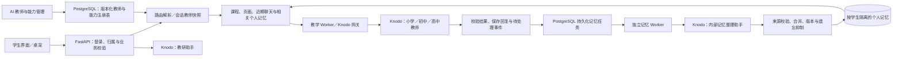

# K12人工智能教学平台

霜铃 K12：面向比赛展示的 AI 教学作品，串联课程学习、自由对话、互动练习、动画演示、在线编程和学习记录。
采用 FastAPI + React/TypeScript/Vite + PostgreSQL，AI 通过 Knodo 的小学、初中、高中教师、教研助手和内部记忆整理助手接入。

本项目为非开源比赛作品，代码保存在私有仓库
[K12-AI-Teaching-Platform](https://github.com/zxkk97984-creator/K12-AI-Teaching-Platform)。
`main` 保存已集成版本，功能开发使用独立分支；仓库不包含本机密钥、数据库或上传文件。

## 启动

本机运行配置位于 `~/.config/k12/runtime.env`，由 `./k12 setup` 首次创建，
模板为 [config/runtime.env.example](config/runtime.env.example)。已有配置和数据库凭据会保留。
详细步骤见[本地开发说明](docs/operations/LOCAL_DEV.md)。

```bash
./k12 setup           # 首次配置、依赖、数据库迁移与课程导入
./k12 start --build   # 按当前源码构建并启动完整服务
./k12 status          # 查看服务
```

前端：<http://127.0.0.1:15173>；API：<http://127.0.0.1:18081>。
修改运行配置后使用 `./k12 restart` 重启应用。

比赛演示使用示例账号和四学段演示课程。`GATEWAY_MODE=fixture` 用于离线演示和测试；真实 Knodo 模式
使用本机配置中的平台凭据，以及 `/admin/ai` 保存的教师和路由。对话页面支持不选课程直接提问，CodeLab 需单独启动
[Docker runner](docs/operations/RUNNER_T24.md)。需要完整本地编程演示时，先运行
`./k12 setup --with-runner` 构建 runner，再运行 `./k12 start --with-runner`；脚本会在用户状态目录
自动生成权限为 600 的 runner token，同时启动 API、worker、前端和回环 runner。

## 当前项目状态

截至 2026-09-30，学生默认进入 `/workbench`，管理员进入 `/admin/resources`。
未完成首次设置的学生先选择具体年级；一年级至高三映射到小学低段、小学高段、初中和高中。
四学段共用业务数据和账号体系，首页、导航名称及内容入口按学段变化。

| 模块 | 当前入口与能力 |
| --- | --- |
| 学习首页 | `/workbench`：四学段布局、学习入口、书架和继续学习 |
| 资源与阅读 | `/resources` 区分专题教材、课程讲义、资料与讲解，默认收起合成演示课程；`/study` 提供书架和阅读历史；20 门导入课程可逐章阅读，正文支持章节目录、专注阅读和字号调整；`/books/:bookSlug` 提供三本内置教材；`/picturebooks` 提供小学绘本续读 |
| AI 教师 | `/conversations`：按学段选择小学／初中／高中教师，无课程提问、历史会话、回复生成练习；桌宠支持页面提问；`/study/lesson` 提供课程课堂 |
| 互动内容 | `/animations` 讲解、`/activities` 探索、`/practice` 小学小游戏；`/interactive/:resourceId` 支持场景、进度保存、恢复和重试 |
| 学科练习 | `/practice`：按章节或教师回复生成、答题与提示、草稿、结果回顾、收藏；初高中提供错题入口 |
| CodeLab | `/code`：初中／高中各 6 道题，搜索筛选、收藏、草稿、公开示例、正式判题和历史回看 |
| 个人记忆 | `/growth`：自动整理聊天、按类搜索／更正／遗忘条目、查看来源、整理历史聊天和管理开关；保留手写 Markdown 及版本恢复 |
| 学习设置 | `/settings`：年级、昵称、头像、教师风格、语音偏好和六套桌宠形象；昵称不改变登录账号 |
| 教学管理 | `/admin/resources` 管理资料，`/admin/resources/interactive` 导入和发布互动包，`/admin/authoring` 管理题目与课程草稿；`/admin/ai` 管理教师、路由、能力与绑定核验 |

新增的六本原创专题教材在 `curriculum/source/original/original-books-v1/`，共 72 章、
311,590 个正文汉字。小学两本同时供低段和高段阅读，初中和高中各两本；每本目录 12 章。
`./k12 setup` 幂等导入到本地开发库，资料库将它们归为“专题教材”。前言和题目随书阅读，
参考答案只保留在后端源目录 `source/answers/`，不进入学生接口或前端资产；这些自测题尚未接入自动判分。
教材为 AI 辅助原创、未经人工教学审校，相关说明保留在书架与章节中。转换与复核命令见
[本地开发说明](docs/operations/LOCAL_DEV.md)。

既有内置教材源文件在 `frontend/src/features/books/content/`；绘本和学段知识点示例的唯一维护源为
`curriculum/source/synthetic/k12-demo-v1/student-content.json`。它们是预置内容，不冒充实时 AI 生成。
首批内置 HTML 讲解覆盖四学段：AI 认图片、二进制卡片、条件与循环、二分查找。AI 认图片点击开始即自动演示与朗读，二进制卡片可选择“自动播放”；画面等待本段朗读结束再前进，可暂停、重播、问老师或“自己试一试”。没有可用声音或静音时，按字幕阅读时间无声演示并提示。自动演示不覆盖手动实验状态，也不自动标记课程完成；手动操作可保存和续学，字幕始终可看。
新导入讲义保留 Markdown 代码块、表格、公式和来源说明；小学低段选取基础章节，高段可读完整小学内容。
课程源在 `curriculum/source/imported/computing-ai-md-v1/`，互动源在 `curriculum/interactive/computing-ai-v1/`；
`./k12 setup` 会幂等导入，已存在的学习记录与版本保留。本批内容标记为本地演示可见，审核状态如实保存。

导入讲义是按主题整理的本地学习材料，不代表所参考出版书籍的全文。资料卡显示当前年级可读章节数，合成演示课可通过“显示演示内容”查看。新增小学、初中、高中原创教材的固定文件格式、章节与篇幅要求见[教材生成 Prompt](docs/operations/BOOK_CONTENT_PROMPT.md)，生成包交回项目后再转换并导入现有课程协议。

互动内容支持 HTML 或 ZIP 包，制作与导入规则见[互动内容接入说明](docs/operations/INTERACTIVE_CONTENT.md)。
新增四档各三份自动播放讲解在 `k12-autoplay-examples-v1/`，已接入本机动画讲解目录；重复导入与独立预览见[样例说明](k12-autoplay-examples-v1/README.md)。
小学低段“趣味练习”已接入[训练小小 AI·水果分类员](curriculum/interactive/computing-ai-v1/ai-fruit-trainer/index.html)：贴标签、补充样例、纠正标签三关挑战，支持进度保存与恢复。该单文件也可离线打开，分类结果属于简化教学模拟。
[趣味答题小游戏](docs/competition/趣味答题小游戏.html) 保留为可独立打开的演示素材。

### 当前能力边界

- 自动记忆归属本地学生账号，三位教师共享该账号的相关记忆。独立 worker 在成功回复后整理新消息，默认合并 30 秒、最长等待 120 秒；用户可主动整理历史聊天。关键词与元数据检索受上下文预算限制，尚未接入向量检索。
- 手写文档与自动条目分开保存。人工更正不被自动覆盖；遗忘或关闭聊天使用记忆会撤回旧上下文并重建远端会话。删除聊天默认保留已提炼记忆，也可同时遗忘关联自动条目；本地遗忘不宣称删除 Knodo 保存的历史。
- 教师及记忆助手已完成真实 Knodo 流程验证。Designer 的题目草稿支持真实调用；`LESSON_PACKAGE_DRAFT` 课程包业务任务目前仅开放 fixture，真实模式仍返回明确的未开放状态。能力注册与受控后端工具接口已预留，未安装处理器或未核验技能不能算已生效。
- 练习生成失败会显示失败状态。CodeLab 公开示例不产生正式成绩，提交判题使用服务器可信用例和 70 分制；AI 建议独立标明来源，不改变成绩。runner 未启动时不能声称代码已执行。
- 章节页支持整章与选中文字朗读、暂停／继续／停止和语速调整，使用系统语音逐句连续播放并高亮当前句；继续朗读从暂停的当前句重新开始。朗读声音在学习设置中选择，保存在当前账号的本机浏览器中，与互动朗读共用；代码块提示对照正文查看。语音输入、回复朗读和互动讲解依赖浏览器能力、权限、中文语音或内容包音频；独立服务端 ASR/TTS 未接入。文本输入始终是基础入口。
- 完整演示取决于本机 Knodo、runner 和已发布内容。静态检查、合成浏览器测试与真实调用分别记录，不把通过测试等同于教学效果已验证。

学生端视觉源自本机 Open Design 的页面与素材设计，实际实现以 `frontend/src` 和
`frontend/public` 为准，运行不依赖 Open Design 项目。旧静态 HTML 导出、重复绘本定义、
废弃前端组件和一次性验收材料已清理；现有数据库迁移、课程历史版本、协议和仍被工具引用的
Knodo 历史评测资产继续保留。

## Agent 与记忆架构



这五个助手由后端按任务选择，不会自行互相派工。小学两档共用小学教师；新会话保存教师快照，改绑目标后重建远端会话。Knodo 负责模型与 Skill 执行，本地服务负责学生身份、记忆、评分和业务写入。共享空间的两套 Knodo 记忆关闭，学生记忆不上传为共享知识库。

## 检查

Knodo ZIP 为可重建产物，不提交 Git。首次克隆或修改 Knodo 资产后先构建，再执行检查：

```bash
python3 scripts/package-knodo.py build
python3 k12-autoplay-examples-v1/source/build.py # 重建不入 Git 的 12 份互动 ZIP
./k12 check
```

包含协议测试、后端测试与静态检查、OpenAPI 类型一致性、前端测试、类型检查和构建。
后端测试使用独立的 `55434 / k12r1_test` 数据库。可按修改范围单独执行：

```bash
python3 contracts/test_contracts.py -v
npm test --prefix frontend
npm run typecheck --prefix frontend
npm run build --prefix frontend
npm run test:e2e:ui --prefix frontend # 使用拦截 API 的合成浏览器场景
python3 scripts/package-knodo.py verify
./scripts/knodo-live-test.sh         # 真实教师与记忆验收；只写隔离测试库
```

## 项目导航

| 目录 | 内容 |
| --- | --- |
| `backend/app` / `backend/tests` | API、教学业务、后台任务与测试 |
| `frontend/src` | 页面、组件和浏览器测试 |
| `contracts` | 协议、示例与 OpenAPI |
| `curriculum` | 课程源、发布版本、动画和编程题 |
| `platform/knodo` | 三位教师、教研和记忆助手的提示词、Skill／Plugin 与交付资产 |
| `runner` / `scripts` | 编程执行环境与开发工具 |
| `evals` | 教学评测用例与评测工具 |

[开发指引](AGENTS.md) · [启动说明](docs/operations/LOCAL_DEV.md) ·
[互动内容接入说明](docs/operations/INTERACTIVE_CONTENT.md) ·
[浏览器回归](docs/acceptance/ui-reuse/README.md) · [Knodo 接入](docs/integrations/knodo/DEPLOYMENT_GUIDE.md) ·
[演示脚本](docs/competition/DEMO_SCRIPT.md) · [参赛报告](docs/competition/REPORT_DRAFT.md)

密钥保存在仓库外；演示数据与真实学生数据分开。功能和评测结果按实际完成情况介绍。
