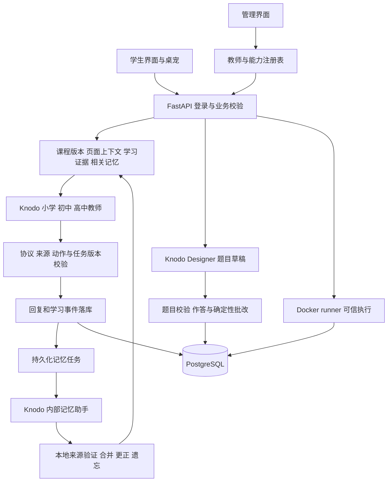

# 霜铃 K12 多模态人工智能通识教学助手项目报告

更新日期：2026 年 10 月 3 日。对应赛题：中国移动杯第二届浙江省大学生人工智能竞赛，JBGS-2026-02「多模态 K12 人工智能通识课教学助手对话智能体」。沿用原报告文件路径，便于从 README 和演示脚本访问。

## 1 项目目标与实现概况

霜铃面向小学低段、小学高段、初中和高中，把人工智能通识课程的阅读、对话、互动讲解、随堂练习、编程实践和学习记录放在同一学习空间中。学生可以直接向 AI 教师提问，也可以从教材章节进入课堂，由教师主动介绍目标，再经过讲解、检查、练习和复盘。系统保存会话、内容版本和操作进度，使学习过程可以暂停和恢复。

项目已实现可运行的本地原型。React 提供学生与管理界面，FastAPI 和 PostgreSQL 负责身份、课程、记录和判分，Knodo 承担教学回复、题目草稿和记忆提取，独立 Docker runner 执行学生代码。多模态能力主要通过自然语言问答、动画与互动实验、在线编程、生成式练习共同呈现。赛题要求六种方式至少实现三种；现阶段具备多种方式，但实时绘本生成及视频生成尚未实现。

报告依据源码、本机页面和可检查的测试文件编写。取证期间推荐功能出现并行修订，后段已补录首页建议和对应题目入口；2026-10-03 推荐闭环已通过隔离库与浏览器复验，新增证据列于第 8 节。[本次演示证据](../../frontend/test-results/competition-evidence-20261002/EVIDENCE.md)记录采集时间、版本范围、截图和测试结果。[演示脚本](DEMO_SCRIPT.md)给出现场操作顺序。

## 2 赛题要求与作品对应关系

| 赛题要求 | 当前实现 | 完成范围与限制 |
| --- | --- | --- |
| 四学段选择与适配 | 一年级至高三映射四学段，筛选课程与内容，选择教师、题量、题型和难度上限 | 界面与业务策略已实现；教学质量需结合样例评估 |
| 学生提问及教师主动引导 | 自由对话、内容页提问、章节课堂主动开场及五阶段流程 | 主动开场在章节课堂触发；阶段确认与正式成绩分别记录 |
| 对话问答 | 三位学段教师、历史会话、页面上下文、桌宠、只读查询卡片 | 真实模式依赖 Knodo，失败和过期结果有明确状态 |
| 多模态教学材料 | 教材、讲义、Word、PPT、视频和互动包的管理与访问接口 | 本机 Word、PPT、视频素材尚未向学生开放 |
| 动画讲解 | 四份内置讲解和十二份自动播放讲解，支持继续实验 | 预制离线 HTML，非每轮实时生成 |
| 绘本生成 | 两本小学示例绘本，段落续读与教师提问 | 阅读已实现，按 AI 知识点实时生成尚未实现 |
| 编程环境 | 初高中各六道题、代码框架、编辑、草稿、示例、可信判题和 AI 建议 | 成绩来自可信用例，公开示例和 AI 建议不计分 |
| 游戏化练习 | AI 水果分类游戏；章节或教师回复生成题目，自动批改 | 生成需学生触发，讲解后自动准备练习尚未贯通 |
| 个性化学习路径 | 学习证据、错题、兴趣和下一步推荐规则；新修订加入首页卡片与对应题目链接 | 错题复盘与重练闭环已通过隔离库浏览器验证；规则未作教学效果评测 |
| 原型部署与报告 | 本机启动、API、Knodo 和 runner 说明及本报告 | 本次验证不代表公网持续服务或学习效果评测 |

## 3 系统架构与助手分工

系统采用模块化单体后端，四学段复用账号、课程版本和学习记录。浏览器请求先经过登录、CSRF、身份与归属检查，再进入业务模块。需要调用模型时，后端选择目标助手、构造可信上下文、调用网关并校验响应；正式业务写入和成绩计算留在本地服务。



| 助手 | 任务 | 本地服务保留的责任 |
| --- | --- | --- |
| 小学教师 | 小学低段和高段讲解 | 两档题量与难度分别限制，共用教师不代替学段适配 |
| 初中教师 | 概念、算法和基础代码讲解 | 学段、资料可见性、会话归属及结果验证 |
| 高中教师 | 推理、算法边界和编程反馈 | 难度依据真实作答，可信成绩与 AI 建议分别保存 |
| Designer | 固定章节版本或教师回复的结构化题目草稿 | 来源、题型、题量、答案结构、评分和题目快照 |
| 内部记忆助手 | 学生明确陈述的结构化提取 | 来源核验、账号隔离、更正优先及遗忘抑制 |

五个助手由后端按任务选择，不自行互相派工。教师、路由和能力定义保存于版本化注册表；新会话保存教师快照，改绑不将已有会话静默切换到另一教师。Knodo 的提示词、模型和 Skill 在远端配置，本地资产构建、远端绑定及实际调用分别验证。

当前已经接入 `COURSE_SEARCH`、`WRONG_QUESTIONS`、`LEARNING_PROGRESS` 三类本地查询，旧报告中“没有已安装业务工具”的描述已不适用。教师提出受限计划，后端按当前账号和学段执行只读查询，再把结果交回教师简短解释。每轮最多三类查询，只执行一批；后续不递归扩展查询。结果卡片由本地生成，包含查询时间和可授权解析的目标，点击时重新核验权限。模型不获得任意 SQL、数据库连接或业务写入权限。

实现依据：[应用入口](../../backend/app/main.py)、[教师注册与解析](../../backend/app/modules/ai/service.py)、[查询执行](../../backend/app/modules/lookup/rounds.py)、[目标解析](../../backend/app/modules/lookup/targets.py)。

## 4 知识库构建与来源管理

### 4.1 内容来源和规模

课程分为导入讲义、原创专题教材、内置阅读内容和合成流程样例，沿用课程协议和数据库版本链导入。学生目录按账号学段、年级和内容状态筛选。

| 来源 | 源文件统计 | 使用方式 |
| --- | --- | --- |
| 计算机与 AI 导入讲义 | 20 门课程、250 个学段章节版本 | 保留来源说明和原始文件哈希，支持代码块、表格、公式和阅读 |
| AI 辅助原创专题教材 | 六本、72 个源章节、96 个学段版本；正文 311,590 个汉字 | 小学两本供低段与高段阅读，初中和高中各两本，每本十二章 |
| 原创教材固定自测 | 432 道题、72 份答案文件 | 按题展开答案与解析，不产生在线成绩或错题记录 |
| 内置教材与绘本 | 三本内置教材、两本小学示例绘本 | 预置内容，段落与提问由固定版本提供 |
| 合成课堂样例 | 四学段演示课程及测试题稿 | 用于离线演示和隔离测试，明确标记 fixture |

以上数字表示源内容包规模，某个账号实际可见数量由年级和发布状态决定。导入讲义是按主题整理的材料，不等于参考出版物的全文。原创教材标注为 AI 辅助、未经人工教学审校；结构和答案隔离检查通过不等于全部内容已经专家确认。

来源清单：[导入讲义 inventory](../../curriculum/source/imported/computing-ai-md-v1/inventory.json)、[原创教材 inventory](../../curriculum/source/original/original-books-v1/inventory.json)、[原创教材 manifest](../../curriculum/source/original/original-books-v1/source/manifest.json)。

### 4.2 章节切分与学段标注

导入器按课程配置选择标题层级或章节标题作为边界，识别代码围栏，避免将代码示例中的井号误当正文标题。原始字节按 SHA-256 归档，规范化 Markdown 和课程 JSON 保留为可复现源。规范化统一换行、修复本地目录链接，并在明确位置纠正已发现的内容错误。

课程和章节具有稳定标识、顺序、目标、知识点、学段、年级范围、来源与审核状态。小学低段选择基础章节，高段提供更完整的内容；原创小学教材生成两档版本，因此 72 个源章节对应 96 个学段版本。初高中保留各自概念、算法和编程深度。

实现依据：[Markdown 导入器](../../backend/app/modules/content/markdown_import.py)、[教材转换器](../../backend/app/modules/content/book_import.py)。

### 4.3 版本、答案与模型引用

内容哈希和版本标识用于幂等导入，重复导入保留已有学习历史。课堂会话、生成题稿和作答记录绑定具体章节版本，更新后仍可追溯旧材料。正文、参考答案和隐藏判题用例使用不同的存储和投影路径，普通正文及前端静态包不携带参考答案。

章节课堂从后端正文构建 `knowledge_context`，每项包含 `source_id`、`revision`、`locator` 和文本。当前最多八项来源；没有独立来源块时使用章节版本，正文有长度上限。模型引用必须属于本轮来源集合，资源或动画目标也必须来自授权集合。

无课程自由对话可使用远端教师已有知识，但不能宣称已经检索某本本地教材。当前没有将六本教材全部正文自动上传 Knodo，也没有统一向量知识检索。远端课堂包、章节上下文、本地课程查询是三条路径，答辩按实际调用介绍。

实现依据：[教学上下文](../../backend/app/modules/teaching/context.py)、[响应校验](../../backend/app/modules/teaching/validation.py)、[参考答案接口](../../backend/app/modules/content/textbook_answers.py)、[Knodo 资产边界](../../platform/knodo/README.md)。

## 5 大模型调用与个性化策略

### 5.1 教学调用顺序与失败处理

问题提交后，后端先写入带幂等标识的任务，再在短事务之外调用 Knodo。教学 Worker 读取会话、章节版本、页面快照和学生相关信息，解析教师快照，构造请求并调用教师。返回结果经过 Schema、任务版本、来源、动作和当前记忆版本检查后，才成为正式回复。

网页通过 SSE 和任务查询显示生成状态及可用草稿。刷新重读原任务，不重复发起模型调用。失败、取消、上下文过期和保存冲突有终态；迟到的旧结果不能覆盖更正或遗忘后的上下文。模型等待不占用数据库长事务。

需要业务查询时，第一轮输出查询计划，本地执行后第二轮生成解释；第二轮再要求查询时不递归执行。本地状态卡说明空结果、不可用或失败，避免将无数据描述为学生已经掌握。

实现依据：[教学 Worker](../../backend/app/jobs/teaching_worker.py)、[网关](../../backend/app/integrations/knodo/gateway.py)、[查询轮次](../../backend/app/modules/lookup/rounds.py)。

### 5.2 四学段策略

| 学段 | 年级 | 每组题数上限 | 题型 | 学段难度范围 | 讲解策略长度上限 |
| --- | --- | --- | --- | --- | --- |
| 小学低段 | 1—3 | 1 | 单选、判断 | EASY | 220 字符，短句和生活观察 |
| 小学高段 | 4—6 | 2 | 单选、判断、排序 | EASY、MEDIUM | 320 字符，逐步引入规则 |
| 初中 | 7—9 | 3 | 单选、排序 | EASY、MEDIUM | 480 字符，联系概念与代码 |
| 高中 | 10—12 | 3 | 单选、排序 | EASY、MEDIUM、HARD | 640 字符，说明条件和边界 |

表格描述本地策略字段，不表示每轮实际回复一定达到该长度。HARD 仍需相应学习证据，高年级不能单独解锁。提示、跳过和阅读时间不作为正确作答。偏好和兴趣由学生填写或明确陈述，不推断人格、智力或未经验证的能力。

实现依据：[学段策略](../../backend/app/modules/learning/policy.py)、[策略应用](../../backend/app/modules/teaching/context.py)。

### 5.3 个人记忆

成功回复与待处理记忆事件在同一事务保存。独立 Worker 合并消息，调用内部助手提取兴趣、目标与讲解偏好，再核验来源、归属和消息哈希，合并到学生本地记忆。整理不阻塞聊天。

后续通过关键词与元数据召回有限的相关条目和可验证摘要，三位教师共享同一学生的有效记忆。学生可看来源、更正、遗忘和关闭召回；人工更正优先，旧消息、摘要或迟到任务不能恢复撤回条目。手写 Markdown 独立保存，不被自动整理覆盖。共享空间原生记忆关闭，个人记忆不作为共享课堂知识包上传。

记忆是有来源的教学参考，不替代测验成绩。其兴趣可影响教师举例；课程推荐读取档案兴趣，并复用本地召回的有效个人兴趣作为关键词备选。更正、遗忘、过期、关闭使用和另一账号的边界已纳入推荐回归；兴趣不作为掌握证据。

实现依据：[记忆 Worker](../../backend/app/jobs/memory_worker.py)、[来源](../../backend/app/modules/memory/provenance.py)、[摘要](../../backend/app/modules/memory/summaries.py)、[教学召回](../../backend/app/modules/ai/teaching_context.py)。

### 5.4 下一步推荐与学习闭环

推荐使用当前学段的真实作答、未完成课堂、完成章节和兴趣。规则 v2 优先复盘尚未纠正的错题，其次继续课堂、练习仍在形成的目标，再按课程目录继续；兴趣通过关键词形成可选内容。复盘按同一来源题目的最新作答判定，重练答对会解除该题旧错误，其他未纠正问题继续保留。建议由本地规则生成，尚未验证教学效果。

提交答案后整理证据并更新建议；推荐更新失败不撤销已经保存的答案。首页“接下来学什么”和 `/learn/next` 使用同一建议，题目链接携带本人练习会话及题目位置，访问时仍检查登录与归属。重复提交不重复计数，重复整理复用快照，恢复已有输入时重新启用对应快照。GET 保持只读，历史未整理记录通过显式“更新建议”补齐。

2026-10-03 在隔离 API/PostgreSQL 与 Chrome 中完成“答错—首页建议—打开原题—重练答对—建议更新—刷新保持”，并检查 390px 页面无横向溢出。这里的教师和题目为合成 fixture，真实 Knodo 查询四学段均有通过案例，首轮小学高段解释回退和专项复测结果分别列于第 8 节。`/learn` 仍跳转 `/study`，推荐详情使用 `/learn/next`。

实现依据：[决策](../../backend/app/modules/recommendation/decision.py)、[首页](../../frontend/src/features/workbench/WorkbenchShell.tsx)、[跳转](../../frontend/src/features/learning-next/types.ts)。

## 6 多模态教学与内容生成路线

### 6.1 动画和互动实验

动画以离线 HTML、SVG、Canvas 和 JavaScript 将规则转为可观察变化。四份内置讲解覆盖 AI 认图片、二进制、条件与循环、二分查找；另外四学段各三份自动播放讲解。水果分类游戏通过贴标签、补充样例、纠正标签展示样例学习、多样性和标签质量。

内容包的 `k12-interactive-v1` 清单描述学段、用途、场景、台词和知识点。导入器检查路径、素材和执行范围，宿主用受限 iframe 与消息桥接入场景、预设台词、检查点和提问。不执行包内构建命令，不加载外部 CDN 脚本。

自动播放等待朗读结束或字幕阅读时间后推进，可暂停、重播、静音和手动实验。无声音时保留字幕并提示。实验参数在后端确认保存后恢复；“已看完”仍可继续实验，不等于掌握。小游戏自报分数属于活动结果，正式练习由服务器评分。

制作入口：[内容规范](../operations/INTERACTIVE_CONTENT.md)、[内置互动源](../../curriculum/interactive/computing-ai-v1/)、[十二课件源](../../k12-autoplay-examples-v1/README.md)。

### 6.2 教材、文档、视频和绘本

教材支持目录、正文、字号、专注阅读和朗读。“问问老师”提交发送时的可验证页面上下文。Word、PPT 和视频经后台登记、上传与授权提供预览或下载，赛题允许上传现有材料。

语音输入使用浏览器 SpeechRecognition，识别结果先进入可编辑草稿，由学生确认发送；输出使用浏览器 speechSynthesis 或课件包内音频。输入、输出及自动朗读分别配置，语音能力取决于浏览器声音和麦克风权限。当前没有独立服务端 ASR/TTS；不可用时保留文本输入和字幕。

本机视频、PPT 各七项撤回，Word 七项撤回、四项草稿且未开启本地演示可见，所以当前演示不能承诺学生可打开这些材料。十七项互动资源开启本地演示可见，并保留实际审核状态。接口已实现与素材已交付分别介绍。

绘本为《乌鸦喝水》《龟兔赛跑》两本预置示例，包含来源、续读和提问，没有把 AI 知识点实时编排为绘本的链路。若继续开发，应围绕分类、机器人指令或数据偏差制作故事。

### 6.3 题目生成与批改

选择章节或教师回复后，后端冻结材料、学段策略、题量和难度，将 `QUIZ_DRAFT` 提交 Designer。题稿通过 Schema、来源、目标、题型、题量与答案结构验证，保存为带来源标签的私人随堂练习。失败显示明确状态，不用示例题冒充模型生成。

前端获得作答字段，答案、解析和提示由服务端接口控制。单选、判断和排序确定性判分，作答、事件、错题关联和状态在同一短事务保存，重放不重复计分。教材固定自测是答案阅读，不属于在线判分。

目前生成由学生点击触发，讲解后自动准备练习尚未贯通。`LESSON_PACKAGE_DRAFT` 教学包只开放 fixture，真实模式返回未开放状态，常规导航已隐藏新建课程编排入口。

实现依据：[材料构造](../../backend/app/modules/assessment/specs.py)、[生成](../../backend/app/modules/assessment/service.py)、[作答评分](../../backend/app/modules/assessment/quiz_service.py)、[教学包限制](../../backend/app/jobs/authoring_worker.py)。

### 6.4 在线编程

CodeLab 提供说明、函数框架、Python 编辑器、草稿、公开示例和正式判题。独立 Docker runner 执行代码，期望结果和可信用例来自服务端。网络、时间、输出和写入有边界，异常、超时和基础设施故障有状态记录。

公开示例帮助调试，不产生正式分数。正式提交按可信用例给出 70 分制结果。AI 建议引用运行 ID 和代码哈希，解释问题，不修改成绩。初高中各六道题支持搜索、筛选、收藏和历史。

实现依据：[可信用例](../../backend/app/modules/codelab/trusted.py)、[判题](../../backend/app/modules/codelab/grading.py)、[反馈](../../backend/app/modules/codelab/feedback.py)、[runner](../../runner/host/runner.py)。

## 7 实际难题与解决方法

| 问题 | 已采用的方法 | 剩余工作或证据范围 |
| --- | --- | --- |
| 模型引用不存在的资料或越界动作 | 后端来源与动作集合、响应验证、本地卡片及目标授权 | 协议和归属测试，素材仍需补齐 |
| 学段与内容更新导致上下文不一致 | 年级映射、策略和教师快照、章节版本、材料冻结 | 四学段策略测试；推荐闭环已按修订版复验 |
| 刷新、重放和长调用影响体验 | 幂等任务、短事务、SSE、状态恢复、独立记忆整理 | 首字和完成耗时需分别测量 |
| 更正后旧摘要恢复旧记忆 | 来源哈希、版本、更正优先、撤回和摘要核验 | 后端测试；本次未重跑完整真实记忆验收 |
| 代码输出冒充可信判定 | Docker、stdout 分离、可信用例、结果校验 | 真实 runner 与既有三十六项边界记录 |
| 进度恢复及语音失败不一致 | 保存回执、冲突提示、台词状态和字幕回退 | 自动化媒体事件不等于人耳听声 |
| 文档与实现不一致 | 逐项核对源码、运行页面和结果文件，记录模式、失败、跳过 | 本次修正工具、教材、推荐和教学包描述 |

## 8 验证结果与演示证据

本次记录从 2026 年 10 月 2 日开始，跨日完成，采用 Asia/Shanghai。目录 `frontend/test-results/competition-evidence-20261002/` 表示开始日；源码基线为 `4b479bb3d495965399aee3fd13871fc99775fe2b`。

前端 `http://127.0.0.1:15173` 返回 HTTP 200，API `/health/ready` 报告数据库、runner 和存储正常。配置为 Knodo 模式，健康检查不等于完成真实教学调用。新录浏览器用 Chrome/Playwright 连接实际本地 API，记录账号真实年级、地址、操作、截图和控制台。桌面为 1440×1000，窄屏为 390×844。

| 证据 | 来源 | 说明 |
| --- | --- | --- |
| 完整本地检查 | [本次日志](../../frontend/test-results/competition-evidence-20261002/local-check.log) | 协议 41 项；后端 544 项通过、7 项跳过；前端 265 项通过；OpenAPI/类型、Ruff、构建及资产通过。隔离库、fixture 网关，不覆盖其后所有并行修订 |
| 推荐闭环最终本地检查 | [收尾日志](../../frontend/test-results/recommendation-loop/local-check.log) | 2026-10-03：后端 551 项通过、7 项按条件跳过；前端 269 项、协议 41 项通过；OpenAPI/类型、Ruff、构建及资产校验通过，fixture 网关与独立临时测试库 |
| 推荐闭环浏览器 | [最终报告](../../frontend/test-results/recommendation-loop/browser-report.json)、[桌面](../../frontend/test-results/recommendation-loop/wrong-recommendation.png)、[390px](../../frontend/test-results/recommendation-loop/corrected-mobile.png) | 隔离 API/PostgreSQL 与 Chrome；答错、直达原题、重练答对、建议更新及刷新保持；无页面 JavaScript 异常、无横向溢出 |
| 推荐配套真实 Knodo 查询 | [四学段首轮](../../frontend/test-results/recommendation-loop/knodo-live.log)、[小学高段复测](../../frontend/test-results/recommendation-loop/knodo-upper-diagnostic.log) | 2026-10-03，合成隔离账号与真实模型：首轮 3 项通过、1 项失败；高段解释触发本地回退，专项复测 1 项通过。四学段均有普通回复及三类查询通过案例，包含另一账号排除及卡片目标核验；不表示每次模型输出都有效 |
| 当前页面和操作 | [本次浏览器记录](../../frontend/test-results/competition-evidence-20261002/browser-evidence.json) | 实际登录、教材、动画、练习页签、编程工作区、推荐与窄屏 |
| 真实教师与本地查询 | [本次专属库日志](../../frontend/test-results/competition-evidence-20261002/live-lookup-isolated.log) | 小学低段普通问答及三类查询通过，一个参数用例、三次 Knodo 调用；含账号隔离与卡片目标检查，其余三学段本次未执行 |
| 推荐修订早期前端 | [本次局部日志](../../frontend/test-results/competition-evidence-20261002/recommendation-candidate-frontend.log) | 23 项通过；首页补录属于未提交工作区，不扩展为完整闭环验收 |
| 四学段界面 | [既有报告](../../frontend/test-results/finish-20261002/ui-reuse-report.json) | 2026-10-02 21:00 起，60 项通过；API 拦截 fixture |
| 四学段教学作答 | [既有报告](../../frontend/test-results/finish-20261002/final-learning-flow/report.json) | 四项通过；隔离 API/PostgreSQL，教师与题稿为 fixture |
| 完整学习入口 | [既有通过报告](../../frontend/test-results/finish-20261002/learning-content-browser/accepted-report.json) | 28 项通过、7 项按模式跳过；较早报告含失败，不引用为全通过 |
| 十二课件 | [既有独立模式报告](../../frontend/test-results/finish-20261002/autoplay-examples/final-report.json) | 七项通过，不证明真实听声或教学效果 |
| 初高中编程及真实 Knodo 建议 | [初中](../../frontend/test-results/finish-20261002/finish-runner/junior-knodo-report.json)、[高中](../../frontend/test-results/finish-20261002/finish-runner/senior-knodo-report.json) | 各一项通过；[反馈快照](../../frontend/test-results/finish-20261002/finish-runner/runner-feedback-snapshots.json)核对运行、代码哈希与可信成绩 |
| 异常边界 | [既有记录](../../frontend/test-results/finish-20261002/finish-runner/per-task-boundaries.json) | 十二题的语法、超时、输出限制，共三十六项 |
| 真人语音反馈 | [既有记录](../../frontend/test-results/finish-20261002/browser-voice/human-verification.json) | 朗读有声、识别草稿正常；浏览器名称及其他入口未逐项确认 |

本机已有十条教学调用中八条成功、两条失败；成功记录完整完成耗时中位数约 114 秒、P95 约 209 秒。它们是已有混合操作统计，不是本次统一压测，也不是首字时间。T31 十六例结果保留在[历史摘要](../acceptance/T31-live-summary.json)，不代替当前表现。

功能测试、截图和模型调用不能据此推断学生成绩提升、真机全兼容或全天候服务。本机证据不入 Git，交付报告副本时同时复制引用目录；复现入口在仓库，私有配置、账号密码与 PAT 不进入附件。

首次真实查询验证的普通问答成功，但查询阶段保存远端绑定时出现任务外键缺失，原日志保留为失败证据。改用本次专属临时测试库后，同一用例通过；共享隔离库的数据干扰属于排查方向，不以一次失败或重跑推断完整系统稳定性。专属库与私有注册表临时快照均已清理，详见[隔离记录](../../frontend/test-results/competition-evidence-20261002/live-isolation.json)。

## 9 部署集成与复现

浏览器页面接入 FastAPI，后端读取仓库外配置和数据库注册表，经网关对接 Knodo。runner 为独立本机服务，学生仅通过业务 API 访问。迁移、课程导入和存储沿用启动链。

```bash
./k12 setup                    # 首次配置、迁移和内容导入
./k12 start --build            # 构建并启动
./k12 status                   # 查看状态
./k12 setup --with-runner      # 首次准备执行环境
./k12 start --with-runner      # 编程演示启动 runner
./k12 check                    # 隔离库完整检查
./scripts/knodo-live-test.sh   # 单独执行真实教师与记忆验收
```

完整检查与真实验收分别运行，共享同一隔离库的测试不能并行。互动内容可嵌入离线包，业务 API 可供受控页面对接。当前验证为本机原型，公网发布不在本次工作内。详细说明：[本地开发](../operations/LOCAL_DEV.md)、[Knodo](../integrations/knodo/DEPLOYMENT_GUIDE.md)、[runner](../operations/RUNNER_T24.md)。

## 10 项目特点与后续工作

作品把“模型提供教学建议、服务端保留身份与事实、可信执行负责成绩”落实为可恢复流程。章节与题目版本、可追踪记忆、受限查询卡片、自动讲解后继续手动实验，是可展示的设计特点。创新性由评委结合赛题评价，本报告不自行宣称行业首创。

推荐闭环已完成隔离库与浏览器复验；后续贯通讲解后的练习准备、补齐可打开的教学材料。现场体验需测首字、完整回复及出题时间，优化较长调用。绘本围绕 AI 知识点制作。教学效果须另行设计学生样本与评估方法；本报告说明原型功能、技术实现和实际证据。
